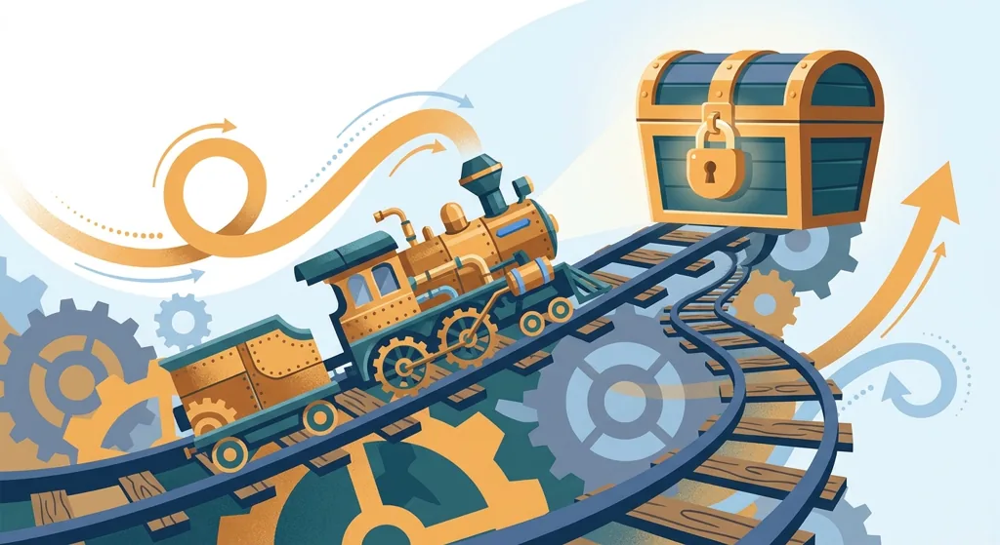
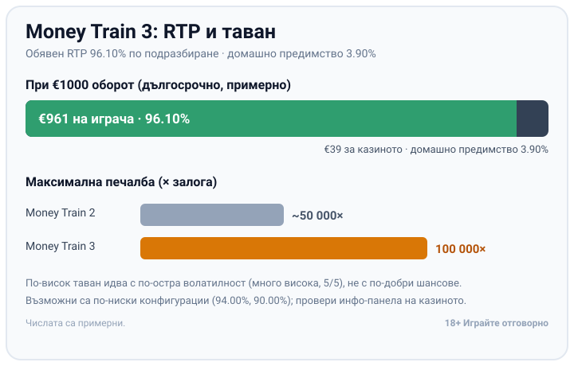

Title tag: Money Train 3: RTP 96.10%, таван 100 000× и новото
Meta description: Money Train 3 на Relax Gaming: RTP 96.10%, таван 100 000× (двойно спрямо втората част), нови символи в Money Cart и feature buy от 20 до 500×.

---

# Money Train 3: какво променя третата част, RTP и таван от 100 000×

Третата част на Relax Gaming вдига тавана до 100 000 пъти залога, добавя нови символи в бонуса и предлага по-фин избор при купуването на функцията. Успоредно с това обявеният RTP слиза малко под този на втората част. Ако сте играли Money Train 2, познавате двигателя, а тук се сменят предавките.

## Какво е новото в третата част

Money Train 3 (мъни трейн 3) излезе през септември 2022 г. върху същата мрежа от 5 колони и 4 реда с 40 фиксирани линии, залог от €0.10 до €10. Разликите са няколко и всяка има значение. Максималната печалба стига 100 000 пъти залога, двойно спрямо около 50 000 пъти при [Money Train 2](/blog/money-train-2/). Бонус рундът Money Cart получава нови специални символи. Купуването на функцията вече е стълбичка от няколко цени вместо един бутон. За контекст около студиото зад играта вижте нашия [профил на Relax Gaming](/blog/relax-gaming/) и [прегледа на доставчиците](/blog/games-providers/).

## Money Cart остава сърцето на играта

Механиката, около която се върти всичко, е непроменена по замисъл. Три или повече бонус символа стартират Money Cart с 3 респина, символите се заключват на местата си, а всеки нов символ връща брояча на респините на 3. Докато падат нови попадения, рундът продължава. Попълни ли се цяла колона, се отваря още една, до два пъти. Пълното описание на този двигател стои в текста ни за втората част, затова тук гледам само какво е сложено отгоре.

## Новите символи в Money Cart

Money Cart вече събира над дузина специални символа, като класиките Collector, Sniper, Necromancer и Collector-Payer се връщат заедно с persistent версиите си. Новото са три допълнения. Persistent Shapeshifter се превръща в различна функция на всяко следващо завъртане и остава до края на рунда. Absorber поглъща множителите по екрана и ги трупа в себе си. Tommy Gun се държи от Payer или Sniper и насочва ефекта им към цял тип символ наведнъж. Тези добавки правят добрия Money Cart потенциално по-експлозивен, което обяснява и защо таванът скочи толкова.

## RTP 96.10% и какво значи при €1000

Обявеният RTP по подразбиране е 96.10%, което оставя домашно предимство от около 3.90%. При €1000 оборот това е средно връщане от порядъка на €961 в дългосрочен план и около €39 за казиното, разпределени върху хиляди завъртания. Relax Gaming доставя играта и в по-ниски конфигурации, официално листвани при 94.00% и дори 90.00% за някои пазари, а кой вариант работи избира операторът. Затова числото със значение за вас е това в инфо-панела на конкретното казино, не рекламните 96.10%. В [методологията ни](/kak-ocenyavame/) гледаме реалния RTP за всяко заглавие, а различните [ротативки](/kazino-igri/rotativki/) се сравняват честно само на тази база.

*Обявен RTP 96.10% по подразбиране: при €1000 оборот средно ~€961 се връщат на играча, ~€39 остават за казиното (домашно предимство ~3.90%). Максималната печалба е 100 000 пъти залога, двойно спрямо ~50 000 пъти при втората част. Числата са примерни.*

## По-висок таван не значи по-добри шансове

Тук е лесно да се подведете. 100 000 пъти залога е реално постижимо, но представлява горната граница на почти идеален Money Cart, не средно и дори не често събитие. По-широкият таван идва с по-остра волатилност: третата част е много волатилна, 5 от 5 по стандартната скала, и е дори по-безмилостна в сухите периоди от втората. Повечето бонус рундове приключват на малка част от максимума. Да планирате бюджета си около 100 000 пъти залога е като да го кроите около джакпот.

## Feature buy: по-гъвкав, но не по-щедър

Вместо единствената опция при втората част, тук купуването на бонуса е стълбичка: 20 пъти залога за 1 респин, 50 пъти за 2 респина, 100 пъти за оригиналния рунд с 3 респина и 500 пъти за рунд с гарантиран persistent символ. Обявеният RTP на купения режим е около 96.50%, но по-високото число не значи по-добри шансове. Плащате скъпо за директен достъп до най-волатилната част на играта, докато дългосрочното домашно предимство остава същото. Дали изобщо можете да купите функцията зависи от пазара и оператора. [VERIFY: наличност на feature buy при конкретния оператор и пазар; проверява се в самата игра].

## Преди реални пари

Темпото на чакане към Money Cart прави играта такава, в която лесно се засилвате. Демо режимът е честният начин да видите колко рядко идва бонусът и колко дълги стават сухите серии, преди да заложите реални пари. Задайте си лимит за загуба и за време преди първото завъртане и го спазвайте, особено при толкова волатилна игра. 18+ Хазартът може да пристрасти. Играйте отговорно. Ако усетите, че играта излиза извън контрол, вижте [инструментите за отговорна игра](/otgovorna-igra/).

## Струва ли си

Money Train 3 е по-голяма и по-волатилна версия на познатата формула, с по-богат Money Cart и по-фин избор при feature buy. Таванът от 100 000 пъти залога продава играта, но по-ниският RTP по подразбиране и по-острата вариация вървят в комплект с него. Проверете кой RTP работи в инфо-панела на вашето казино, преди да седнете, и залагайте сума, която можете да загубите изцяло.

---

**Георги Тодоров**
Публикувано: 14.09.2026 · Последна редакция: 14.09.2026

[About Всички Казина boilerplate]

**Отговорна игра.** 18+ Хазартът може да пристрасти. Играйте отговорно. Ако усетиш, че играта излиза извън контрол или искаш да я ограничиш, виж [инструментите за отговорна игра](/otgovorna-igra/) и възможността за самоизключване чрез националния регистър на уязвимите лица към НАП (подава се писмено само от засегнатото лице). Национална информационна линия за наркотиците, алкохола и хазарта („Солидарност") 0888 99 18 66, делнични дни 10:00–17:00.

**Разкриване на партньорства.** Всички Казина съдържа партньорски (афилиейт) връзки; когато отвориш оферта през такава връзка, това може да финансира сайта, без да променя цената за теб и без да влияе на оценките ни. От 1 август 2026 г. дейността на афилиейт оператори в България се лицензира съгласно Закона за държавния бюджет за 2026 г. (ДВ, бр. 69 от 31.07.2026 г.). Всички Казина е подало заявление за лиценз пред Националната агенция по приходите и очаква издаването му.
