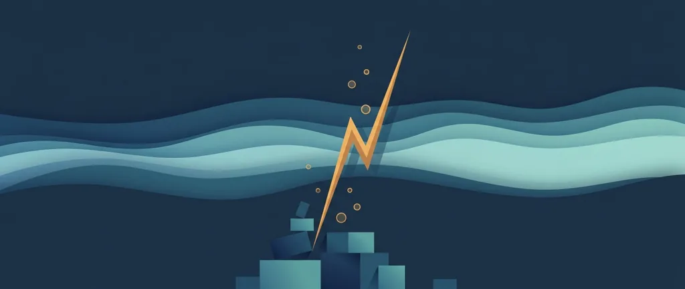
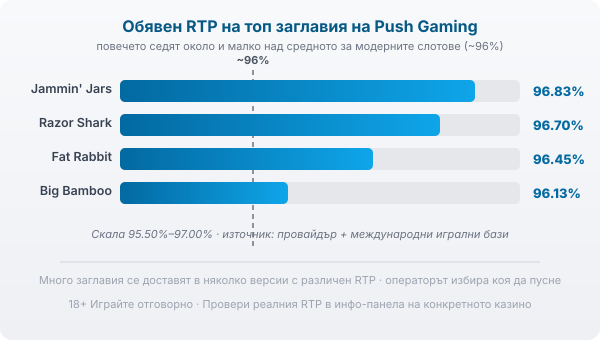

Title tag: Push Gaming: профил на доставчика, механики и топ слотове
Meta description: Кой е Push Gaming, какви механики и слотове прави (Razor Shark, Jammin' Jars) и защо реалният RTP се проверява в инфо-панела, а не се приема от банера.

---

# Push Gaming: профил на доставчика, механики и топ слотове

Push Gaming (пуш гейминг) е малко британско студио, което мнозина познават по две заглавия: Razor Shark и Jammin' Jars. Компанията е основана през 2010 г. със седалище в Лондон и офис в Малта, а игрите ѝ се появяват в част от българските онлайн казина.

## Малко студио, силни заглавия

За разлика от гигантите, които пускат по няколко слота месечно, Push Gaming държи сравнително тесен каталог и залага на високоволатилни заглавия, които се помнят. За играча е полезно едно разграничение, което лесно се губи: Push прави играта, но не я предлага сам. Доставчикът пише математиката и графиката; операторът е казиното, което приема залога ти и държи парите. Когато отвориш Razor Shark в две различни казина, играта е една и съща, но условията около нея зависят от оператора.

## Какво значат лицензите

Push Gaming работи под лицензи от UK Gambling Commission и Malta Gaming Authority, а игрите му минават през независими лаборатории като eCOGRA и BMM Testlabs. На практика това значи, че генераторът на случайни числа е тестван и обявеният RTP отговаря на реалната математика на заглавието. Сертификатът гарантира, че играта е честна спрямо собствените си правила. Тези правила обаче не са писани в твоя полза: домашното предимство си остава вградено, а тестът просто потвърждава, че то е точно такова, каквото пише. Сериозният регулаторен лиценз потвърждава, че механиката е коректна. Върху шансовете ти за печалба той няма ефект.

## Механиките на Push

Почеркът на студиото личи в няколко механики. Razor Shark стъпва на Mystery Stacks: стекове от по четири символа, които при падане задействат Nudge & Reveal и се плъзгат надолу ред по ред, разкривайки символи. Покаже ли се Golden Shark, идва Razor Reveal, при който всеки златен символ дава монета с множител между 1x и 2,500x или скатер. Jammin' Jars пък е cluster pays: печелиш, когато еднакви символи се групират, а не по фиксирана линия, като каскадите махат печелившите и пускат нови отгоре. Общото между заглавията е разчитането на резки, редки, но едри изблици, често подсилени с множители в бонус играта. Повечето слотове на Push предлагат и опция Bonus Buy, с която си купуваш директно входа в бонуса вместо да го чакаш; тя не мени RTP-то, а само сменя как плащаш за достъпа.

## Топ слотове

Няколко заглавия направиха компанията разпознаваема. Razor Shark е флагманът: подводен слот на решетка 5 на 4 с 20 линии, много висока волатилност и обявен RTP от 96.70%, с таван на печалбата от 85,475x залога. По-подробно разглеждаме заглавието в [отделния ни профил на Razor Shark](/blog/razor-shark/). Jammin' Jars е другата емблема, с cluster pays, обявен RTP 96.83% и таван 20,000x. Fat Rabbit (96.45%) и Big Bamboo (96.13%, таван 50,000x) допълват познатите заглавия. Числата за таван изглеждат внушително, но идват с много висока волатилност: това са максимуми, които падат изключително рядко. Популярността на едно заглавие говори повече за визията и маркетинга му, отколкото за шансовете ти. Едно широко играно заглавие не ти връща повече от друго само защото е известно.

*Обявени RTP на четири топ заглавия на Push Gaming спрямо ориентира ~96%: повечето седят около и малко над средното за модерните слотове. Реалната стойност зависи от заглавието и от версията, която операторът е пуснал.*

## RTP: проверявай, не приемай

Обявените RTP стойности на топ заглавията на Push седят около и малко над средните за модерните слотове, които започват от 96% нагоре. Това число обаче не е фиксирано и не е обещание. Много заглавия се доставят в няколко версии с различен RTP и операторът избира коя да пусне, така че една и съща игра може да ти връща различен процент в различни казина. А при много висока волатилност обявеният процент е дългосрочна средна над милиони завъртания: на практика ще виждаш дълги сухи серии между редките едри печалби, а не равномерно връщане. Заради това в [методологията ни](/kak-ocenyavame/) гледаме реалния RTP на конкретното казино вместо рекламния. Отвори инфо-панела на играта и виж кое число работи там, преди да заложиш.

## Демо режим, лимити и реален RTP

[Слот игрите](/slot-igri/) на Push обикновено имат демо режим, в който да усетиш темпото и волатилността, без да залагаш; при толкова високоволатилни заглавия демото е честният начин да разбереш дали стилът им ти понася, преди да сложиш пари. Ако искаш да сравниш доставчици един до друг, [прегледът ни на доставчиците](/blog/games-providers/) стъпва на същата логика. Задай си лимит за загуба и за време преди първото завъртане и провери реалния RTP на конкретното казино. 18+ Хазартът може да пристрасти. Играйте отговорно. Ако усетите, че играта излиза извън контрол, вижте [инструментите за отговорна игра](/otgovorna-igra/).

---

**Георги Тодоров**
Публикувано: 14.09.2026 · Последна редакция: 14.09.2026

[About Всички Казина boilerplate]

**Отговорна игра.** 18+ Хазартът може да пристрасти. Играйте отговорно. Ако усетиш, че играта излиза извън контрол или искаш да я ограничиш, виж [инструментите за отговорна игра](/otgovorna-igra/) и възможността за самоизключване чрез националния регистър на уязвимите лица към НАП (подава се писмено само от засегнатото лице). Национална информационна линия за наркотиците, алкохола и хазарта („Солидарност") 0888 99 18 66, делнични дни 10:00–17:00.

**Разкриване на партньорства.** Всички Казина съдържа партньорски (афилиейт) връзки; когато отвориш оферта през такава връзка, това може да финансира сайта, без да променя цената за теб и без да влияе на оценките ни. От 1 август 2026 г. дейността на афилиейт оператори в България се лицензира съгласно Закона за държавния бюджет за 2026 г. (ДВ, бр. 69 от 31.07.2026 г.). Всички Казина е подало заявление за лиценз пред Националната агенция по приходите и очаква издаването му.
