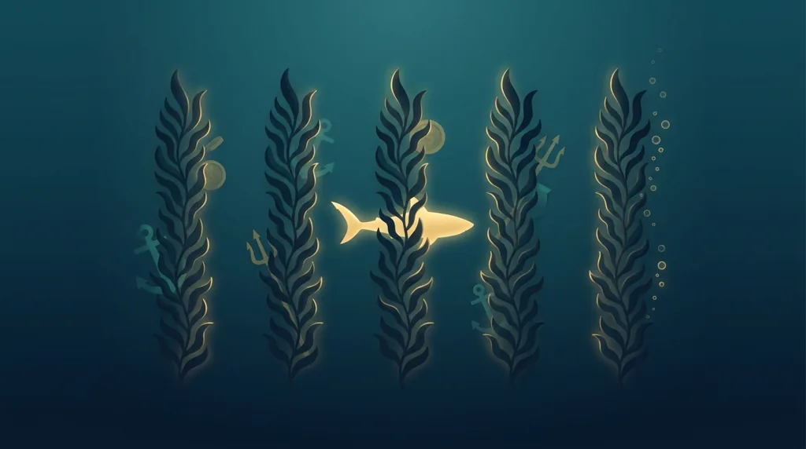
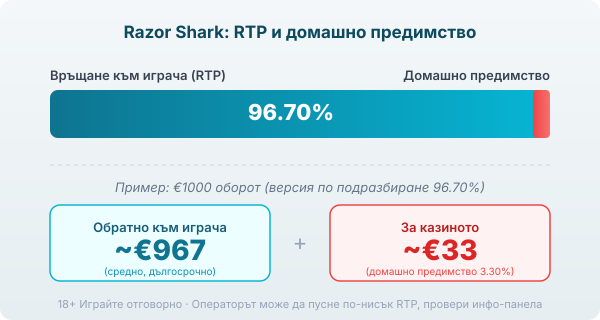

Title tag: Razor Shark: RTP, Mystery Stacks и как се играе
Meta description: Как работи Razor Shark на Push Gaming: Mystery Stacks, nudge, Razor Reveal до 2500× и безплатни завъртания с растящ множител. RTP 96.70% и защо се проверява.

---

# Razor Shark: RTP, Mystery Stacks и как се играе

Razor Shark е слот на Push Gaming от 2019 г. с дълбоководна тема: тъмна вода, водорасли и акула, която дебне зад барабаните. Полето е 5 колони и 4 реда с 20 фиксирани линии, а залогът върви от €0.10 до €100. Играта обаче не се помни с линиите. Помни се с Mystery Stacks и с бонуса, който тегли всичко нагоре, така че още от първите завъртания става ясно, че тук чакаш момента, в който водораслите започнат да се разкриват.

## Mystery Stacks: символът, който още не се е показал

Основната механика са стековете от mystery символи. По барабаните падат цели колони скрити символи, изобразени като водорасли, и всеки такъв стек се разкрива наведнъж в един и същ символ. Разкрият ли се високо платени символи, това е добра ръка; изскочи ли сред тях златна акула, започва по-интересната част. Nudge механиката придвижва стека надолу с по един ред на всяко завъртане, така че един и същ стек може да отвори нови позиции няколко завъртания подред. Това е разкриване на място, а не каскада: символите не изчезват, за да падат нови отгоре, а скритото се показва там, където стои. Push Gaming използва тази логика като запазена марка, а [профилът на доставчика](/blog/push-gaming/) показва как тя се среща и в други негови заглавия.

## Razor Reveal и златната акула

Разкрие ли се стек в златна акула, се включва Razor Reveal. Всяка позиция от акулите показва или паричен множител, или scatter символ. Множителите вървят от 1× до 2500× от залога. При залог €1 това е разкрита позиция със стойност между €1 и теоретични €2500, а няколко такива на екрана се събират. Scatter символите не плащат сами, а водят към безплатните завъртания, което прави златната акула символа, който едновременно плаща и отваря вратата към бонуса.

## Безплатните завъртания и растящият множител

Три или повече scatter символа стартират безплатните завъртания, режимът, заради който повечето играчи изобщо сядат на Razor Shark. В него колони 2 и 4 се пълнят с Mystery Stacks, които се придвижват надолу, а над всичко стои множител на печалбата, който расте с +1× на всеки nudge. Таван на този множител няма: докато стековете се движат и носят печалба, той се качва. „Без таван" обаче звучи като безкрайност, а не е. Веригите свършват, а големият резултат зависи от рядко съвпадение на дълга серия nudge-ове с високо платени символи. Максималната печалба на играта е фиксирана на 50 000× залога, така че „безкрайният" множител на практика опира точно в този таван.

## RTP: число, което се проверява

Обявеният RTP на Razor Shark е 96.70% по подразбиране, което оставя домашно предимство от около 3.30%. При €1000 оборот това означава средно връщане от порядъка на €967 в дългосрочен план и около €33 за казиното, разпределени върху много завъртания. Push Gaming доставя играта и в по-ниски конфигурации, като 95.05% и под нея, а операторът избира коя версия да пусне. Една и съща игра при две казина може да ти връща различен процент. Заради това в [методологията ни](/kak-ocenyavame/) гледаме реалния RTP на конкретното казино, а не рекламния, и си струва да отвориш инфо-панела на играта, преди да заложиш, за да видиш кое число работи там.

*Обявен RTP 96.70% (версия по подразбиране): при €1000 оборот средно ~€967 се връщат на играча, ~€33 остават за казиното. Възможни са и по-ниски конфигурации (напр. 95.05%), затова провери инфо-панела.*

## Висока волатилност значи търпение

Razor Shark е игра с висока волатилност. Балансът пада бавно през дребни или никакви печалби в основната игра, а големите резултати идват рядко и почти винаги през безплатните завъртания. Дълъг сух период тук е част от темперамента на играта, а не сигнал, че нещо се е счупило. Максималната печалба от 50 000× залога съществува, но е екстремно рядко събитие: при залог €1 това са теоретични €50 000, само че вероятността е нищожна и няма място в никаква сметка за бюджет. По-полезно е да гледаш на бонуса като на нещо, което идва рядко, отколкото като на нещо, което е на косъм всяко завъртане.

## Преди реални пари

Темпото и чакането за акулата правят Razor Shark игра, в която лесно се засилваш. [Слот игрите](/slot-igri/) обикновено имат демо режим, в който да видиш колко рядко идва бонусът, без да залагаш. Задай си лимит за загуба и за време преди първото завъртане и го спазвай, дори когато стек след стек се разкрива и ти се струва, че златната акула е следващата. 18+ Хазартът може да пристрасти. Играйте отговорно. Ако усетите, че играта излиза извън контрол, вижте [инструментите за отговорна игра](/otgovorna-igra/).

## Атрактивна тема, ясна аритметика

Razor Shark създава напрежение без каскади: скрито, което се разкрива, стек, който слиза ред по ред, и множител, който расте, докато веригата държи. Зад това стоят висока волатилност, домашно предимство около 3.30% и RTP, който операторът може да е свалил под обявения. Провери реалното число в инфо-панела, гледай на 50 000× като на рядкост, а не на цел, и играй със сума, която можеш да загубиш изцяло.

---

**Георги Тодоров**
Публикувано: 14.09.2026 · Последна редакция: 14.09.2026

[About Всички Казина boilerplate]

**Отговорна игра.** 18+ Хазартът може да пристрасти. Играйте отговорно. Ако усетиш, че играта излиза извън контрол или искаш да я ограничиш, виж [инструментите за отговорна игра](/otgovorna-igra/) и възможността за самоизключване чрез националния регистър на уязвимите лица към НАП (подава се писмено само от засегнатото лице). Национална информационна линия за наркотиците, алкохола и хазарта („Солидарност") 0888 99 18 66, делнични дни 10:00–17:00.

**Разкриване на партньорства.** Всички Казина съдържа партньорски (афилиейт) връзки; когато отвориш оферта през такава връзка, това може да финансира сайта, без да променя цената за теб и без да влияе на оценките ни. От 1 август 2026 г. дейността на афилиейт оператори в България се лицензира съгласно Закона за държавния бюджет за 2026 г. (ДВ, бр. 69 от 31.07.2026 г.). Всички Казина е подало заявление за лиценз пред Националната агенция по приходите и очаква издаването му.
