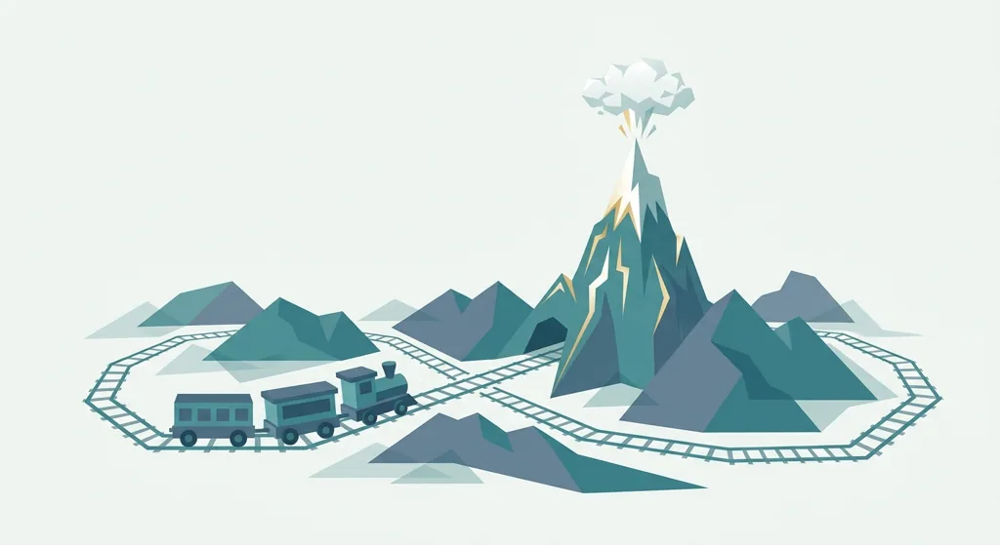
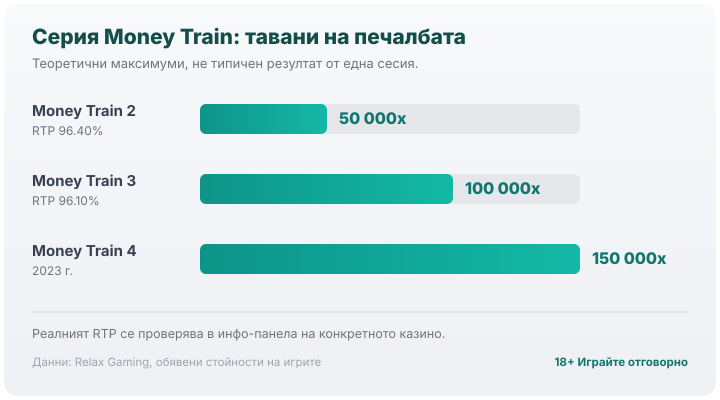

Title tag: Relax Gaming: профил на доставчика, механики и топ слотове
Meta description: Кой е Relax Gaming, какви слотове и механики прави (Money Train, Dream Drop) и защо лицензът не е предимство, а реалният RTP се проверява в инфо-панела.

---

# Relax Gaming: профил на доставчика, механики и топ слотове

Relax Gaming е основана през 2010 г. и днес стои зад едни от най-разпознаваемите високоволатилни ротативки в онлайн казиното: серията Money Train и мрежовия джакпот Dream Drop. Централата е в Малта, а студия и офиси има и в Швеция, Естония, Сърбия и Гибралтар. От 1 октомври 2021 г. компанията е част от Kindred Group, който изкупи и последния дял в нея.

## Кой стои зад логото „Relax"

Патрик Йостеракер и Яни Текониеми стартират Relax Gaming през 2010 г. с идея за технологичен доставчик, а не само студио за игри. Разликата личи и до днес. Освен собствените си заглавия Relax държи две партньорски програми, Silver Bullet и Powered By Relax, през които разпространява игрите на десетки други студия към стотици оператори по света. Затова, когато видиш логото на Relax в лобито, играта невинаги е тяхна.

## Какво прави Relax разпознаваеми

Високата волатилност е запазена марка. Ротативките на Relax обикновено плащат рядко, но когато плащат, го правят едро. Отличителната им механика е бонус рундът с колекциониране на символи, най-ясно видим в Money Cart на серията Money Train: символи с парични стойности и множители се залепват за екрана и се пресмятат чак накрая. Оттам идват и екстремните тавани на печалбата, с които серията стана известна.

Второто, което ще познаеш веднага, е опцията да си купиш бонуса, feature buy или Bonus Buy. Срещу многократно по-голям залог, да речем 100 или 500 пъти залога, влизаш директно в бонус рунда, вместо да го чакаш. Математиката на играта обаче не се променя. Плащаш предварително за средно същото, което би получил и при чакане, само по-концентрирано и по-бързо. А бюджетът се стопява със същата скорост.

## Dream Drop: мрежовият джакпот

През март 2022 г. Relax пуска Dream Drop, прогресивен джакпот с пет нива: Rapid, Midi, Maxi, Major и Mega. Пулът се пълни от залозите на всички играчи в мрежата, а всяко ниво е с гарантирано изплащане, тоест трябва да падне, преди да прехвърли определен таван. Най-голямото, Mega, може да стигне до **€10 000 000**, а от старта си джакпотът е раздал над 20 големи Mega печалби. Механиката е ефектна, макар да важи общото за прогресивните джакпоти: приносът към пула идва от твоя оборот, шансът да го уловиш е мъничък и наличието му не намалява домашното предимство на играта.

## Топ слотове на Relax Gaming

Серията Money Train е визитката. Оригиналният Money Train излиза през 2019 г., но истинската популярност идва с Money Train 2 през 2020 г.: таван от **50 000x** залога, обявен RTP **96.40%** и висока волатилност. Money Train 3 (2022 г.) вдига тавана до **100 000x** при RTP **96.10%**, а Money Train 4 (2023 г.) стига до **150 000x**. Тези тавани са теоретични максимуми при почти невъзможно съвпадение на символите, а не типичен резултат от една вечер игра. Огромният таван и високата волатилност вървят ръка за ръка: за да е математически възможна една рядка печалба от 50 000x, повечето завъртания трябва да дават малко или нищо.

*Таваните в серията Money Train растат от 50 000x (MT2) до 150 000x (MT4). Това са теоретични максимуми при почти невъзможно съвпадение, не типичен резултат.*

Извън Money Train каталогът включва заглавия като Temple Tumble и версиите им с Dream Drop джакпот. Популярността на едно заглавие обаче не променя нито неговия RTP, нито волатилността му.

## Лицензи, RTP и какво значат те за теб

Relax Gaming е лицензиран доставчик, познат с регулатори като Британската комисия по хазарта и Malta Gaming Authority, а игрите минават през независими тестови лаборатории; актуалния списък с лицензи винаги можеш да провериш в официалните регистри на съответните комисии. Сертификатът потвърждава, че генераторът на случайни числа е честен и че играта отговаря на обявените си правила. Той не потвърждава, че самите правила са изгодни за теб. Домашното предимство си остава вградено.

Обявеният RTP пък се променя от казино на казино. Много заглавия се доставят в няколко версии с различен процент и операторът избира коя да пусне, така че една и съща игра на Relax може да ти връща различно в различни казина. Числото от рекламата не е задължително онова, което работи в твоето. В [методологията ни](/kak-ocenyavame/) гледаме реалния RTP на конкретния оператор, а не рекламния. Направи същото и ти: отвори инфо-панела на играта и виж кой процент е активен там, преди да заложиш.

Волатилността Relax поддържа съзнателно висока. При ниска волатилност печалбите са чести и дребни; висока волатилност носи дълги сухи серии и редки едри удари. Кое от двете ти пасва е въпрос на бюджет и темперамент. Ако темпото на Money Train не отговаря на банкрола ти, [демо режимът](/slot-igri/) го показва, без да залагаш реални пари.

## Преди да отвориш заглавие на Relax

Искаш ли да сравниш Relax с други имена, [прегледът ни на доставчиците](/blog/games-providers/) стъпва на същата логика. Задай си лимит за загуба и за време преди да отвориш което и да е заглавие, и провери реалния RTP на конкретното казино. 18+ Хазартът може да пристрасти. Играйте отговорно. Ако усетиш, че играта излиза извън контрол, виж [инструментите за отговорна игра](/otgovorna-igra/).

---

**Георги Тодоров**
Публикувано: 14.09.2026 · Последна редакция: 14.09.2026

[About Всички Казина boilerplate]

**Отговорна игра.** 18+ Хазартът може да пристрасти. Играйте отговорно. Ако усетиш, че играта излиза извън контрол или искаш да я ограничиш, виж [инструментите за отговорна игра](/otgovorna-igra/) и възможността за самоизключване чрез националния регистър на уязвимите лица към НАП (подава се писмено само от засегнатото лице). Национална информационна линия за наркотиците, алкохола и хазарта („Солидарност") 0888 99 18 66, делнични дни 10:00–17:00.

**Разкриване на партньорства.** Всички Казина съдържа партньорски (афилиейт) връзки; когато отвориш оферта през такава връзка, това може да финансира сайта, без да променя цената за теб и без да влияе на оценките ни. От 1 август 2026 г. дейността на афилиейт оператори в България се лицензира съгласно Закона за държавния бюджет за 2026 г. (ДВ, бр. 69 от 31.07.2026 г.). Всички Казина е подало заявление за лиценз пред Националната агенция по приходите и очаква издаването му.
