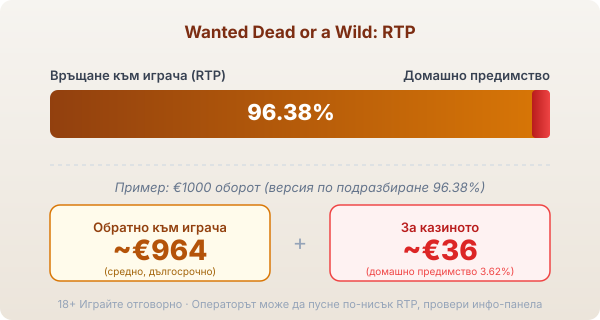

Byline: Editorial | Market: bg (branded slot explainer, guide), published Георги Тодоров

Title tag: Wanted Dead or a Wild: RTP и трите бонус режима
Meta description: Как работи Wanted Dead or a Wild на Hacksaw: DuelReels, трите бонус режима и feature buy. RTP 96.38%, много висока волатилност и защо се проверява.

---

# Wanted Dead or a Wild: RTP и трите бонус режима

Wanted Dead or a Wild е слот на Hacksaw Gaming от 2021 г. с тема от Дивия запад: прашен град, престрелки и издирвани бандити по плакати. Полето е 5 барабана на 5 реда с 15 линии, а волатилността е много висока, 4 от 5 по скалата на доставчика. Механиката, която играта носи като запазена марка, са DuelReels, а най-сериозните пари идват през трите бонус режима. Как Hacksaw подрежда портфолиото си около такива функции личи и в [профила на доставчика](/blog/hacksaw-gaming/).

## DuelReels: откъде идват wild-овете

DuelReels тръгва от VS символите. Падне ли VS върху барабан, двама бандити се изправят на дуел и победителят разширява целия барабан в wild със свой множител някъде между 2× и 100×. Този множител се прилага върху всяка печеливша комбинация, която минава през барабана. Когато няколко барабана станат wild в едно завъртане и участват в обща печалба, стойностите на множителите им се събират и умножават печалбата по линията. Няколко високи множителя, паднали заедно, са една от причините играта да се помни, но такова подреждане е рядко. Оттук идват и по-едрите резултати в основната игра, преди изобщо да си стигнал до бонус.

## Трите бонус режима

Трите режима имат различен характер. The Great Train Robbery е рундът с безплатни завъртания и лепкави wild символи, които остават по местата си до края. Duel at Dawn също дава безплатни завъртания, но с по-чести VS символи, тоест повече дуели и повече wild барабани на екрана. Dead Man's Hand работи по друга логика: първо събираш символи през серия ре-спинове, а после идва финална фаза с три завъртания за разплата. Всеки от трите се пуска от самата игра и може да бъде купен директно.

## Feature buy: цената е реален залог

Купуването на бонус струва според режима, 80× залога за The Great Train Robbery, 200× за Duel at Dawn и 400× за Dead Man's Hand. При залог €1 това са съответно €80, €200 и €400. Сумата е реален залог, а не депозит срещу гарантиран резултат. Плащаш, за да влезеш в бонуса веднага, но какво ще извади той пак зависи от случайността, и едно скъпо купуване спокойно може да завърши с връщане под платеното. За играч с малък бюджет 400× залога изгарят сесията за едно натискане, затова купуването е за хора, които вече знаят, че тези пари могат да изчезнат наведнъж.

## RTP: число, което се проверява

Обявеният RTP на Wanted Dead or a Wild е 96.38% в основната версия, което оставя домашно предимство от 3.62%. При €1000 оборот това означава средно връщане от порядъка на €964 в дългосрочен план и около €36 за казиното, разпределени върху много завъртания. Hacksaw доставя играта и в по-ниски конфигурации, 94.55%, 92.33% и 88.42%, а операторът избира коя от тях да пусне. Една и съща игра при две казина може да ти връща различен процент, затова в [методологията ни](/kak-ocenyavame/) гледаме реалния RTP на конкретното казино, а не рекламния. Отвори инфо-панела на играта, преди да заложиш, за да видиш кое число работи там.

*Обявен RTP 96.38% (версия по подразбиране): при €1000 оборот средно ~€964 се връщат на играча, ~€36 остават за казиното. Възможни са и по-ниски версии (94.55%, 92.33%, 88.42%), затова провери инфо-панела.*

## Много висока волатилност значи търпение

Волатилността тук е от най-високите. Балансът пада бавно през дребни или никакви печалби, а едрите резултати идват рядко и почти винаги през дуел с висок множител или през бонус режим. Дълга суха серия е нормална за такъв профил. Максималната печалба е 12,500× залога, тоест теоретични €12,500 при залог €1, само че вероятността е нищожна и няма място в никаква сметка за бюджет. Поредица от почти-попадения не значи, че следващото завъртане ще донесе дуела.

## Преди реални пари

Темпото и обещанието на трите режима правят Wanted Dead or a Wild игра, в която лесно се засилваш. [Слот игрите](/slot-igri/) обикновено имат демо режим, в който да видиш колко рядко идва голямото завъртане, без да залагаш. Задай си лимит за загуба и за време преди първото завъртане и го спазвай, особено ако те сърби да купиш бонус. 18+ Хазартът може да пристрасти. Играйте отговорно. Ако усетите, че играта излиза извън контрол, вижте [инструментите за отговорна игра](/otgovorna-igra/).

## Струва ли си

Wanted Dead or a Wild е една от игрите, с които Hacksaw се наложи, и DuelReels държи вниманието без излишни каскади. Кое число реално играеш обаче зависи от казиното: обявените 96.38% може да са свалени до по-ниска версия. Feature buy е скъп и не купува резултат. Провери инфо-панела, преди да седнеш, и залагай сума, която можеш да загубиш изцяло.

---

**Георги Тодоров**
Публикувано: 14.09.2026 · Последна редакция: 14.09.2026

[About Всички Казина boilerplate]

**Отговорна игра.** 18+ Хазартът може да пристрасти. Играйте отговорно. Ако усетиш, че играта излиза извън контрол или искаш да я ограничиш, виж [инструментите за отговорна игра](/otgovorna-igra/) и възможността за самоизключване чрез националния регистър на уязвимите лица към НАП (подава се писмено само от засегнатото лице). Национална информационна линия за наркотиците, алкохола и хазарта („Солидарност") 0888 99 18 66, делнични дни 10:00–17:00.

**Разкриване на партньорства.** Всички Казина съдържа партньорски (афилиейт) връзки; когато отвориш оферта през такава връзка, това може да финансира сайта, без да променя цената за теб и без да влияе на оценките ни. От 1 август 2026 г. дейността на афилиейт оператори в България се лицензира съгласно Закона за държавния бюджет за 2026 г. (ДВ, бр. 69 от 31.07.2026 г.). Всички Казина е подало заявление за лиценз пред Националната агенция по приходите и очаква издаването му.
