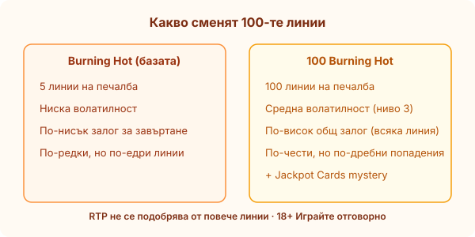
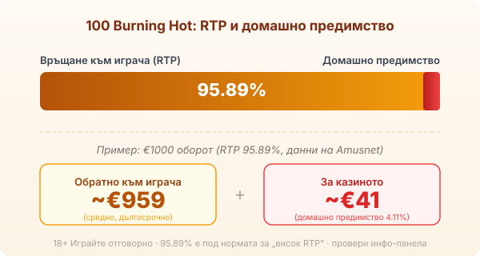

Title tag: 100 Burning Hot: RTP, характеристики и Jackpot Cards
Meta description: 100 Burning Hot на Amusnet (EGT): 100 линии, RTP 95.89%, детелина-wild, два скатера и Jackpot Cards mystery джакпот на 4 нива. Защо повече линии не значат по-добри шансове.

---

# 100 Burning Hot: RTP, характеристики и Jackpot Cards

*Числото в името е броят линии, не по-добър шанс: 100 линии значат по-чести дребни удари, но и по-висок общ залог.*

100 Burning Hot е от онези игри, които изглеждат познати още преди да завъртиш. Плодове, лъскава седмица, звезда и долар, всичко в стила на класическите машини на Amusnet, известни у нас като EGT. Разликата спрямо оригиналния Burning Hot е в числото отпред: сто линии на печалба вместо пет. Звучи като повече шанс, но числото „100" описва механика, не късмет, и си струва да разбереш какво точно купуваш с всяка от тези линии.

## Какво значи „100" в името

Базовият Burning Hot играе на 5 линии; тази версия ги качва на 100 фиксирани линии върху мрежа от 5 барабана и 4 реда. Повече линии значат две неща едновременно. От една страна, печелившите комбинации падат по-често, защото има много повече начини да се подредят символи. От друга, всяка линия се плаща, така че общият залог за едно завъртане е по-висок. По-честите попадения лесно създават усещане за щедрост, но много от тях са по-малки от самия залог. Затова 100-линиеният формат не е „по-печеливш", а просто по-плътен: повече, но по-дребни събития, при по-голяма сума на завъртане.

## Символите: детелина, долар и звезда

Специалните символи са три. Четрилистната детелина е wild и замества обикновените символи, за да допълва комбинации. Доларът и звездата са скатери, тоест плащат независимо от линиите, стига да се появят достатъчно от тях някъде на екрана. Звездата има и самостоятелна стойност, която при пълен екран може да стигне до 2000 пъти залога. Най-високо платеният обикновен символ е седмицата: пет седмици на линия носят до 3000 пъти залога на тази линия. Това са теоретичните тавани на отделните символи, не типични резултати.

## RTP: число под нормата за „висок RTP"

Обявеният RTP на 100 Burning Hot по данни на производителя Amusnet е 95.89%, което оставя домашно предимство от около 4.11%. При €1000 оборот това означава средно връщане от порядъка на €959 в дългосрочен план и около €41 за казиното, разпределени върху много завъртания. Има уговорка: EGT доставя игрите в няколко конфигурации, а операторът избира коя да пусне, така че проверете точното число в инфо-панела на твоето казино (някои източници цитират и по-висок процент). Струва си да отбележим, че 95.89% е под онова, което обикновено броим за [висок RTP](/slot-igri/visok-rtp/); играта не е сред най-щедрите по математика. Затова в [методологията ни](/kak-ocenyavame/) гледаме реалния процент в инфо-панела на конкретното казино, а не рекламния.

*Обявен RTP 95.89% (данни на Amusnet): при €1000 оборот средно ~€959 се връщат на играча, ~€41 остават за казиното. EGT доставя и други конфигурации, затова провери инфо-панела.*

## Волатилност: средна, с дълги равни отсечки

Amusnet описва играта като средна по волатилност (ниво 3 по вътрешната скала). На практика 100-линиеният формат дава чести дребни попадения, които държат баланса в движение, докато по-големите удари, включително mystery джакпотът, идват рядко. Това е по-мек ритъм от екстремно волатилен слот, но не бъркай честотата на дребните печалби с печелившост: те често са по-малки от залога за завъртане.

## Jackpot Cards: mystery джакпотът на 4 нива

Истинската притегателна сила на серията е Jackpot Cards, споделеният mystery джакпот на Amusnet. Той може да се задейства на случаен принцип след всяко завъртане, независимо от резултата на самата ротативка. Влезеш ли в него, виждаш 12 обърнати карти и ги отваряш една по една, докато събереш три от една боя. Боята решава кое от четирите нива печелиш: спатия, каро, купа или пика, подредени от най-малкото до най-голямото. Важното за разбиране е откъде идват тези пари. Джакпотът се пълни от залозите на играчите през мрежата от EGT игри, не е бонус, който казиното добавя отгоре. Затова и голямото ниво е рядко събитие, а не разумно очакване за сесия.

## Gamble функцията: удвояване, което реже и в двете посоки

След печелившо завъртане играта предлага комар: познай цвета на скрита карта и удвои печалбата, сгреши и я губиш цялата. Математически това е чиста монета, залог с приблизително равен шанс, който нито добавя, нито отнема от дългосрочното предимство, но рязко вдига волатилността на конкретната сесия. Няколко удвоявания подред могат да превърнат прилична печалба в нула за секунди. Ако използваш комара, прави го с предварително решение докъде спираш, не на инерция. 18+ Хазартът може да пристрасти. Играйте отговорно. Ако усетите, че играта излиза извън контрол, вижте [инструментите за отговорна игра](/otgovorna-igra/).

## Повече линии не значи по-добри шансове

100 Burning Hot взема позната класика и я разширява до сто линии с mystery джакпот отгоре. Това я прави по-динамична, но не по-щедра: RTP е под средното за високо изплащащите слотове, дребните попадения често са под залога, а голямата награда е рядка по дизайн. Пробвай я първо в [демо режим](/slot-igri/), за да усетиш темпото и цената на сто линии, задай си лимит за загуба и за време, и играй със сума, която можеш да загубиш изцяло. Числото в името продава повече, отколкото връща.

---

**Георги Тодоров**
Публикувано: 15.09.2026 · Последна редакция: 15.09.2026

[About Всички Казина boilerplate]

**Отговорна игра.** 18+ Хазартът може да пристрасти. Играйте отговорно. Ако усетиш, че играта излиза извън контрол или искаш да я ограничиш, виж [инструментите за отговорна игра](/otgovorna-igra/) и възможността за самоизключване чрез националния регистър на уязвимите лица към НАП (подава се писмено само от засегнатото лице). Национална информационна линия за наркотиците, алкохола и хазарта („Солидарност") 0888 99 18 66, делнични дни 10:00–17:00.

**Разкриване на партньорства.** Всички Казина съдържа партньорски (афилиейт) връзки; когато отвориш оферта през такава връзка, това може да финансира сайта, без да променя цената за теб и без да влияе на оценките ни. От 1 август 2026 г. дейността на афилиейт оператори в България се лицензира съгласно Закона за държавния бюджет за 2026 г. (ДВ, бр. 69 от 31.07.2026 г.). Всички Казина е подало заявление за лиценз пред Националната агенция по приходите и очаква издаването му.
