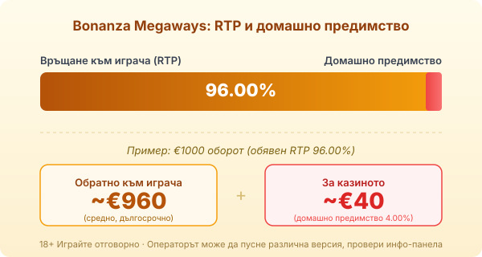

Byline: Георги Тодоров | Market: BG — game explainer (guide), editorial-leaning register, signed Тодоров

Title tag: Bonanza Megaways: RTP, 117 649 начина и множителят
Meta description: Как работи Bonanza Megaways на Big Time Gaming: 117 649 начина, каскади и неограниченият множител в безплатните завъртания. RTP 96% и защо се проверява.

---

# Bonanza Megaways: RTP, 117 649 начина и множителят

Bonanza Megaways излиза през декември 2016 г. и е слотът, който изкара Megaways от нишата на масата. Big Time Gaming пуска златна мина, в която броят на начините за печалба се мени на всяко завъртане и стига до 117 649. Линии няма, има реакции: печелившите символи изчезват, отгоре падат нови, а сериозната игра се разиграва в безплатните завъртания, където множителят няма таван.

## Откъде идват 117 649 начина

Полето е шест барабана, но всеки от тях показва между два и седем символа на завъртане, а над средните четири барабана се върти още една хоризонтална лента с допълнителни символи. Броят на начините е произведението на символите по всеки барабан, тоест при седем на всичките шест се получава 7⁶, или 117 649. Затова числото подскача при всяко завъртане: понякога няколкостотин начина, понякога над сто хиляди. Самата механика се нарича [Megaways](/blog/megaways-kak-rabotyat/), а Bonanza е заглавието, което я направи разпознаваема.

## Реакциите: печелившите падат, местата се пълнят

Печелившата комбинация се маха от полето, а символите над нея се свличат надолу и запълват дупките. Едно завъртане така навързва няколко печалби една след друга, докато спрат да падат съвпадения. В основната игра това удължава завъртането и от време на време струпва прилична сметка, но рядко нещо повече. Голямото се пази за бонуса.

## Множителят в безплатните завъртания

Бонусът тръгва, когато на горната лента се подредят поне четири златни символа, които изписват думата GOLD. Началото е 12 безплатни завъртания, а всеки допълнителен златен символ в завъртането, което ги е задействало, добавя по пет. В този режим над полето стои множител, който започва от 1 и се качва с единица след всяка печеливша реакция, без горна граница. Дълга верига от каскади може да го вдигне високо, преди да спре, и оттам идват едрите резултати на играта. В основната игра този множител се нулира между завъртанията; в бонуса се трупа през целия рунд.

## RTP: 96% и защо не е точно това

Обявеният RTP на Bonanza Megaways е 96.00%, което оставя домашно предимство от 4.00%. Върху €1000 оборот това означава средно връщане от порядъка на €960 в дългосрочен план и около €40 за казиното, разпределени върху хиляди завъртания. Числото описва играта в милиони завъртания, а не една твоя вечер. Струва си да отвориш инфо-панела при конкретното казино, преди да заложиш: [методологията ни](/kak-ocenyavame/) гледа реалния RTP на място, защото едно и също заглавие понякога върви с различна версия при различни оператори.

*Обявен RTP 96.00%: при €1000 оборот средно ~€960 се връщат на играча, ~€40 остават за казиното (домашно предимство 4.00%). Провери инфо-панела в конкретното казино.*

## Висока волатилност и таванът 26 000×

Bonanza е игра с висока волатилност. Балансът се топи през дребни печалби и празни завъртания в основната игра, а сериозното идва рядко и почти винаги през натрупания множител в бонуса. Дълъг период без свестен бонус е нормален за такъв профил, не повреда на играта. Таванът е 26 000× залога, тоест при €1 залог теоретични €26 000, само че вероятността да го докоснеш е нищожна и такова число няма място в никаква сметка за бюджет.

## Преди реални пари

Каскадите вървят бързо и без бонус играта може да глътне доста, преди да си усетил. [Слот игрите](/slot-igri/) обикновено имат демо режим, в който да видиш колко рядко се подрежда думата GOLD, без да залагаш свои пари. Реши си лимит за загуба и за време още преди първото завъртане и го спазвай, дори когато поредната каскада ти нашепва, че големият бонус е на следващия спин. 18+ Хазартът може да пристрасти. Играйте отговорно. Ако усетите, че играта излиза извън контрол, вижте [инструментите за отговорна игра](/otgovorna-igra/).

## Струва ли си

Осем години по-късно Bonanza още е еталонът, с който се мерят Megaways слотовете, и неограниченият множител в бонуса си остава причината да го отвориш. Само че същият този механизъм прави играта брутална в основния режим: може да въртиш дълго за нищо и целият смисъл да опре до един бонус, който да не дойде тази вечер. Влез с пари, които можеш да загубиш докрай, и с ясното съзнание, че 26 000× е витрина, не план.

---

**Георги Тодоров**
Публикувано: 15.09.2026 · Последна редакция: 15.09.2026

[About Всички Казина boilerplate]

**Отговорна игра.** 18+ Хазартът може да пристрасти. Играйте отговорно. Ако усетиш, че играта излиза извън контрол или искаш да я ограничиш, виж [инструментите за отговорна игра](/otgovorna-igra/) и възможността за самоизключване чрез националния регистър на уязвимите лица към НАП (подава се писмено само от засегнатото лице). Национална информационна линия за наркотиците, алкохола и хазарта („Солидарност") 0888 99 18 66, делнични дни 10:00–17:00.

**Разкриване на партньорства.** Всички Казина съдържа партньорски (афилиейт) връзки; когато отвориш оферта през такава връзка, това може да финансира сайта, без да променя цената за теб и без да влияе на оценките ни. От 1 август 2026 г. дейността на афилиейт оператори в България се лицензира съгласно Закона за държавния бюджет за 2026 г. (ДВ, бр. 69 от 31.07.2026 г.). Всички Казина е подало заявление за лиценз пред Националната агенция по приходите и очаква издаването му.
