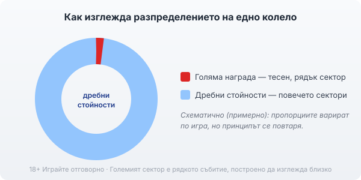
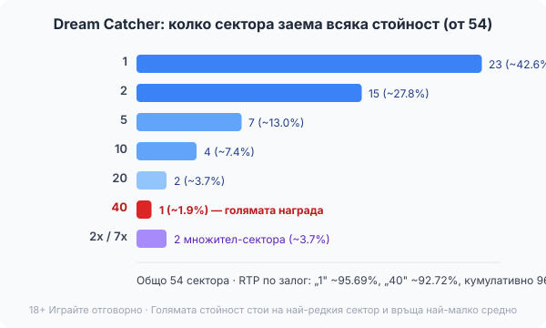

Title tag: Бонус колело: как колелото определя наградата
Meta description: Бонус колелото изглежда като равен шанс за всичко, но секторите са претеглени: голямата награда стои на най-редкия сектор. Как работят колелата, примерът Dream Catcher и защо RTP варира.

---

# Бонус колело: как колелото определя наградата

*Секторите изглеждат равни, но голямата награда обикновено стои на най-тесния или най-рядкия сектор.*

Бонус колелото е един от най-приятните моменти в казиното. Играта спира, появява се голямо въртящо се колело, стрелката забавя и за секунда всичко е възможно. Точно това усещане за „равен шанс за всичко" е и капанът. Колелото изглежда честно, защото секторите му са еднакви на вид, но зад визията стои разпределение, което рядко е в твоя полза за голямата награда.

## Какво всъщност е бонус колело

По същество колелото е списък с награди, подредени в кръг. Завърташ го, то спира на един сектор и печелиш това, което пише там. Стойностите варират от съвсем дребни до голямата награда или джакпот. Дотук просто, и точно затова механиката е толкова разпространена: разбира се от пръв поглед и не иска стратегия. Проблемът не е в правилата, а в допускането, което правим наум, че всеки сектор има равен шанс да излезе.

## Защо равните на вид сектори не са равен шанс

Има два начина едно колело да наклони везните. Първият се вижда: голямата награда заема един тесен сектор, а дребните стойности се повтарят на много места из кръга. Вторият не се вижда: дори когато секторите изглеждат еднакви, зад тях може да стои генератор на случайни числа, който дава на всеки сектор различна тежест. В онлайн игрите резултатът се определя от софтуер, не от физиката на въртенето, така че „колко голям изглежда секторът" и „колко често излиза" не са едно и също. Големият сектор може да е рядък, без това да личи по картинката.

## Пример: колелото на Dream Catcher

Живото шоу Dream Catcher на Evolution показва принципа ясно, защото разпределението му е публично. Колелото има 54 сектора, но стойностите по тях са разпределени неравномерно. Числото 1 стои на 23 от секторите, числото 2 на 15, петицата на 7, десетката на 4, двайсетицата на 2, а най-голямото число, 40, е само на един сектор. Има и два сектора с множител, 2x и 7x.

Преведено в шансове, това значи, че единицата излиза в около 42.6% от случаите, а голямата четиридесетка в около 1.9%, тоест малко по-често от веднъж на петдесет завъртания. Голямата награда не е скрита, тя е пред очите ти, но стои на едно-единствено място от петдесет и четири.

*Dream Catcher: голямата стойност 40 стои на 1 от 54 сектора (~1.9%), докато дребната 1 покрива 23 сектора (~42.6%).*

## Голямата награда е рядкият сектор, и често с по-нисък RTP

Тук идва обратът, който малцина забелязват. При колело с различни стойности процентът на връщане не е един и същ за всеки залог. При Dream Catcher залог върху единицата връща около 95.69% в дългосрочен план, а залог върху четиридесетката около 92.72%; кумулативно играта е обявена на 96.58%. С други думи, секторът, който плаща най-много при удар, е и този, който ти връща най-малко средно. Голямата награда струва двойно: тя е и по-рядка, и по-скъпа откъм очаквана стойност. Затова в [методологията ни](/kak-ocenyavame/) гледаме реалния процент на връщане за конкретния залог, а не само рекламното число на играта.

## Къде срещаш колело

Колелото се появява в три познати форми. Живите шоу игри като Dream Catcher са изцяло колело. В [слот игрите](/slot-igri/) колелото често е бонус функция, която се пуска при определен символ и раздава множител или безплатни завъртания. А при [прогресивните джакпоти](/blog/progresivni-dzhakpoti/) колелото понякога е финалната стъпка, която решава кое ниво на джакпота печелиш. И в трите случая важи същото: секторите не са равновероятни, а голямата награда е рядкото събитие, за което е построена цялата анимация.

## Колелото е част от RTP, не бонус отгоре

Лесно е да усетиш колелото като подарък от казиното, защото идва „безплатно" след завъртане или бонус символ. Не е. Изплащанията му са вече включени в процента на връщане на играта. Казиното не добавя пари, когато колелото се завърти; то ти връща част от онова, което вече е заложено, само по по-драматичен начин. Ефектната анимация е дизайн, не щедрост.

## Гледай къде стои голямото число

Следващия път, когато колелото се появи, не гледай колко лъскаво се върти, а къде стои голямата награда и колко място заема. Ако е един тесен сектор сред много дребни, картината е ясна: това е рядко събитие, построено да изглежда близко. Задай си лимит за загуба и за време преди да седнеш на такава игра и го спазвай, независимо колко пъти стрелката спре „на косъм" от голямото. 18+ Хазартът може да пристрасти. Играйте отговорно. Ако усетите, че играта излиза извън контрол, вижте [инструментите за отговорна игра](/otgovorna-igra/).

---

**Георги Тодоров**
Публикувано: 15.09.2026 · Последна редакция: 15.09.2026

[About Всички Казина boilerplate]

**Отговорна игра.** 18+ Хазартът може да пристрасти. Играйте отговорно. Ако усетиш, че играта излиза извън контрол или искаш да я ограничиш, виж [инструментите за отговорна игра](/otgovorna-igra/) и възможността за самоизключване чрез националния регистър на уязвимите лица към НАП (подава се писмено само от засегнатото лице). Национална информационна линия за наркотиците, алкохола и хазарта („Солидарност") 0888 99 18 66, делнични дни 10:00–17:00.

**Разкриване на партньорства.** Всички Казина съдържа партньорски (афилиейт) връзки; когато отвориш оферта през такава връзка, това може да финансира сайта, без да променя цената за теб и без да влияе на оценките ни. От 1 август 2026 г. дейността на афилиейт оператори в България се лицензира съгласно Закона за държавния бюджет за 2026 г. (ДВ, бр. 69 от 31.07.2026 г.). Всички Казина е подало заявление за лиценз пред Националната агенция по приходите и очаква издаването му.
