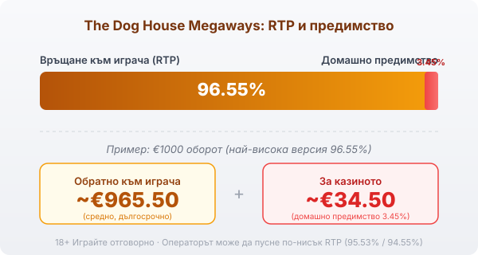

Title tag: The Dog House Megaways: RTP и двата бонус режима
Meta description: The Dog House Megaways: 6 колони, до 117 649 начина, каскади и избор между Sticky Wilds и Raining Wilds. RTP 96.55%, волатилност 5/5, таван 12,305x.

---

# The Dog House Megaways: RTP, 117 649 начина и двата бонус режима

The Dog House Megaways взема познатото куче от оригинала и го слага на съвсем различна машина. Вместо 5×3 с 20 фиксирани линии тук работи Megaways двигател на Pragmatic Play: 6 колони, по 2 до 7 символа на всяка, и брой начини за печалба, който се мени на всяко завъртане, от 64 чак до 117 649. Темата и лепкавите wild-ове остават, но почти всичко около тях е друго, включително това, че при бонуса вече избираш как да играеш.

## Шест колони и променлив брой начини

Всяка от шестте колони показва между 2 и 7 символа, а броят им се определя наново за всяко завъртане. Когато всичките шест излязат със седем символа, начините за печалба стигат тавана от 117 649; при по-плитки колони падат до 64. Печели се по съседни колони отляво надясно, без фиксирани линии да броиш. Механиката е каскадна: печелившите символи изчезват, отгоре падат нови и едно завъртане може да плати няколко пъти подред. Самата Megaways механика е лицензирана от Big Time Gaming, а Pragmatic Play я слага под темата на кучето.

## Бонусът тръгва от лапите, но избираш режима

Безплатните завъртания се отключват от 3 до 6 символа-лапа (Paw Print), които се броят навсякъде по екрана. Разликата спрямо оригинала идва веднага след това: щом бонусът тръгне, играта те кара да избереш един от два режима, преди да завърти. Изборът е еднократен за целия бонус и определя как ще протече, така че си струва да знаеш разликата, преди да го натиснеш.

## Sticky Wilds срещу Raining Wilds

Sticky Wilds дава малко завъртания, но ги трупа. Три лапи отварят 7 завъртания, шест лапи стигат до 20. Wild-овете се появяват по колони 2 до 5, всеки носи множител от 1x до 3x и щом падне, залепва на място до края на бонуса. Заради малкото завъртания силата идва от натрупването: няколко залепени wild-а с високи множители могат да вдигнат едно завъртане рязко.

При Raining Wilds сметката е обратна и залага на обем. Три лапи тук дават 15 завъртания, а шест стигат до 30. На всяко завъртане падат случайни wild-ове с множител 2x или 3x, но не залепват; разчиташ повечето завъртания сами да съберат печеливша комбинация. По-малко концентрирана сила, повече поводи да улучиш.

И в двата режима работи едно правило, което вдига тавана. Когато няколко wild множителя участват в една и съща печалба, стойностите им се умножават помежду си, не се събират. Два wild-а по 3x в една печалба правят 9x.

*Двата режима един до друг: Sticky Wilds (малко завъртания, залепени множители 1x–3x по колони 2–5) срещу Raining Wilds (повече завъртания, валящи wild-ове с 2x–3x). Няколко wild множителя в една печалба се умножават: 3x · 3x = 9x.*

## RTP: обявеното число и версията, която зареждат

Обявеният RTP на The Dog House Megaways в най-високата версия е 96.55%, което оставя домашно предимство от 3.45%. При €1000 оборот това са средно около €965.50 обратно към играча и около €34.50 за казиното в дългосрочен план, разпределени върху хиляди завъртания. Както при други заглавия на Pragmatic Play, играта се лицензира в няколко версии: под най-високата стоят билдове от 95.53% и 94.55%, а операторът избира коя да зареди. Един и същ слот при две казина може да ти връща различен процент. В [методологията ни](/kak-ocenyavame/) гледаме реалния RTP на конкретния оператор, не рекламния, затова отвори инфо-панела и провери коя версия работи, преди да заложиш.

*Обявен RTP 96.55% (най-висока версия, домашно предимство 3.45%): при €1000 оборот средно ~€965.50 се връщат на играча, ~€34.50 остават за казиното. Възможни са и по-ниски версии 95.53% и 94.55%, затова провери инфо-панела.*

## Висока волатилност и таванът 12,305x

Волатилността е висока, пет от пет по вътрешната скала. Повече начини за печалба и по-висок таван не носят по-плавен баланс; носят по-дълги серии без нищо и по-редки, но по-едри попадения. Максималната печалба е 12,305x залога, почти двойно над 6750x на оригинала. При €1 залог това са €12,305, но такъв резултат е статистическа рядкост и идва почти само от натрупани множители в бонуса. На практика балансът често пада бавно през дребни или никакви завъртания, докато чакаш бонуса, затова бюджетът трябва да издържи дълги сухи серии между попаденията.

## Какво сменя спрямо оригинала

Темата е същата, машината е друга. Базовият [The Dog House](/slot-igri/) е 5×3 с 20 фиксирани линии, RTP 96.51%, таван 6750x и един-единствен бонус: 10 безплатни завъртания с лепкави wild-ове и множители до 3x. Megaways версията заменя линиите с променливите начини, качва тавана до 12,305x и добавя избора между двата режима. За играч, свикнал с 20-те линии на оригинала, най-осезаемата промяна е ритъмът: каскадите и променливият брой начини правят всяко завъртане по-непредсказуемо по размер. Повече механика значи и по-висока волатилност, така че ако търсиш по-спокоен ритъм със същото куче, оригиналът остава по-меката игра.

## За кого е и как да го подходиш

Megaways версията пасва на играч, който харесва темата, но иска повече движение и е готов да плати за него с търпение и по-суров баланс. Изборът на режим е истинската добавка: Sticky Wilds концентрира силата в малко завъртания, Raining Wilds я разрежда в повече. Преди реални пари слот игрите обикновено имат демо режим, в който да усетиш колко рядко идва плътният бонус и как се държат двата режима, без да залагаш. Задай си лимит за загуба и за време още преди първото завъртане и залагай със сума, която можеш да загубиш изцяло. 18+ Хазартът може да пристрасти. Играйте отговорно. Ако усетите, че играта излиза извън контрол, вижте [инструментите за отговорна игра](/otgovorna-igra/). Провери кой RTP е зареден, реши кой режим отговаря на бюджета ти и не гони тавана от 12,305x: той е рядкото изключение, не планът.

---

**Георги Тодоров**
Публикувано: 15.09.2026 · Последна редакция: 15.09.2026

[About Всички Казина boilerplate]

**Отговорна игра.** 18+ Хазартът може да пристрасти. Играйте отговорно. Ако усетиш, че играта излиза извън контрол или искаш да я ограничиш, виж [инструментите за отговорна игра](/otgovorna-igra/) и възможността за самоизключване чрез националния регистър на уязвимите лица към НАП (подава се писмено само от засегнатото лице). Национална информационна линия за наркотиците, алкохола и хазарта („Солидарност") 0888 99 18 66, делнични дни 10:00–17:00.

**Разкриване на партньорства.** Всички Казина съдържа партньорски (афилиейт) връзки; когато отвориш оферта през такава връзка, това може да финансира сайта, без да променя цената за теб и без да влияе на оценките ни. От 1 август 2026 г. дейността на афилиейт оператори в България се лицензира съгласно Закона за държавния бюджет за 2026 г. (ДВ, бр. 69 от 31.07.2026 г.). Всички Казина е подало заявление за лиценз пред Националната агенция по приходите и очаква издаването му.
