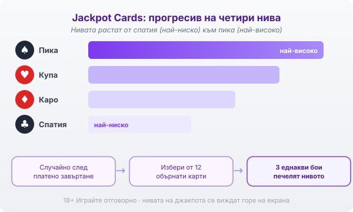
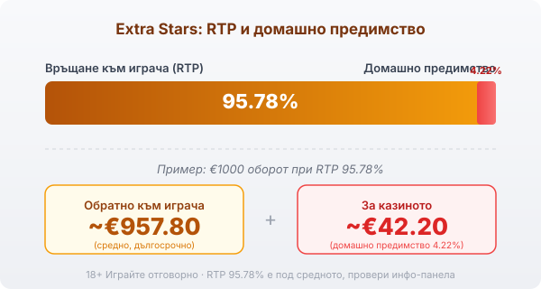

Byline: Георги Тодоров | Market: BG — guide/game-explainer, editorial-leaning teacher voice

# Extra Stars: RTP, разширяваща се звезда и Jackpot Cards

Extra Stars е класическа ротативка на Amusnet Interactive, компанията, която дълги години работеше под името EGT. Стилът е точно този, който българският играч познава от наземните зали: плодове, седмици и звезди върху мрежа от пет колони и три реда. Функциите са малко и цялата игра стъпва върху една механика, разширяващата се звезда с респин, а върху нея виси случайният прогресив Jackpot Cards.

## Основата: 5×3, 10 линии и печалби в двете посоки

Основната игра е толкова традиционна, колкото звучи. Пет колони, три реда, десет фиксирани линии. Отличава я едно нещо от повечето класики: Extra Stars чете печелившите комбинации и в двете посоки, отляво надясно и отдясно наляво, така че една и съща поредица символи може да плати по линия в двете направления. Плодовете и седмиците са символите с по-ниска стойност, звездата стои над тях.

## Разширяващата се звезда движи цялата игра

Звездата е wild и замества останалите символи, но същинската ѝ роля идва на средните колони. Появи ли се звезда на колона 2, 3 или 4, тя се разширява върху цялата колона, изплаща приложимите комбинации и завърта колоните още веднъж безплатно. Този респин е сърцето на играта. Докато цяла лента е запълнена със звезди, шансът за печеливша линия в двете посоки скача осезаемо.

## Респините и защо звездите се трупат

Респинът рядко остава единичен. Падне ли по време на безплатното завъртане нова звезда на колона 2, 3 или 4, тя също се разширява и носи още един респин. Така на екрана може да се задържат две, дори три разширени wild колони едновременно, всяка държаща по цяла лента звезди. Големите завъртания на Extra Stars почти винаги идват от такова наслагване на звезди по няколко колони наведнъж.

## Jackpot Cards: случайният прогресив на четири нива

Освен основната игра, Extra Stars върви със споделения прогресив Jackpot Cards, който Amusnet слага в цяла поредица свои заглавия. Той може да се задейства на случаен принцип след всяко платено завъртане, независимо дали то е спечелило нещо. Пусне ли се, екранът се сменя с 12 обърнати карти и ти обръщаш една по една, докато откриеш три от една и съща боя. Боята решава кое от четирите нива взимаш: спатия за най-ниското, после каро и купа, а пика е челното. Стойностите на четирите джакпота текат на брояч горе на екрана през цялото време, така че виждаш докъде са стигнали, преди изобщо да завъртиш.

*Jackpot Cards: четири нива по боя (спатия най-ниско, пика най-високо); появява се случайно след платено завъртане, а ти избираш от 12 карти до 3 еднакви бои.*

## RTP 95.78% и какво значи на €1000

Обявеният RTP на Extra Stars е 95.78%, което е под средното за индустрията, където повечето модерни ротативки стоят около и над 96%. Домашното предимство е 4.22%. На €1000 оборот това означава средно около €957.80, върнати към играча, и около €42.20, задържани от казиното в дългосрочен план, разпределени върху хиляди завъртания. Класическите заглавия на Amusnet често вървят само в една RTP версия, но това не важи за всяко казино, затова в [методологията ни](/kak-ocenyavame/) гледаме реалния RTP от инфо-панела на конкретния оператор, а не рекламното число.

*RTP 95.78% (домашно предимство 4.22%): при €1000 оборот средно ~€957.80 се връщат на играча, ~€42.20 остават за казиното. Провери инфо-панела на конкретното казино.*

## Хазарт функцията: удвои или загуби

Всяка редова печалба може да мине през хазарт функцията. Отваря се карта с гръб нагоре и залагаш на цвета ѝ, червено или черно. Познаеш ли, печалбата се удвоява и можеш да опиташ пак; сгрешиш ли, губиш цялата сума от завъртането. Шансът е горе-долу равен на всяко теглене, а домашното предимство на самата ротативка не зависи от това дали рискуваш. Функцията е бърз начин да качиш дребна печалба или да я изпуснеш за секунда.

## Волатилност и за кого е Extra Stars

Волатилността е средна, което поставя Extra Stars по средата между спокойните класики и тежките високоволатилни ротативки. Респините носят сравнително чести дребни попадения, а прогресивът виси като рядка, но реална възможност отгоре. Челната награда тук не идва от някакъв обявен таван, а от Jackpot Cards и от подредени разширени звезди по няколко колони. Играта пасва на човек, който харесва старата школа плодове и звезди, познава наземния EGT ритъм и не гони екзотични бонус функции. RTP-то от 95.78% е под средното и това е цената на достъпа до прогресива, така че знай какво получаваш, преди да седнеш.

Преди реални пари [слот игрите](/slot-igri/) на Amusnet почти винаги имат демо режим, в който да усетиш темпото на респините, без да заложиш и стотинка. Задай си лимит за загуба и за време преди първото завъртане и играй само със сума, която можеш да загубиш изцяло. 18+ Хазартът може да пристрасти. Играйте отговорно. Ако усетите, че играта излиза извън контрол, вижте [инструментите за отговорна игра](/otgovorna-igra/).

---

[AUTHOR BIO BLOCK]
[BRAND BOILERPLATE]
[18+ / RG LINE + AFFILIATE DISCLOSURE]

CANON ADDITIONS: none.
[DATA NEEDED]: none. (Max win intentionally omitted — source conflict.)
