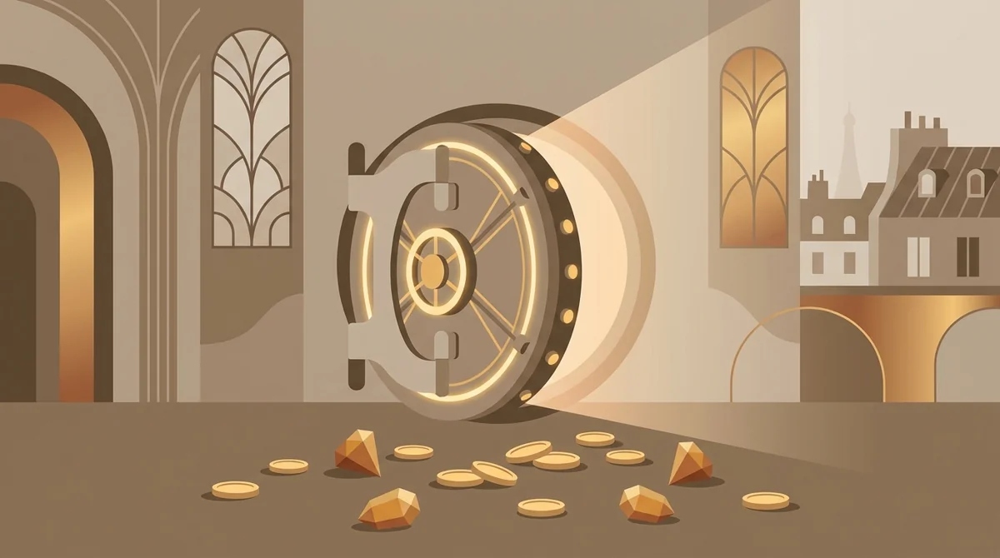
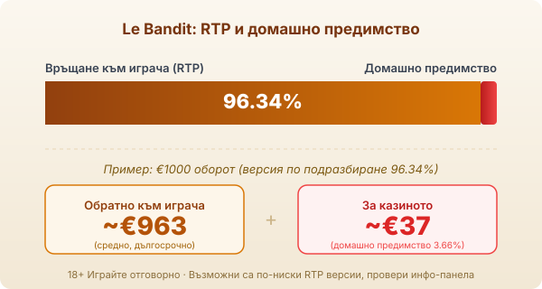

Byline: Георги Тодоров | Market: BG — game explainer (guide), editorial-leaning register, signed Тодоров

Title tag: Le Bandit: RTP, cluster pays и Golden Squares
Meta description: Как работи Le Bandit на Hacksaw Gaming: cluster pays 6×5, Super Cascade, Golden Squares и Rainbow. RTP 96.34%, средна волатилност и защо се проверява.

---

# Le Bandit: RTP, cluster pays и Golden Squares

Le Bandit излиза през август 2023 г. и е една от по-меките игри на Hacksaw Gaming, студио, познато иначе с брутално волатилни заглавия. Темата е френски обир в сепия, с меченок в ролята на крадеца, а полето е шест на пет с печалби на клъстери вместо линии. Подписът на играта са Golden Squares и Rainbow символът, който ги пали.

## Cluster pays на поле 6×5

Печалба се образува от пет или повече еднакви символа, залепени един до друг по хоризонтала или вертикала, а не подредени по линия. Печелившата група изчезва и на нейно място падат нови символи чрез Super Cascade, така че едно завъртане може да навърже няколко попадения подред. Играта пуска печалба на приблизително всяко трето завъртане, което за [Hacksaw Gaming](/blog/hacksaw-gaming/) е сравнително щедро темпо, далеч от дългите сухи серии на най-волатилните им слотове.

## Golden Squares и Rainbow: подписът на играта

Върху полето има маркирани клетки, наречени Golden Squares. Докато стоят заключени, те не правят нищо, но щом на екрана се появи Rainbow символ, той ги активира и всяка от тях разкрива монета със стойност. Монетите идват в три нива: бронзови от 0.2× до 4× залога, сребърни от 5× до 20× и златни от 25× чак до 500×. Един добър Rainbow, който отключи струпани Golden Squares с високи стойности, е начинът, по който Le Bandit прави големите си резултати в основната игра.

## Безплатните завъртания

Три скатера пускат осем безплатни завъртания, четири дават дванадесет, а пет отново дванадесет, но с гарантиран Rainbow на всяко завъртане, което на практика превръща рунда в поредица от активирани Golden Squares. В този режим се появяват и множители тип детелина със стойност от ×2 до ×10, които се качват върху печалбите. Играта предлага и купуване на бонуса срещу кратен на залога, но наличността на тази функция зависи от оператора и пазара, а в някои юрисдикции изобщо липсва.

## RTP: 96.34% и по-ниските версии

Обявеният RTP на Le Bandit е 96.34% при версията по подразбиране, което оставя домашно предимство от 3.66%. Върху €1000 оборот това е средно връщане от порядъка на €963 в дългосрочен план и към €37 за казиното. Hacksaw доставя играта и в по-ниски конфигурации, 94.23%, 92.17% и 88.36%, а кое число върви зависи от оператора. Разликата между 96.34% и 88.36% е огромна за джоба ти във времето, затова [методологията ни](/kak-ocenyavame/) гледа реалния RTP на конкретното казино. Отвори инфо-панела на играта, преди да заложиш, и виж кой процент е активен там.

*Обявен RTP 96.34% (версия по подразбиране): при €1000 оборот средно ~€963 се връщат на играча, ~€37 остават за казиното (домашно предимство 3.66%). Възможни са по-ниски версии (94.23%, 92.17%, 88.36%), провери инфо-панела.*

## Средна волатилност и таванът 10 000×

По скалата на Hacksaw Le Bandit е средно волатилен, три от пет. Балансът се движи по-плавно, отколкото при екстремните им заглавия, печалбите идват по-редовно, но за сметка на това рядко са огромни. Таванът е 10 000× залога, тоест теоретични €10 000 при €1 залог, а вероятността да го докоснеш е около едно на четиринадесет милиона. Ако търсиш точно екстремната крива, [Wanted Dead or a Wild](/blog/wanted-dead-or-a-wild/) на същото студио е другият полюс; Le Bandit е по-балансираната игра.

## Преди реални пари

Каскадите и чакането за Rainbow правят темпото приятно, а приятното темпо е точно когато се засядаш най-лесно. [Слот игрите](/slot-igri/) обикновено имат демо режим, в който да усетиш колко често идва свестен Rainbow, без да залагаш свои пари. Реши си лимит за загуба и за време преди първото завъртане и го спазвай, независимо колко близо ти се струва следващият голям клъстер. 18+ Хазартът може да пристрасти. Играйте отговорно. Ако усетите, че играта излиза извън контрол, вижте [инструментите за отговорна игра](/otgovorna-igra/).

## Струва ли си

Le Bandit е рядкото Hacksaw заглавие, което можеш да въртиш, без да ти къса нервите, и Golden Squares му дават достатъчно характер, за да не е поредният клъстер слот. Само че всичко опира до версията: при 96.34% сделката е нормална, при 88.36% играеш съвсем друга игра за същите пари. Отвори инфо-панела, преди да седнеш, и залагай сума, която можеш да загубиш докрай.

---

**Георги Тодоров**
Публикувано: 15.09.2026 · Последна редакция: 15.09.2026

[About Всички Казина boilerplate]

**Отговорна игра.** 18+ Хазартът може да пристрасти. Играйте отговорно. Ако усетиш, че играта излиза извън контрол или искаш да я ограничиш, виж [инструментите за отговорна игра](/otgovorna-igra/) и възможността за самоизключване чрез националния регистър на уязвимите лица към НАП (подава се писмено само от засегнатото лице). Национална информационна линия за наркотиците, алкохола и хазарта („Солидарност") 0888 99 18 66, делнични дни 10:00–17:00.

**Разкриване на партньорства.** Всички Казина съдържа партньорски (афилиейт) връзки; когато отвориш оферта през такава връзка, това може да финансира сайта, без да променя цената за теб и без да влияе на оценките ни. От 1 август 2026 г. дейността на афилиейт оператори в България се лицензира съгласно Закона за държавния бюджет за 2026 г. (ДВ, бр. 69 от 31.07.2026 г.). Всички Казина е подало заявление за лиценз пред Националната агенция по приходите и очаква издаването му.
