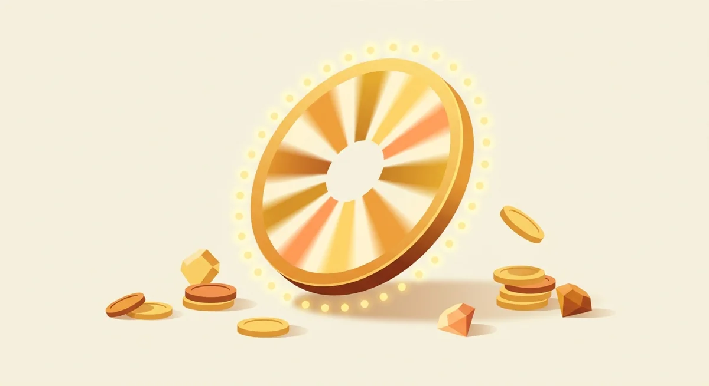
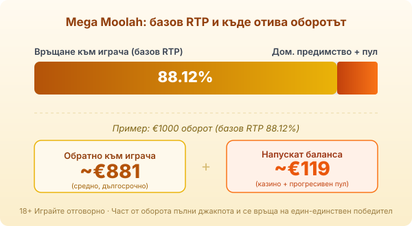

Title tag: Mega Moolah: как работи прогресивният джакпот (RTP 88%)
Meta description: Как работи прогресивният джакпот на Mega Moolah (Microgaming): четирите нива, колелото на случаен принцип и защо базовият RTP е само 88.12%.

---

# Mega Moolah: как работи прогресивният джакпот

Mega Moolah е слотът, който изписа най-големите числа в историята на онлайн джакпотите. Microgaming го пуска през ноември 2006 г. с проста африканска тема и пет барабана, но славата му не идва от основната игра. Идва от четирите нива джакпот и от едно колело, което може да се завърти на случаен принцип във всеки момент и да върне милиони на един-единствен играч.

## Четирите нива на джакпота

Джакпотът не е един, а четири: Mini, Minor, Major и Mega. Първите три са скромни и падат често, Mega е този, за който се говори. Той тръгва от стартова стойност €1 000 000 и расте с всеки залог, направен върху играта в цялата мрежа от казина, които я предлагат. Затова числото се качва бързо и понякога надхвърля десетки милиони, преди някой да го отключи. Това е [прогресивен джакпот](/blog/progresivni-dzhakpoti/) в чист вид: пулът се пълни от оборота на хиляди играчи едновременно.

## Колелото: как се стига до Mega

До нито едно от четирите нива не се стига с комбинация на барабаните. Влиза се през бонус колело, което може да се появи на случаен принцип след всяко завъртане, независимо от залога. Колелото има двадесет сектора и нито един празен, тоест щом се завърти, гарантирано отваря някой от четирите джакпота. Секторите за Mega са малцинство, затова повечето завъртания на колелото връщат Mini или Minor. Голямото се пада рядко.

## Основната игра: лъвът и маймуната

Докато чакаш колелото, върви обикновен слот на пет барабана и двадесет и пет линии. Лъвът е wild и удвоява всяка печалба, в която влезе, а в безплатните завъртания я утроява. Маймуната е скатер: три от нея пускат петнадесет безплатни завъртания, в които всичко се умножава по три и които могат да се подновят. Печалбите тук са нормални за слот отпреди близо две десетилетия, нищо повече. Основната игра е чакалнята, наградата е колелото.

## RTP 88.12%: защо е толкова нисък

Обявеният RTP на Mega Moolah е 88.12%, доста под обичайните 96% за модерен слот. Върху €1000 оборот това е средно връщане от около €881 и близо €119, които напускат баланса ти. Причината за ниското число е самият джакпот: част от всеки залог не се разиграва в основната игра, а отива в прогресивния пул. Тези пари се връщат при играч, но при един късметлия, който завърти колелото на правилния сектор, а не при теб вечерта. Реалният дълготраен процент, ако включиш и изплатените джакпоти, е по-висок от 88.12%, само че идва като лотариен удар, не като редовни връщания. [Методологията ни](/kak-ocenyavame/) третира RTP като статистика върху милиони завъртания, а при джакпот игра тази статистика е особено подвеждаща за една сесия.

*Базов RTP 88.12%: при €1000 оборот средно ~€881 се връщат на играча, ~€119 напускат баланса. Част от този дял захранва прогресивния пул и се връща на един-единствен джакпот победител.*

## Джакпотът е лотария, не стратегия

Рекордът на Mega Moolah е €18 915 872.81, платен през септември 2018 г. Числото е реално и затова играта е легенда, но е разумно да го гледаш като печалба от лото, а не като възможен резултат от вечерта. Залогът върви от €0.01 до €6.25, таванът на обикновената игра е скромен и на практика всичко опира до това дали и кога колелото ще се появи и ще спре на Mega. Шансът за това е нищожен и никой размер на залога не го променя съществено.

## Преди реални пари

Ниският RTP означава, че при дълга игра балансът се топи по-бързо, отколкото при стандартен слот, а компенсацията е само теоретичният шанс за джакпот. [Слот игрите](/slot-igri/) обикновено имат демо режим, в който да видиш темпото, без да залагаш свои пари, но демо колелото няма да ти плати реален джакпот. Реши си лимит за загуба и за време преди първото завъртане и го спазвай, защото точно при джакпот игрите е най-лесно да си кажеш, че следващият спин може да е онзи. 18+ Хазартът може да пристрасти. Играйте отговорно. Ако усетите, че играта излиза извън контрол, вижте [инструментите за отговорна игра](/otgovorna-igra/).

## Струва ли си

Mega Moolah е билет за лотария с огромна награда и нищожен шанс, облечен в слот. Ако това е сделката, която търсиш, знаеш какво купуваш и играеш с малки суми, играта прави точно каквото обещава. Ако искаш редовна игра с приличен баланс във времето, базовите 88.12% работят срещу теб и има по-щедри слотове за същите пари. Влез със сумата за билета, не с бюджета за вечерта.

---

**Георги Тодоров**
Публикувано: 15.09.2026 · Последна редакция: 15.09.2026

[About Всички Казина boilerplate]

**Отговорна игра.** 18+ Хазартът може да пристрасти. Играйте отговорно. Ако усетиш, че играта излиза извън контрол или искаш да я ограничиш, виж [инструментите за отговорна игра](/otgovorna-igra/) и възможността за самоизключване чрез националния регистър на уязвимите лица към НАП (подава се писмено само от засегнатото лице). Национална информационна линия за наркотиците, алкохола и хазарта („Солидарност") 0888 99 18 66, делнични дни 10:00–17:00.

**Разкриване на партньорства.** Всички Казина съдържа партньорски (афилиейт) връзки; когато отвориш оферта през такава връзка, това може да финансира сайта, без да променя цената за теб и без да влияе на оценките ни. От 1 август 2026 г. дейността на афилиейт оператори в България се лицензира съгласно Закона за държавния бюджет за 2026 г. (ДВ, бр. 69 от 31.07.2026 г.). Всички Казина е подало заявление за лиценз пред Националната агенция по приходите и очаква издаването му.
