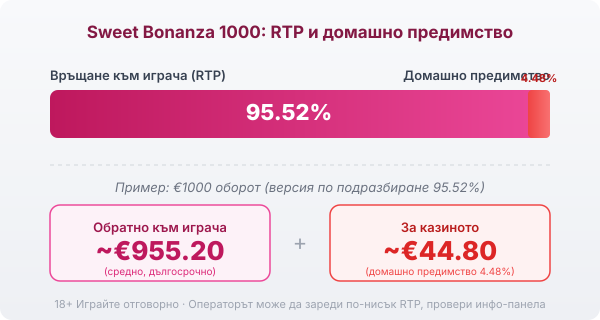
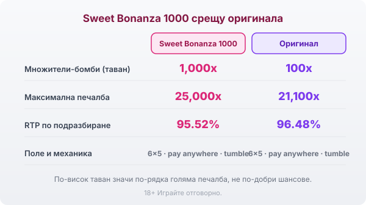

Title tag: Sweet Bonanza 1000: какво променя версията 1000
Meta description: Sweet Bonanza 1000: бомбите растат от 100x на 1,000x, максимумът е 25,000x. Защо това е повече волатилност, не по-добри шансове, и кой RTP реално играеш.

---

# Sweet Bonanza 1000: какво променя версията 1000

Sweet Bonanza 1000 излезе през май 2024 г. и е надстройка на Pragmatic Play върху същата захарна основа, която играчите вече познават от оригиналния Sweet Bonanza. Полето е 6 колони на 5 реда, без линии: осем или повече еднакви символа плащат, независимо къде са паднали по екрана. Печелившите символи изчезват, отгоре падат нови и веригата продължава, докато има печалба. Уайлд символи няма, точно както в оригинала. Числото 1000 сочи една конкретна промяна върху познатата база.

## Множителите-бомби до 1,000x

Промяната, заради която версията носи 1000 в името си, живее в безплатните завъртания. Там падат множители-бомби (в играта rainbow bombs), всяка със стойност между 2x и 1,000x. В оригиналния Sweet Bonanza таванът на такава бомба е 100x. Бомбите остават на екрана до края на цялата tumble верига, стойностите им се събират, а сборът умножава печалбата от завъртането наведнъж. Паднат ли няколко едри бомби в едно плътно завъртане, тяхната сума може да качи средна печалба до най-голямата за сесията.

## Безплатните завъртания и близалките

Бонусът се пуска от 4 или повече символа близалка (скатер) и дава 10 безплатни завъртания. Паднат ли 3 или повече близалки по време на бонуса, добавят се още 5 завъртания. Самите близалки също плащат: 4 близалки носят 3x залога, 5 близалки 5x, а 6 близалки 100x. Множителите-бомби работят само в тези завъртания, затова обикновеното завъртане и попадналият бонус са две различни игри по размера на възможната печалба.

## RTP: рекламните числа и това, което сядаш да играеш

Pragmatic Play пуска Sweet Bonanza 1000 в няколко RTP конфигурации и операторът избира коя да зареди. Най-високата сертифицирана версия връща 96.53%. Най-често заредената по подразбиране е 95.52%. На дъното стои билд от 94.51%. Едно и също заглавие при две казина може да ти връща различен процент, а най-високата бройка почти никога не е тази, която отваряш. Затова в [методологията ни](/kak-ocenyavame/) гледаме реалния RTP на конкретния оператор, а не рекламния, и си струва да отвориш инфо-панела, преди да заложиш.

При версия по подразбиране 95.52% домашното предимство е 4.48%. На €1000 оборот това са средно около €955.20 обратно към играча и около €44.80 за казиното в дългосрочен план, разпределени върху много завъртания. Разликата от една версия до друга е реален лев от джоба ти върху дълга игра.

*Обявен RTP по подразбиране 95.52% (домашно предимство 4.48%): при €1000 оборот средно ~€955.20 се връщат на играча, ~€44.80 остават за казиното. Провери коя версия е заредена в инфо-панела.*

## Таванът 25,000x и колко рядко идва

Максималната печалба е 25,000 пъти залога срещу 21,100x на оригинала. При €1 залог това прави €25,000, но такъв резултат е статистическа рядкост, а не цел за една сесия. Волатилността е пет от пет, най-високата по вътрешната скала. На практика балансът често се топи през дълги серии дребни или празни завъртания, а голямото идва рядко и почти винаги от натрупани бомби в бонуса. По-високият таван прави едрата печалба по-рядка. Шансовете ти на едно завъртане остават същите като преди.

## Sweet Bonanza 1000 срещу оригинала

Двете игри стъпват на едно и също поле 6×5 с pay anywhere и каскади, затова усещането от игра е близко. Числата се разминават: бомбите стигат до 1,000x вместо 100x, максимумът е 25,000x вместо 21,100x, а версията по подразбиране връща 95.52% срещу 96.48% при оригинала. Ако предпочиташ по-спокоен ритъм със същата механика, оригиналният [Sweet Bonanza](/slot-igri/) остава по-меката версия. 1000 е за играч, който съзнателно гони рядкото едро завъртане и приема цената му в търпение и по-нисък процент по подразбиране.

*Sweet Bonanza 1000 срещу оригиналния Sweet Bonanza: същата основа 6×5 (pay anywhere, tumble), но по-висок таван на бомбите (1,000x срещу 100x) и максимум (25,000x срещу 21,100x); RTP по подразбиране 95.52% срещу 96.48%.*

## Bonus buy и ante bet: удобство, не предимство

Ante bet качва залога с 25% и увеличава шанса за близалки, тоест за вход в бонуса. Bonus buy отива по-далеч: срещу фиксирана цена купуваш директно безплатните завъртания, без да ги чакаш. Pragmatic предлага две версии на купуването, чийто RTP е 96.52% при стандартната и 96.55% при по-скъпата „super" опция. Купуването не сваля домашното предимство. Плащаш отпред за достъп до волатилния режим, а математиката в дългосрочен план остава същата. Наличността зависи от юрисдикцията и оператора, а в някои пазари, сред които Обединеното кралство, функцията е забранена. Достъпна ли е, цената ѝ е реален залог и трябва да влезе в бюджета ти като такъв.

## Как да го играеш разумно

Каскадите и растящите бомби правят Sweet Bonanza 1000 бърза игра с високо темпо, а трупащите се на екрана множители създават усещане за близка голяма печалба. Всяко следващо завъртане обаче тръгва от същата математика, колкото и пълен да изглежда екранът. Преди реални пари [слот игрите](/slot-igri/) обикновено имат демо режим, в който да усетиш колко рядко идва плътният бонус, без да залагаш. Задай си лимит за загуба и за време още преди първото завъртане и играй със сума, която можеш да загубиш изцяло. 18+ Хазартът може да пристрасти. Играйте отговорно. Ако усетите, че играта излиза извън контрол, вижте [инструментите за отговорна игра](/otgovorna-igra/).

## За кого е Sweet Bonanza 1000

Играта пасва на играч, който харесва захарната механика на оригинала, но иска по-едрия таван и е готов да търпи дълги сухи серии заради шанса за бомба до 1,000x в бонуса. Ако търсиш по-чести дребни печалби и по-плавен баланс, високата волатилност и по-ниският RTP по подразбиране ще ти дойдат тежко, и тогава оригиналът върши същата работа по-спокойно. Провери коя версия е заредена в инфо-панела и залагай със сума, която можеш да загубиш изцяло.

---

**Георги Тодоров**
Публикувано: 15.09.2026 · Последна редакция: 15.09.2026

[About Всички Казина boilerplate]

**Отговорна игра.** 18+ Хазартът може да пристрасти. Играйте отговорно. Ако усетиш, че играта излиза извън контрол или искаш да я ограничиш, виж [инструментите за отговорна игра](/otgovorna-igra/) и възможността за самоизключване чрез националния регистър на уязвимите лица към НАП (подава се писмено само от засегнатото лице). Национална информационна линия за наркотиците, алкохола и хазарта („Солидарност") 0888 99 18 66, делнични дни 10:00–17:00.

**Разкриване на партньорства.** Всички Казина съдържа партньорски (афилиейт) връзки; когато отвориш оферта през такава връзка, това може да финансира сайта, без да променя цената за теб и без да влияе на оценките ни. От 1 август 2026 г. дейността на афилиейт оператори в България се лицензира съгласно Закона за държавния бюджет за 2026 г. (ДВ, бр. 69 от 31.07.2026 г.). Всички Казина е подало заявление за лиценз пред Националната агенция по приходите и очаква издаването му.
