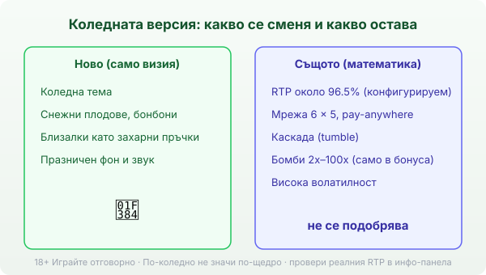
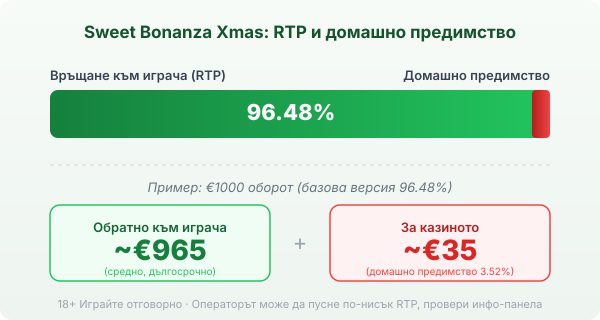

Title tag: Sweet Bonanza Xmas: какво променя коледната версия
Meta description: Sweet Bonanza Xmas сменя визията на познатата игра, но не и математиката: pay-anywhere, множители 2x–100x в бонуса, конфигурируем RTP около 96.5%. Защо празничната тема не подобрява шансовете.

---

# Sweet Bonanza Xmas: какво променя коледната версия

*Коледната версия сменя визията; математиката остава на базовата Sweet Bonanza.*

Всеки декември Sweet Bonanza сменя дрехите. Плодовете стават снежни, близалките получават цвят на захарна пръчка, а фонът светва в червено и зелено. Заглавието се казва Sweet Bonanza Xmas и Pragmatic Play го пуска като сезонен вариант на една от най-разпознаваемите си игри. Изглежда празнично и точно затова се търси около Коледа. Въпросът, който си струва да зададеш, преди да завъртиш, е дали под новата визия има нова игра, или само нова опаковка.

## Нов скин, същата математика

Коротката версия: сменя се картинката, не сметката. Sweet Bonanza Xmas работи на същата мрежа от 6 колони и 5 реда, със същата каскадна механика и същия начин на печелене като оригинала. Символите са коледни, но структурата зад тях е тази, която вече описахме за [базовата Sweet Bonanza](/blog/sweet-bonanza/). Затова е честно да гледаш на Xmas като на реставрирана витрина: примамлива през декември, но с идентична стока отзад. Празничният блясък не мести нито едно число в твоя полза.

## Как се печели без линии

Тук няма линии на печалба, които да следиш. Механиката е „pay anywhere": ако 8 или повече еднакви символа паднат някъде из полето, комбинацията плаща, независимо къде стоят. Погледът не търси редици, а брои колко от един и същ символ са се събрали. Колкото повече еднакви, толкова по-голяма е печалбата за този символ, а полето е широко, така че често се засичат няколко групи наведнъж.

## Каскадата: едно завъртане, няколко удара

Печелившите символи не остават на екрана. След като платят, изчезват и на тяхно място падат нови отгоре. Ако новите допълнят следваща печеливша група, тя също плаща и процесът се повтаря. Тази верига, наречена tumble, продължава, докато дойде подредба без печалба. Едно завъртане така може да донесе няколко печалби подред. Каскадата не добавя пари извън RTP-то на играта; тя просто разпределя вече заложената печалба на няколко стъпки, което създава усещане за движение дори когато сумите са дребни.

## Безплатните завъртания и множителите-бомби

Специалният символ е близалката, която играе ролята на scatter. Съберат ли се 4 или повече от нея някъде на екрана, играта дава 10 безплатни завъртания. В този режим се включва и онова, което повечето играчи чакат: бомбите. По полето падат захарни бомби със стойност от 2x до 100x. Когато каскадата спре, стойностите на всички бомби на екрана се събират и умножават общата печалба от завъртането. Извън безплатните завъртания бомби няма. Затова обикновеното завъртане и попадналият бонус са на практика две различни игри по размер на печалбата, и голямата част от потенциала на Sweet Bonanza Xmas живее в бонуса, а не в базовия режим.

## RTP: число, което се проверява

Обявеният RTP на Sweet Bonanza Xmas е около 96.5%, което оставя домашно предимство от порядъка на 3.5%. При €1000 оборот това означава средно връщане около €965 в дългосрочен план и около €35 за казиното, разпределени върху много завъртания. Има уговорка обаче: Pragmatic Play доставя играта в няколко конфигурации с различен RTP, а операторът избира коя да пусне. `[VERIFY]` точната версия и максималната печалба (таванът е от порядъка на 21 100 пъти залога) при конкретното казино. Заради това в [методологията ни](/kak-ocenyavame/) гледаме реалния RTP, а не рекламния. Отвори инфо-панела на самата игра при твоето казино и виж кое число работи там, преди да заложиш.

*Обявен RTP около 96.5% (базова версия 96.48%): при €1000 оборот средно ~€965 се връщат на играча, ~€35 остават за казиното. Възможни са и по-ниски конфигурации, затова провери инфо-панела.*

## Волатилност и таван: търпение и рядкости

Sweet Bonanza Xmas е игра с висока волатилност. На практика това значи дълги отсечки, в които балансът пада бавно през дребни или никакви печалби, прекъсвани рядко от голям удар, обикновено в безплатните завъртания. Максималната теоретична печалба е екстремно рядко събитие, а не разумно очакване. Ако видиш многохилядния множител в рекламата, гледай на него като на далечна възможност, не като на цел, около която да планираш бюджет.

## Ante bet и bonus buy: удобство, не предимство

Играта предлага два начина да стигнеш по-бързо до бонуса. Ante bet качва залога с 25% и в замяна увеличава шанса за scatter символи. Bonus buy отива по-далеч: срещу цена около 100 пъти общия залог купуваш директен вход в безплатните завъртания, без да ги чакаш. Купуването на бонус не сваля домашното предимство. Плащаш отпред за достъп до волатилния режим, а математиката в дългосрочен план остава същата или по-лоша при някои конфигурации. Наличността на функцията пък зависи от юрисдикцията и оператора. Ако е достъпна, третирай цената ѝ като реален залог, защото точно това е. 18+ Хазартът може да пристрасти. Играйте отговорно. Ако усетите, че играта излиза извън контрол, вижте [инструментите за отговорна игра](/otgovorna-igra/).

## По-коледно не значи по-щедро

Sweet Bonanza Xmas дава на позната игра празнично лице, и в това няма нищо лошо, стига да знаеш какво купуваш. Отдолу стоят същото високо предимство за казиното, същата висока волатилност и същият рекламен RTP, който може да не е този, който реално играеш. Преди реални пари [слот игрите](/slot-igri/) обикновено имат демо режим, в който да усетиш темпото без залог. Провери реалното число, гледай на тавана като на рядкост, а не на план, и играй със сума, която можеш да загубиш изцяло. Опаковката е нова; цената под нея е старата.

---

**Георги Тодоров**
Публикувано: 15.09.2026 · Последна редакция: 15.09.2026

[About Всички Казина boilerplate]

**Отговорна игра.** 18+ Хазартът може да пристрасти. Играйте отговорно. Ако усетиш, че играта излиза извън контрол или искаш да я ограничиш, виж [инструментите за отговорна игра](/otgovorna-igra/) и възможността за самоизключване чрез националния регистър на уязвимите лица към НАП (подава се писмено само от засегнатото лице). Национална информационна линия за наркотиците, алкохола и хазарта („Солидарност") 0888 99 18 66, делнични дни 10:00–17:00.

**Разкриване на партньорства.** Всички Казина съдържа партньорски (афилиейт) връзки; когато отвориш оферта през такава връзка, това може да финансира сайта, без да променя цената за теб и без да влияе на оценките ни. От 1 август 2026 г. дейността на афилиейт оператори в България се лицензира съгласно Закона за държавния бюджет за 2026 г. (ДВ, бр. 69 от 31.07.2026 г.). Всички Казина е подало заявление за лиценз пред Националната агенция по приходите и очаква издаването му.
