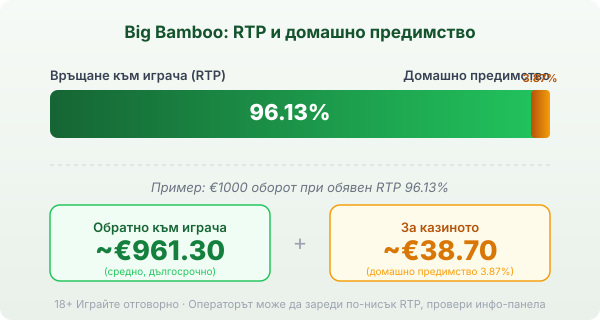
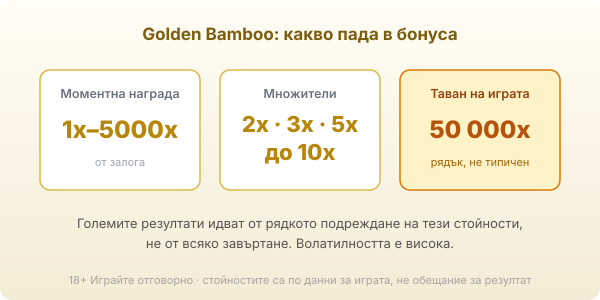

Title tag: Big Bamboo (Push Gaming): RTP 96.13%, макс. 50 000x
Meta description: Big Bamboo (биг бамбу) на Push Gaming: поле 5×6, RTP 96.13%, висока волатилност и таван 50 000x. Как работи Golden Bamboo и защо спокойният дизайн лъже за риска.

---

# Big Bamboo: RTP, Golden Bamboo и защо спокойният дизайн лъже за риска

Big Bamboo (биг бамбу) на [Push Gaming](/blog/games-providers/) излиза през 2022 г. и на пръв поглед изглежда като най-кроткото заглавие в каталога: бамбукова гора, панда, тиха източна музика. Точно тази опаковка е капанът. Под спокойния дизайн стои ротативка с висока волатилност и таван от 50 000 пъти залога, тоест игра, която дълго не дава нищо и залага всичко на един рядък голям удар.

## Полето 5×6 и как се печели

Основната игра върви на шест реда и пет колони, тоест трийсет позиции на завъртане, с 50 фиксирани начина за печалба, които не се менят и не се докупуват. Дивата карта замества всички плащащи символи и се появява по всички барабани. Скатер символите падат само на втори, трети и четвърти барабан и когато се съберат достатъчно, пускат безплатните завъртания. Пандата е най-скъпият обикновен символ, но да разчиташ на нея за редовни печалби е грешка, която математиката бързо наказва.

## RTP 96.13% и какво значи при €1000

Обявеният RTP на Big Bamboo е 96.13%, тоест домашно предимство от 3.87%. При €1000 оборот това значи средно връщане от порядъка на €961.30 в дългосрочен план и около €38.70, които остават за казиното, разсипани върху хиляди завъртания. Числото е статистика върху милиони спинове, не обещание за една сесия, която спокойно може да свърши доста над или доста под него. Push Gaming, както и повечето доставчици, пуска заглавието в няколко конфигурируеми версии на RTP и операторът избира коя да зареди, затова реалният процент се чете от инфо-панела на конкретното казино, не от рекламата. Освен основните 96.13% се срещат и по-ниски операторски билдове, чиято конкретна стойност също личи само в инфо-панела, а как гледаме на реалния спрямо обявения RTP е описано в [методологията ни](/kak-ocenyavame/).

*Обявен RTP 96.13%: при €1000 оборот средно ~€961.30 се връщат на играча, ~€38.70 остават за казиното. Операторът може да зареди по-ниска версия, затова провери инфо-панела.*

## Висока волатилност: дългите сухи серии

Big Bamboo е класифициран като заглавие с висока волатилност и това е най-важното число, което рекламата не показва. Висока волатилност значи, че балансът пада бавно и често през дълги серии без печалба, а голямата сума, когато дойде, идва наведнъж и рядко. Спокойната картинка кара играча да го чете като безопасна, лежерна игра, а рискът на практика е сред по-острите в жанра. Ако предпочиташ по-равномерно темпо с по-чести дребни печалби, [ротативките](/kazino-igri/rotativki/) със средна волатилност пасват по-добре, а разликата обикновено се проверява в демо режим без реален залог.

## Golden Bamboo: сърцето на играта

Почти всичко интересно при Big Bamboo се случва в бонуса. Специалният символ Mystery Bamboo разкрива случайни символи или задейства функцията Golden Bamboo, при която полето се завърта наново и по него падат символи с моментна награда, множители, скатери и събирачи. Моментните награди варират от 1x до 5000x залога, а множителите стигат до 10x и умножават събраното. Тук се раждат големите суми и тук волатилността си показва другото лице: когато функцията подреди високите стойности една до друга, резултатът е внушителен, но точно тази подредба е рядка.

*Какво пуска функцията Golden Bamboo: моментни награди 1x–5000x и множители до 10x. Големите резултати идват от рядкото им подреждане, не от всяко завъртане.*

Безплатните завъртания се задействат от скатерите, а колело за ъпгрейд може да ги увеличи или да отнеме кръга наведнъж, така че броят им не е предварително фиксиран.

## Таванът от 50 000x

Максималната печалба е 50 000 пъти залога. При €1 залог това прави €50 000, което звучи като причина да седнеш на играта. Реалността е, че таван от такъв ред се удря изключително рядко и е по-близо до лотария, отколкото до цел. Той е горната граница на разпределението, не типичният резултат, и високата волатилност значи, че повечето сесии свършват далеч под него. Големият таван е примамката, не планът.

## Bonus buy и защо е по-скъп капан тук

Big Bamboo предлага и директна покупка на бонуса на няколко ценови нива, а точните множители се виждат в самата игра при конкретното казино. Покупката спестява чакането, но не мени математиката: домашното предимство от 3.87% продължава да тежи, а при висока волатилност платеният бонус може да върне много под цената си също толкова лесно, колкото и много над нея. Купуването на бонус е по-бърз начин да похарчиш бюджета, не по-сигурен начин да спечелиш. В много юрисдикции тази функция е ограничена или изключена, затова невинаги е налична.

## Накратко

Big Bamboo е за играча, който разбира и приема висока волатилност и играе заради рядкия голям удар в Golden Bamboo, а не заради спокойния дизайн на екрана. По-безопасна от вида си не е, точно обратното: кротката опаковка крие една от по-острите математики в жанра. 18+ Хазартът може да пристрасти. Играйте отговорно. Преди първото завъртане си задай лимит за загуба и за време, защото при такава волатилност балансът пада бавно и незабелязано, и провери на инфо-панела кой RTP е зареден при конкретното казино.

---

**Георги Тодоров**
Публикувано: 16.09.2026 · Последна редакция: 16.09.2026

[About Всички Казина boilerplate]

**Отговорна игра.** 18+ Хазартът може да пристрасти. Играйте отговорно. Ако усетиш, че играта излиза извън контрол или искаш да я ограничиш, виж [инструментите за отговорна игра](/otgovorna-igra/) и възможността за самоизключване чрез националния регистър на уязвимите лица към НАП (подава се писмено само от засегнатото лице). Национална информационна линия за наркотиците, алкохола и хазарта („Солидарност") 0888 99 18 66, делнични дни 10:00–17:00.

**Разкриване на партньорства.** Всички Казина съдържа партньорски (афилиейт) връзки; когато отвориш оферта през такава връзка, това може да финансира сайта, без да променя цената за теб и без да влияе на оценките ни. От 1 август 2026 г. дейността на афилиейт оператори в България се лицензира съгласно Закона за държавния бюджет за 2026 г. (ДВ, бр. 69 от 31.07.2026 г.). Всички Казина е подало заявление за лиценз пред Националната агенция по приходите и очаква издаването му.
