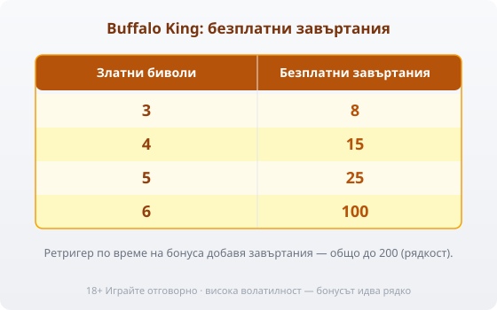
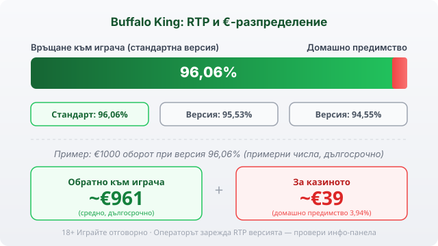

Title tag: Buffalo King: RTP, wild множители и как се играе
Meta description: Как работи Buffalo King на Pragmatic Play: 6×4 мрежа, 4096 начина, RTP 96,06%, безплатни завъртания и wild множители ×2/×3/×5, умножаващи се до ×3125 в бонуса.

---

# Buffalo King: RTP, wild множители и как се играе

Buffalo King е ротативка на Pragmatic Play, изградена върху мрежа от 6 колони и 4 реда с 4096 начина за печалба вместо фиксирани линии. Играта е утвърдено заглавие в портфолиото на доставчика, с тема на американската прерия: бивол, пума, елк и орел се редуват със стандартните карти. Отделно съществува Buffalo King Megaways, версия с различна, разширяваща се мрежа и 200 704 начина за печалба; тя не е предмет на този текст. Тук става дума за базовата Buffalo King, каквато повечето казина зареждат по подразбиране. Двете игри споделят име и тема, но не и механика: базовата версия има фиксирана мрежа, докато Megaways разчита на променлив брой символи на колона от завъртане до завъртане.

## Мрежата: 6×4 и 4096 начина за печалба

4096-те начина за печалба заменят модела с фиксирани линии: печалбата се брои за всяка съседна поредица еднакви символи по колоните, независимо от реда им във всяка отделна колона. Шест колони по четири символа дават точно това число, 4 на степен 6 комбинации, преброени като отделни пътища към печалба. На практика играчът вижда повече активни комбинации при всяко завъртане, без залогът да зависи от брой линии, защото линии тук просто няма.

Символите следват темата без изненади. Бивол, пума, елк и орел плащат най-много и носят визуалната идентичност на играта, а картите от A до 10 запълват таблицата отдолу с по-скромни суми. Точните стойности по символ зависят от версията, която операторът е заредил, затова таблицата с изплащанията в самата игра остава по-надежден източник от общи цифри.

## Wild-овете, които умножават печалбата

Wild символите в Buffalo King не се появяват навсякъде. Те падат само на колони 2, 3, 4, 5 и 6, никога на първата, и всеки от тях носи собствен множител: ×2, ×3 или ×5. Когато в една печалбовна комбинация участва повече от един wild, множителите им не се събират, а се умножават помежду си. Три wild-а с ×5 на отделни колони в една и съща печалба дават ×125, а при повече wild-а с високи множители резултатът може да стигне теоретичния таван от ×3125. Таванът от ×3125 се стига математически при пет wild-а с максималния множител ×5 в една и съща комбинация: 5×5×5×5×5 дава точно това число. Тази умножаваща логика носи по-голямата част от най-едрите изплащания в играта.

В основната игра wild замества липсващ символ по обичайния начин, а множителят му се прилага самостоятелно, ако участва сам в комбинацията. Два wild-а с по-скромни ×3 и ×5 върху едно завъртане вече дават ×15, а не сбор от осем. Истинската тежест на механиката се усеща в бонуса, където повече wild-и се трупат на едно завъртане и множителите се редят един върху друг.

## Безплатните завъртания и ретригерите

Бонус кръгът се задейства от златен бивол, разпръснат по мрежата: три копия дават 8 безплатни завъртания, четири дават 15, пет носят 25, а пълна мрежа от шест плаща 100 завъртания наведнъж. Ретригер по време на бонуса следва подобна стъпаловидна логика, но с други числа: два бонус символа добавят 5 допълнителни завъртания, три добавят 8, четири 15, пет 25, а шест отново плащат 100. На теория поредица от ретригери може да качи общия брой завъртания до 200, макар че на практика подобна серия е рядкост, а не нещо, на което да се разчита при планиране на бюджет. Ретригерът не рестартира броя на wild-овете от нулата, а просто добавя завъртания към същия кръг, така че множителите, паднали по-рано в бонуса, продължават да участват във всяка следваща печалбовна комбинация, докато остават на екрана.

*Броят златни биволи определя завъртанията: 3/4/5/6 → 8/15/25/100. Ретригерите могат да стигнат до 200 общо, но това е рядкост.*

## RTP: обявеното число и реалното

Обявеният RTP по подразбиране е 96,06%, което оставя домашно предимство от 3,94%. При €1000 оборот на тази версия на играча се връщат средно около €961 в дългосрочен план, а около €39 остават за казиното, разпределени върху хиляди завъртания. Числата са примерни и важат само като статистическа тенденция, не като обещание за конкретна сесия. Pragmatic Play е лицензирал и версии с RTP 95,53% и 94,55%, а операторът избира коя от трите да зареди. В [методологията ни](/kak-ocenyavame/) гледаме реалния RTP, а не рекламния, затова инфо-панела на конкретното казино е мястото, което казва кое число всъщност работи там.

*Buffalo King работи в няколко RTP версии; примерът е при 96,06% и €1000 оборот (примерни числа, дългосрочно). Провери коя версия е заредена в инфо-панела.*

## Висока волатилност и таванът от 93 750x

Buffalo King е обявена за игра с висока волатилност, пет от пет по вътрешната скала на доставчика. Дългите серии без печалба са вградена част от механиката. Максималната печалба е 93 750 пъти залога и се стига само при рядко съчетание: пълна мрежа бонус символи за 100 завъртания, последвана от завъртане, в което участват няколко wild-а с най-високия множител ×5 в една и съща печалбовна комбинация. Таванът ×3125 върху отделните множители и таванът 93 750x върху цялата печалба са статистически крайности, които повечето сесии никога не доближават. При максимален залог от €60 тези 93 750 пъти отговарят на примерна печалба от €5 625 000, ако изобщо се стигне до тавана, което на практика е събитие за милиони завъртания, а не за отделна вечер игра. Който сяда пред тази игра с очакване за чести малки печалби, ще излезе разочарован в рамките на няколко минути.

## Как да играете разумно

Залогът в Buffalo King варира от €0,40 до €60 на завъртане, а по-високата волатилност оправдава по-малък залог спрямо бюджета, не по-голям. Демо режимът в повечето казина позволява да усетиш темпото на бонуса, преди да заложиш истински пари; [слот игрите](/slot-igri/) обикновено предлагат тази опция без регистрация. Задай лимит за загуба и за време преди първото завъртане, а не по средата на серия без печалба, когато решенията стават по-импулсивни. 18+ Хазартът може да пристрасти. Играйте отговорно. Ако усетиш, че играта излиза извън контрол, виж [инструментите за отговорна игра](/otgovorna-igra/).

## За кого е тази игра

Buffalo King пасва на играч, който предпочита рядък, но едър удар пред поредица от дребни печалби, и който няма да се откаже след десетина завъртания без нищо на екрана. Механиката с умножаващите се wild-ове е добре обмислена и прави бонуса различен от повечето слотове със златни-животински символи на пазара. За играч, който търси спокоен, равномерен баланс, високата волатилност тук ще бъде постоянен източник на раздразнение. Двамата играят различна игра, макар да гледат в един и същ екран: единият чака рядкото стичане на wild-ове с ×5, другият би предпочел казино с по-плитки, но по-чести печалби. Провери кой RTP е зареден на инфо-панела и залагай само сума, която приемаш да загубиш изцяло.

---

**Георги Тодоров**
Публикувано: 16.09.2026 · Последна редакция: 16.09.2026

[About Всички Казина boilerplate]

**Отговорна игра.** 18+ Хазартът може да пристрасти. Играйте отговорно. Ако усетиш, че играта излиза извън контрол или искаш да я ограничиш, виж [инструментите за отговорна игра](/otgovorna-igra/) и възможността за самоизключване чрез националния регистър на уязвимите лица към НАП (подава се писмено само от засегнатото лице). Национална информационна линия за наркотиците, алкохола и хазарта („Солидарност") 0888 99 18 66, делнични дни 10:00–17:00.

**Разкриване на партньорства.** Всички Казина съдържа партньорски (афилиейт) връзки; когато отвориш оферта през такава връзка, това може да финансира сайта, без да променя цената за теб и без да влияе на оценките ни. От 1 август 2026 г. дейността на афилиейт оператори в България се лицензира съгласно Закона за държавния бюджет за 2026 г. (ДВ, бр. 69 от 31.07.2026 г.). Всички Казина е подало заявление за лиценз пред Националната агенция по приходите и очаква издаването му.
