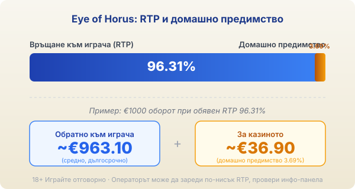
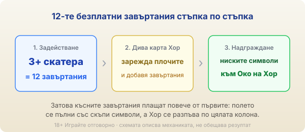

Title tag: Eye of Horus: RTP 96.31%, разширяващ се символ и 12 завъртания
Meta description: Eye of Horus (око на хор): поле 5×3, 10 линии, RTP 96.31%. Как разширяващият се символ Око на Хор надгражда символите в 12-те безплатни завъртания и защо е book-слот.

---

# Eye of Horus: RTP, разширяващият се символ Око на Хор и как се играе

Eye of Horus (око на хор) е класическа египетска ротативка, чийто двигател е дело на студио Reel Time Gaming, а онлайн версията се разпространява под марката Merkur и Blueprint Gaming. Оригиналът излиза през 2016 г. и работи по познатата „book" схема: една дива карта, която се разширява, и безплатни завъртания, в които постепенно се надгражда най-скъпият символ. Тук говорим точно за този оригинал, а не за по-новите Megaways или Fortune Play версии, които имат друга математика.

## Полето 5×3 и десетте линии

Основната игра върви на пет колони и три реда с 10 фиксирани линии отляво надясно, които не се менят и не се докупуват. Символите са египетски: богове, свитъци, скарабеи и картинни ниски символи. Печели се по стария начин, с еднакви символи от лявата колона надясно по някоя от десетте линии. Простата рамка е нарочна, защото цялата тежест на играта пада върху една функция в безплатните завъртания.

## RTP 96.31% и какво значи при €1000

Обявеният RTP на оригиналния Eye of Horus е 96.31%, тоест домашно предимство от 3.69%. При €1000 оборот това значи средно връщане от порядъка на €963.10 в дългосрочен план и около €36.90, които остават за казиното, разсипани върху хиляди завъртания. Числото е статистика върху милиони спинове, не обещание за една вечер. Играта се предлага и в конфигурируеми версии с по-нисък RTP, които операторът може да зареди [VERIFY: точните по-ниски RTP версии на Eye of Horus, например около 94.83%, 92.44%, 90.25% и 88.26%, се дават от единичен източник], затова реалният процент се чете от инфо-панела на конкретното казино, а как гледаме на реалния спрямо обявения RTP е описано в [методологията ни](/kak-ocenyavame/).

*Обявен RTP 96.31%: при €1000 оборот средно ~€963.10 се връщат на играча, ~€36.90 остават за казиното. Операторът може да зареди по-ниска версия, затова провери инфо-панела.*

## Разширяващият се Хор: дивата карта

Символът на бог Хор е дивата карта. Когато падне, той се разпъва вертикално и запълва цялата колона, замествайки всички символи освен скатера. В основната игра това вече е достатъчно да превърне слаба комбинация в печеливша. Скатерът е символът на гробницата и не се замества от дивата карта, а именно той отваря безплатните завъртания.

## 12-те безплатни завъртания и зареждащият се символ

Три или повече скатера пускат 12 безплатни завъртания и точно тук [ротативката](/kazino-igri/rotativki/) показва защо е book-слот. Над барабаните има плочи, които се зареждат всеки път, когато падне дива карта Хор. С всяко зареждане най-ниските символи се надграждат стъпка по стъпка към най-скъпия символ Око на Хор. Колкото по-навътре върви кръгът, толкова повече обикновени символи се превръщат в скъпи, така че последните завъртания могат да платят много повече от първите. Освен това новите диви карти по време на бонуса добавят и допълнителни завъртания [VERIFY: точната схема на добавените завъртания, цитирана като +1/+3/+5 за 1/2/3 диви символа, е от единичен източник]. Комбинацията от разширяващи се Хор-символи и надградена мрежа от скъпи символи е моторът на големите печалби в тази игра.

*3+ скатера отварят 12 безплатни завъртания. Всяка дива карта Хор зарежда плочите и надгражда ниските символи към Око на Хор, затова късните завъртания плащат повече.*

## Волатилност и таван

Повечето публични бази определят Eye of Horus като заглавие със средна волатилност, тоест по-равномерно темпо от острите модерни слотове, макар част от източниците да го поставят по-ниско или по-високо [VERIFY: класификацията на волатилността се разминава между базите, от ниска до висока, при мнозинство за средна]. По-неясен е максималният таван: данните се разминават силно и различни бази посочват стойности от порядъка на 500x, 10 000x и дори 50 000x, затова тук не даваме едно число [VERIFY: максималната печалба на оригиналния Eye of Horus не е потвърдима от един надежден източник, стойностите варират между 500x и 50 000x]. Част от по-високите тавани всъщност идват от Megaways версията и не бива да се приписват на оригинала.

## Накратко

Eye of Horus е за играча, който харесва чист египетски book-слот с една силна идея: разширяващият се Хор и надграждащият се символ в 12-те безплатни завъртания. Средната волатилност дава по-спокойно темпо, но не мени домашното предимство от 3.69%, което тежи върху всеки залог. 18+ Хазартът може да пристрасти. Играйте отговорно. Преди първото завъртане си задай лимит за загуба и за време и провери на инфо-панела кой RTP е зареден при конкретното казино, защото по-ниска версия променя сметката не в твоя полза.

---

**Георги Тодоров**
Публикувано: 16.09.2026 · Последна редакция: 16.09.2026

[About Всички Казина boilerplate]

**Отговорна игра.** 18+ Хазартът може да пристрасти. Играйте отговорно. Ако усетиш, че играта излиза извън контрол или искаш да я ограничиш, виж [инструментите за отговорна игра](/otgovorna-igra/) и възможността за самоизключване чрез националния регистър на уязвимите лица към НАП (подава се писмено само от засегнатото лице). Национална информационна линия за наркотиците, алкохола и хазарта („Солидарност") 0888 99 18 66, делнични дни 10:00–17:00.

**Разкриване на партньорства.** Всички Казина съдържа партньорски (афилиейт) връзки; когато отвориш оферта през такава връзка, това може да финансира сайта, без да променя цената за теб и без да влияе на оценките ни. От 1 август 2026 г. дейността на афилиейт оператори в България се лицензира съгласно Закона за държавния бюджет за 2026 г. (ДВ, бр. 69 от 31.07.2026 г.). Всички Казина е подало заявление за лиценз пред Националната агенция по приходите и очаква издаването му.
