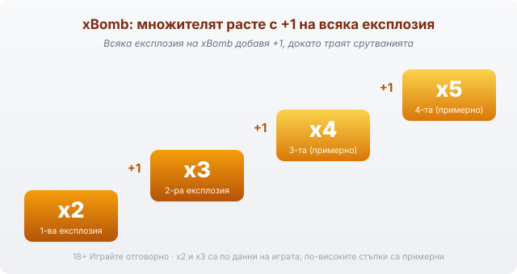
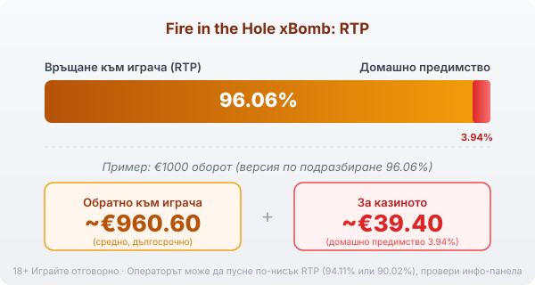

Title tag: Fire in the Hole xBomb: RTP, волатилност и как се играе
Meta description: Как работи Fire in the Hole xBomb на Nolimit City: 6 барабана, xBomb множител, Lucky Wagon Spins и таван 60 000x. Защо RTP 96.06% е дългосрочна средна.

---

# Fire in the Hole xBomb: RTP, xBomb множителят и как се играе

Fire in the Hole xBomb (на кирилица често „файър ин дъ хол") е ротативка на шведското студио [Nolimit City](/blog/games-providers/) от 2021 г. с миньорска тема: шест барабана, три реда в началото и репутация, която върви пред самата игра, тази за екстремна волатилност. Разработчикът я оценява 10 от 10 по собствената си скала, а таванът от 60 000 пъти залога обяснява откъде идва репутацията. Числото, което всъщност решава колко се връща в дългосрочен план, е далеч по-скромно и рядко стои на банера: RTP 96.06%.

## Мрежата, която се разраства

Тук няма линии на печалба. Печалба идва, когато еднакви символи паднат по съседни барабани отляво надясно, а колко „начина" за печалба съществуват зависи от това колко реда са отключени в момента. В началото работят само горните редове и начините са 64. Всяка печалба задейства срутване: печелившите символи изчезват, отгоре падат нови, и ако при това се отвори още ред, полето става по-високо. При напълно разгъната мрежа 6×6 начините стигат 46 656.

## xBomb: множителят, който расте с всяка експлозия

Специалният wild на играта се казва xBomb и той е причината заглавието да носи името си. Замества всеки символ освен bonus символите, но истинската му работа е друга. Щом попадне на екрана, експлодира, дори когато няма печалба, унищожава съседните до него символи и вдига множителя на печалбата с +1. Първата експлозия качва печалбите на x2, следващата на x3, и така нагоре, докато траят срутванията. Тъкмо тук е разликата между обикновено завъртане и завъртане, в което xBomb тръгне да чисти полето, множителят се трупа върху вече разрастващата се мрежа.

*xBomb добавя +1 към множителя при всяка експлозия, докато траят срутванията: x2, x3 и нагоре. Стъпките над x3 са примерни.*

## Wild Mining: когато нищо не се пада, пак става нещо

Nolimit City е сложил механика и за „сухите" завъртания. Ако 3, 4 или 5 еднакви символа се подредят в хоризонтал, но не образуват печеливша комбинация, се задейства Wild Mining: тези символи стават wild-ове, съответно 1, 2 или 3, а позициите над тях избухват и могат да предизвикат ново срутване. Завъртане, което изглежда изгубено, понякога ражда wild точно преди следващата каскада.

## Lucky Wagon Spins: бонусът с монетите

Безплатните завъртания се казват Lucky Wagon Spins и се пускат с 3 до 5 bonus символа при поне два отворени реда. Започваш само с 3 завъртания, но всяка паднала монета връща брояча обратно на 3, така че докато падат монети, бонусът се самоподхранва и продължава. Монетите носят стойности, множители, динамит и събиращи символи, и точно там живеят големите резултати на играта. По данни на разработчика бонусът се пада средно веднъж на около 200 завъртания.

## Bonus buy: да си купиш бонуса

Играта предлага и директна покупка на бонуса, наречена Nolimit Bonus, на три нива: 60x, 157x или 500x залога. Покупката вдига обявения RTP, от 96.07% за най-евтиния вход до 96.96% за най-скъпия. По-високият процент обаче не значи по-малък риск, плащаш до 500 пъти залога наведнъж за режим с екстремна волатилност, в който повечето влизания завършват под цената на входа. На част от регулираните пазари функцията за купуване на бонус е премахната изцяло.

## RTP: обявеното число и реалното

Обявеният RTP на Fire in the Hole xBomb е 96.06%, което оставя домашно предимство от 3.94%. При €1000 оборот това значи средно връщане от порядъка на €960.60 в дългосрочен план и около €39.40 за казиното, разсипани върху много завъртания. Nolimit City обаче пуска играта в няколко версии: освен основните 96.06% съществуват и по-ниски конфигурации, а операторът избира коя да зареди. Едно и също заглавие при две казина може да ти връща различен процент. Затова в [методологията ни](/kak-ocenyavame/) гледаме реалния RTP от инфо-панела, а не рекламния, и преди да заложиш си струва да го отвориш и да провериш кое число работи там.

*Обявен RTP 96.06% (версия по подразбиране): при €1000 оборот средно ~€960.60 се връщат на играча, ~€39.40 остават за казиното. Възможни са и по-ниски версии (94.11% или 90.02%), затова провери инфо-панела.*

## Екстремна волатилност и таванът от 60 000x

Fire in the Hole xBomb е с волатилност 10 от 10 по вътрешната скала на Nolimit City, тоест на самия връх. На практика балансът често пада бавно през дребни или никакви печалби, а голямото идва рядко и почти винаги в бонуса, когато xBomb множителите се струпат. Максималната печалба е 60 000 пъти залога, но по данни на Nolimit City вероятността ѝ е около едно на 2.4 милиона завъртания. При €1 залог 60 000x са €60 000. Такъв удар е статистическа рядкост, затова разумният бюджет се планира спрямо обичайната игра, а таванът остава възможност, която може и никога да не дойде.

## Как да го играеш разумно

Срутващата се мрежа и растящите xBomb множители правят Fire in the Hole xBomb бърза игра, в която едно завъртане вика следващото. Преди реални пари [слот игрите](/slot-igri/) обикновено имат демо режим, в който да усетиш темпото и да видиш колко рядко идва плътният бонус. Задай си лимит за загуба и за време още преди първото завъртане и го спазвай. Extreme волатилността означава дълги сухи серии; тя не увеличава шанса ти за печалба. RTP пък е измерен върху милиони завъртания и не описва конкретната ти сесия. 18+ Хазартът може да пристрасти. Играйте отговорно. Ако усетите, че играта излиза извън контрол, вижте [инструментите за отговорна игра](/otgovorna-igra/).

## За кого е тази игра

Играта пасва на човек, който търпи дълги празни серии заради шанса за рядък голям удар. Ако предпочиташ равномерни, чести дребни печалби, „extreme" тук ще ти дойде тежко. Провери на инфо-панела кой RTP билд е зареден и залагай със сума, която можеш да загубиш изцяло.

---

**Георги Тодоров**
Публикувано: 16.09.2026 · Последна редакция: 16.09.2026

[About Всички Казина boilerplate]

**Отговорна игра.** 18+ Хазартът може да пристрасти. Играйте отговорно. Ако усетиш, че играта излиза извън контрол или искаш да я ограничиш, виж [инструментите за отговорна игра](/otgovorna-igra/) и възможността за самоизключване чрез националния регистър на уязвимите лица към НАП (подава се писмено само от засегнатото лице). Национална информационна линия за наркотиците, алкохола и хазарта („Солидарност") 0888 99 18 66, делнични дни 10:00–17:00.

**Разкриване на партньорства.** Всички Казина съдържа партньорски (афилиейт) връзки; когато отвориш оферта през такава връзка, това може да финансира сайта, без да променя цената за теб и без да влияе на оценките ни. От 1 август 2026 г. дейността на афилиейт оператори в България се лицензира съгласно Закона за държавния бюджет за 2026 г. (ДВ, бр. 69 от 31.07.2026 г.). Всички Казина е подало заявление за лиценз пред Националната агенция по приходите и очаква издаването му.
