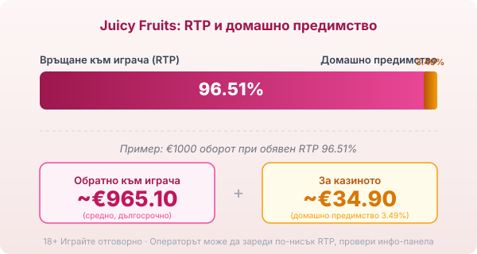
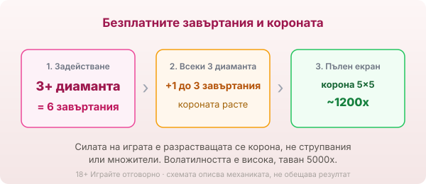

Title tag: Juicy Fruits (Pragmatic): RTP 96.51%, разширяващ се wild
Meta description: Juicy Fruits (джуси фрутс) на Pragmatic Play: поле 5×5, 50 линии, RTP 96.51%. Разширяващият се Crown wild, безплатните завъртания и защо ретро плодовете крият висока волатилност.

---

# Juicy Fruits: RTP, разширяващият се Crown wild и как се играе

Juicy Fruits (джуси фрутс) е ротативка на [Pragmatic Play](/blog/pragmatic-play-provajdar/) от 2021 г. с нарочно ретро визия: череши, лимони, диаманти, познатите символи от старите плодови машини. Външността обаче лъже. Под спокойните плодове стои заглавие с висока волатилност, чийто двигател е една разрастваща се корона в безплатните завъртания. Това не е игра с падащи символи и струпвания, а класическа ротативка с линии, около която се е образувало доста объркване онлайн.

## Полето 5×5 и петдесетте линии

Основната игра върви на пет колони и пет реда с 50 фиксирани линии за печалба, които не се менят и не се докупуват. Печели се по стария начин, с еднакви символи от лявата колона надясно по някоя от петдесетте линии. Тук няма каскади, няма струпвания на еднакви символи по мрежата и няма нарастваща верига от множители, каквито имат други заглавия на Pragmatic. Юси Фрутс е права линийна ротативка и цялата ѝ идея се върти около два символа: короната и диаманта.

## RTP 96.51% и какво значи при €1000

Обявеният RTP на Juicy Fruits е 96.51%, тоест домашно предимство от 3.49%. При €1000 оборот това значи средно връщане от порядъка на €965.10 в дългосрочен план и около €34.90, които остават за казиното, разсипани върху хиляди завъртания. Pragmatic пуска заглавието и в конфигурируеми версии с по-нисък RTP, около 95.54% и 94.50%, а операторът избира коя да зареди, затова реалният процент се чете от инфо-панела на конкретното казино, не от рекламата. Как гледаме на реалния спрямо обявения RTP е описано в [методологията ни](/kak-ocenyavame/).

*Обявен RTP 96.51%: при €1000 оборот средно ~€965.10 се връщат на играча, ~€34.90 остават за казиното. Операторът може да зареди по-ниска версия (95.54% или 94.50%), затова провери инфо-панела.*

## Короната: дивата карта, която се разраства

Короната е дивата карта и замества всички символи освен диаманта. Особеното при нея е, че заема поле с различен размер, от единична клетка до голям блок, и в максимума си може да покрие цялото поле пет на пет. Пълната корона върху целия екран носи най-голямата единична печалба в основната игра, от порядъка на 1200 пъти залога. Именно разрастващата се корона, а не някакви множители, е източникът на силните резултати тук.

## Безплатните завъртания и събирането на диаманти

Диамантът е скатерът и три или повече диаманта пускат 6 безплатни завъртания. По време на бонуса короната остава на полето, а всеки събрани три диаманта добавят по 1 до 3 допълнителни завъртания и надграждат короната с едно стъпало нагоре по размер. Тоест колкото повече диаманти събереш, толкова по-голяма става короната и толкова повече полета покрива, движейки се към пълния екран. Тази механика на натрупване е сърцето на играта и мястото, където се раждат големите суми.

*3+ диаманта отварят 6 безплатни завъртания. Всеки събрани 3 диаманта добавят 1–3 завъртания и уголемяват короната с едно стъпало към пълния екран пет на пет (~1200x).*

## Волатилност, таван и bonus buy

Juicy Fruits е класифициран като заглавие с висока волатилност, което е най-важното число зад ретро визията. Висока волатилност значи дълги серии без печалба и рядък голям удар, а не равномерно, спокойно темпо. Максималната печалба е 5000 пъти залога, солиден, но не екстремен таван за модерна ротативка. Играта предлага и директна покупка на бонуса за около 100 пъти залога. Покупката спестява чакането, но не мени математиката: домашното предимство от 3.49% продължава да тежи и при висока волатилност платеният бонус може да върне много под цената си също толкова лесно, колкото и над нея. Ако търсиш точно ретро усещане, но с по-спокоен ритъм, [плодовите ротативки](/blog/rotativki-s-plodove/) със средна волатилност пасват по-добре от това заглавие.

## Накратко

Juicy Fruits е за играча, който харесва ретро плодове, но разбира, че визията не е обещание за леко темпо. Това е линийна ротативка с висока волатилност, чиято сила е разрастващата се корона в безплатните завъртания, а не струпвания или множители, с които често я бъркат. 18+ Хазартът може да пристрасти. Играйте отговорно. Преди първото завъртане си задай лимит за загуба и за време, защото при висока волатилност балансът пада бавно и незабелязано, и провери на инфо-панела кой RTP е зареден при конкретното казино.

---

**Георги Тодоров**
Публикувано: 16.09.2026 · Последна редакция: 16.09.2026

[About Всички Казина boilerplate]

**Отговорна игра.** 18+ Хазартът може да пристрасти. Играйте отговорно. Ако усетиш, че играта излиза извън контрол или искаш да я ограничиш, виж [инструментите за отговорна игра](/otgovorna-igra/) и възможността за самоизключване чрез националния регистър на уязвимите лица към НАП (подава се писмено само от засегнатото лице). Национална информационна линия за наркотиците, алкохола и хазарта („Солидарност") 0888 99 18 66, делнични дни 10:00–17:00.

**Разкриване на партньорства.** Всички Казина съдържа партньорски (афилиейт) връзки; когато отвориш оферта през такава връзка, това може да финансира сайта, без да променя цената за теб и без да влияе на оценките ни. От 1 август 2026 г. дейността на афилиейт оператори в България се лицензира съгласно Закона за държавния бюджет за 2026 г. (ДВ, бр. 69 от 31.07.2026 г.). Всички Казина е подало заявление за лиценз пред Националната агенция по приходите и очаква издаването му.
