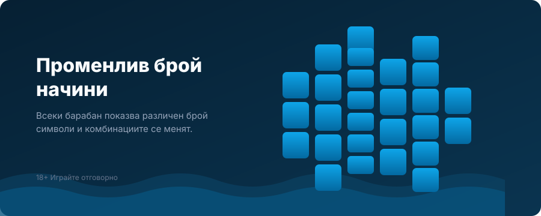

Title tag: Big Bass Bonanza Megaways: какво добавя спрямо базата
Meta description: Какво променя Megaways версията на Big Bass Bonanza (Reel Kingdom/Pragmatic): до 46 656 начина вместо 10 линии, каскади, RTP 96.70%, макс. 4000× и същият рибар с множители x2/x3/x10 в безплатните завъртания.

---

# Big Bass Bonanza Megaways: какво добавя спрямо базата

Big Bass Bonanza Megaways е на Reel Kingdom и излиза през Pragmatic Play в края на 2021 г. Ако вече познаваш базовата Big Bass Bonanza, тук е важен само един въпрос: какво реално мени добавката „Megaways" и струва ли си различната игра. Отговорът е, че сменя двигателя. Базата е класическа ротативка с фиксирани линии, а Megaways версията върти променлив брой начини за печалба и добавя каскади, което прави рисковия профил друг. Числото за старт е RTP 96.70%, а темпераментът е висок.

## От 10 линии към десетки хиляди начини

Базовата Big Bass Bonanza е на 5 барабана с 3 реда и 10 фиксирани линии. Megaways версията е на 6 барабана, всеки от които показва между 2 и 7 символа при всяко завъртане, а броят начини за печалба се мени спрямо това и стига до 46 656. Тоест няма линии, а плащане по съвпадащи символи от ляво надясно по съседни барабани, чийто брой комбинации се преобразува на всяко завъртане. Заедно с това идват и каскадите: всяка печалба маха печелившите символи и на тяхно място падат нови, което може да навърже още печалби от същото завъртане. Базата няма това в редовните завъртания, тя е обикновена линийна ротативка.

## Рибарят и безплатните завъртания

Сърцето на серията Big Bass е едно и също и в двете версии, затова тук няма изненади. Три, четири или пет скатер символа пускат съответно 10, 15 или 20 безплатни завъртания. В бонуса символите с пари остават по екрана, а дивият символ-рибар събира стойностите на всички риби, които са на мрежата в момента. Оттук идва и надграждането: на всеки четвърти събран рибар се получават още 10 завъртания и се качва множителят, който върви x2 при четвърти рибар, x3 при осми и x10 при дванадесети. Множителят се вдига най-много три пъти, спира на x10 и след това няма повече ретригери. Дотук механиката е като в базата.

Полезно е да знаеш, че почти цялата тежест на едрите печалби в серията Big Bass седи именно в тази фаза, при събирането на риби с качения множител. Извън безплатните завъртания играта е доста скромна, а таванът от 4000 пъти залога е практически достижим само ако в бонуса се навържат много риби на висок множител. Затова, ако сравняваш двете версии, гледай не толкова базовия екран, колкото колко благосклонен е бонусът им, и помни, че точно това е и най-рядката част.

## Какво е новото само в Megaways версията

Освен смяната на двигателя, Megaways изданието добавя и две модификации в бонуса, които базата няма. Динамитът добавя допълнителни риби по мрежата, а базуката разчиства всички символи освен рибарите, когато на екрана паднат два рибаря без нито една риба около тях. Тези две неща заедно с каскадите и променливите начини правят бонуса по-експлозивен, но и по-неравен от спокойния ритъм на базовата игра.

## RTP, волатилност и таван

Обявеният RTP на Megaways версията е 96.70%, което оставя домашно предимство от 3.30%. При €1000 оборот това значи средно връщане от порядъка на €967 в дългосрочен план и около €33 за казиното. Тук идва може би най-важното за сравнението: базовата Big Bass Bonanza върви на почти същия RTP от около 96.71%, тоест по число двете са на практика равни. Разликата между тях не е в процента на връщане, а в разпределението, каскадите и по-високия таван местят риска, не очакваната възвръщаемост. Както при повечето заглавия на Pragmatic, играта се доставя в няколко RTP версии, а операторът избира коя да зареди: покрай 96.70% се срещат и по-ниски билдове от 95.66% и 94.62%, а част от базите изписват 95.66% като стойността по подразбиране. Реалната цифра при теб я проверяваш в инфо-панела на играта в конкретното казино.

*Сравнение база спрямо Megaways версия. RTP версиите се конфигурират от оператора; проверявай реалния процент в инфо-панела. Числата за оборота са примерни.*

Волатилността на Megaways изданието е висока, оценена 5/5 по скалата на Pragmatic, тоест печалбите идват по-рядко, но на по-едри порции спрямо по-умерения профил на базата. Максималната печалба е 4000 пъти залога, което е осезаемо повече от тавана на базовата игра от около 2100 пъти, но пак си остава таван, а не очакване. Залогът е между €0.20 и €100 на завъртане. Има и опция за купуване на безплатните завъртания за 100 пъти залога, но дали е налична зависи от пазара и оператора.

## Коя версия за кого

Двете игри споделят темата и рибаря, но искат различна нагласа. Базата е по-спокойна линийна ротативка с по-нисък таван и по-мек ритъм, подходяща, ако търсиш познатото усещане. Megaways версията е по-волатилна, с каскади, променливи начини и по-висок таван, тоест по-големи люлки в двете посоки. Нито едната не мени факта, че домашното предимство работи за казиното на всяко завъртане, затова изборът е по вкус към риска, не по шанс за печалба.

## Преди да завъртиш

[Слот игрите](/slot-igri/) на Pragmatic обикновено имат демо режим, в който да усетиш темпото и волатилността, без да залагаш реални пари, а при толкова различен профил спрямо базата това си струва. Ако искаш да видиш как гледаме на отделните студиа, [прегледът ни на доставчиците](/blog/games-providers/) обяснява подхода, а самите ротативки се сравняват най-честно по RTP, затова в [методологията ни](/kak-ocenyavame/) залагаме на реалния процент при конкретното казино. Задай си лимит за загуба и за време преди първото завъртане, особено при висока волатилност. 18+ Хазартът може да пристрасти. Играйте отговорно. Ако усетиш, че играта излиза извън контрол, виж [инструментите за отговорна игра](/otgovorna-igra/).

---

**Георги Тодоров**
Публикувано: 17.09.2026 · Последна редакция: 17.09.2026

[About Всички Казина boilerplate]

**Отговорна игра.** 18+ Хазартът може да пристрасти. Играйте отговорно. Ако усетиш, че играта излиза извън контрол или искаш да я ограничиш, виж [инструментите за отговорна игра](/otgovorna-igra/) и възможността за самоизключване чрез националния регистър на уязвимите лица към НАП (подава се писмено само от засегнатото лице). Национална информационна линия за наркотиците, алкохола и хазарта („Солидарност") 0888 99 18 66, делнични дни 10:00–17:00.

**Разкриване на партньорства.** Всички Казина съдържа партньорски (афилиейт) връзки; когато отвориш оферта през такава връзка, това може да финансира сайта, без да променя цената за теб и без да влияе на оценките ни. От 1 август 2026 г. дейността на афилиейт оператори в България се лицензира съгласно Закона за държавния бюджет за 2026 г. (ДВ, бр. 69 от 31.07.2026 г.). Всички Казина е подало заявление за лиценз пред Националната агенция по приходите и очаква издаването му.
