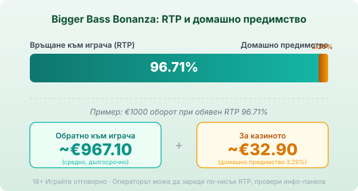
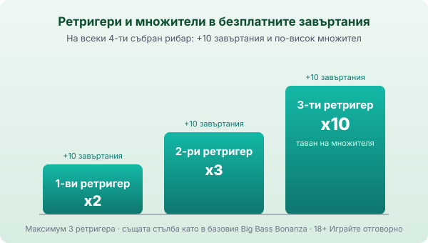

Title tag: Bigger Bass Bonanza: RTP 96.71% и какво добавя версията
Meta description: Bigger Bass Bonanza (бигър бас бонанза): поле 5×4, 12 линии, RTP 96.71%. Какво добавя „Bigger" версията спрямо базата и как работят множителите x2/x3/x10.

---

# Bigger Bass Bonanza: RTP, множители и какво добавя „Bigger" версията

Bigger Bass Bonanza (бигър бас бонанза) е дело на студио Reel Kingdom и се разпространява под марката Pragmatic Play. Излиза през септември 2021 г. като уголемената версия на риболовния хит Big Bass Bonanza. Механиката е същата, рибарят събира парични символи в безплатните завъртания, но всичко наоколо е разтеглено: по-голямо поле, повече линии, по-остра волатилност и почти удвоен таван. И тъй като този въпрос идва пръв, по-голямото поле не значи по-добри шансове. Само по-разлюлян резултат.

## Полето 5×4 и дванадесетте линии

Основната игра върви на пет колони и четири реда, с 12 фиксирани линии отляво надясно. Базовият Big Bass Bonanza имаше 5×3 и 10 линии, така че тук печелиш с един ред и две линии повече. Линиите не се менят и не се докупуват. Символите са рибарски, макари, кукички, ботуши и самият рибар, а печели се по стария начин, с еднакви символи от лявата колона надясно. Простата рамка е нарочна, защото цялата тежест на играта пада върху безплатните завъртания.

## RTP 96.71% и какво значи при €1000

Обявеният RTP по подразбиране е 96.71%, тоест домашно предимство от 3.29%. При €1000 оборот това значи средно връщане от порядъка на €967.10 в дългосрочен план и около €32.90, които остават за казиното, разсипани върху хиляди завъртания. Числото е статистика върху милиони спинове, не прогноза за една вечер. Играта се предлага и в по-ниски конфигурируеми версии, 95.67% и 94.62%, които операторът може да зареди, затова реалният процент се чете от инфо-панела на конкретното казино, а как гледаме на реалния спрямо обявения RTP е описано в [методологията ни](/kak-ocenyavame/).

*Обявен RTP 96.71%: при €1000 оборот средно ~€967.10 се връщат на играча, ~€32.90 остават за казиното. Операторът може да зареди по-ниска версия (95.67% или 94.62%), затова провери инфо-панела.*

## Рибарят и събирането на пари в безплатните завъртания

Три или повече скатера пускат безплатните завъртания: три дават 10, четири дават 15, а пет дават 20 завъртания. Тук на екрана се появяват паричните символи с изписана върху тях стойност, заедно с рибаря като дива карта. Падне ли рибарят, докато има парични символи в игра, той събира сумата на всички тях и я прибавя към баланса. В основната игра паричните символи не носят по този начин, затова целият смисъл на [ротативката](/kazino-igri/rotativki/) е да стигнеш до бонуса. Същото важи и за базовата игра, събирането е обща черта на цялата Big Bass серия.

## Ретригерите и множителите x2, x3 и x10

Тук е истинската разлика в темпото. За всеки четвърти събран рибар бонусът се ретригерира, добавя още 10 завъртания и качва множител върху колектора. Първият ретригер дава x2, вторият x3, третият x10 върху събраните суми. Позволени са максимум три ретригера, тоест таванът на множителя е x10. Стълбата е същата като в базовия Big Bass Bonanza. Bigger не я пипа, а залага на по-голямото поле и по-високата волатилност за по-едрите резултати.

*На всеки 4-ти събран рибар: +10 завъртания и по-висок множител върху събраните суми, x2 → x3 → x10. Максимум три ретригера, таван на множителя x10.*

## Волатилност и таван

Публичните бази определят Bigger Bass Bonanza като слот с висока волатилност, оценка 5 от 5, докато базовата версия стои на 4 от 5. Максималният таван е 4 000× общия залог, срещу около 2 100× при оригинала. По-високата волатилност и по-високият таван вървят ръка за ръка: по-редки, но потенциално по-едри попадения, с по-дълги сухи серии между тях. Резултатът се разлюлява по-силно, средната възвръщаемост не се качва, защото RTP по подразбиране е на практика близък до този на базата.

## Bonus buy

Базовото издание няма нито бутон за директна покупка на бонуса, нито Ante bet. Безплатните завъртания се печелят само по естествен път, със скатери. Дали някъде ще видиш опция за купуване зависи от конкретния оператор и пазар, но в самата игра, както излиза, такава няма.

## Накратко

Bigger Bass Bonanza е за играча, който харесва риболовния бонус на серията, но иска по-остро темпо, по-голямо поле и по-висок таван и приема по-дългите сухи серии, които идват с волатилност 5 от 5. Множителят стига до x10 при трети ретригер, точно като в базата, а таванът от 4 000× е почти двойно спрямо оригинала. Домашното предимство от 3.29% обаче тежи върху всеки залог, колкото и голямо да е полето. 18+ Хазартът може да пристрасти. Играйте отговорно. Преди първото завъртане си задай лимит за загуба и за време и провери на инфо-панела кой RTP е зареден, защото по-ниска версия променя сметката не в твоя полза.

---

**Георги Тодоров**
Публикувано: 17.09.2026 · Последна редакция: 17.09.2026

[About Всички Казина boilerplate]

**Отговорна игра.** 18+ Хазартът може да пристрасти. Играйте отговорно. Ако усетиш, че играта излиза извън контрол или искаш да я ограничиш, виж [инструментите за отговорна игра](/otgovorna-igra/) и възможността за самоизключване чрез националния регистър на уязвимите лица към НАП (подава се писмено само от засегнатото лице). Национална информационна линия за наркотиците, алкохола и хазарта („Солидарност") 0888 99 18 66, делнични дни 10:00–17:00.

**Разкриване на партньорства.** Всички Казина съдържа партньорски (афилиейт) връзки; когато отвориш оферта през такава връзка, това може да финансира сайта, без да променя цената за теб и без да влияе на оценките ни. От 1 август 2026 г. дейността на афилиейт оператори в България се лицензира съгласно Закона за държавния бюджет за 2026 г. (ДВ, бр. 69 от 31.07.2026 г.). Всички Казина е подало заявление за лиценз пред Националната агенция по приходите и очаква издаването му.
