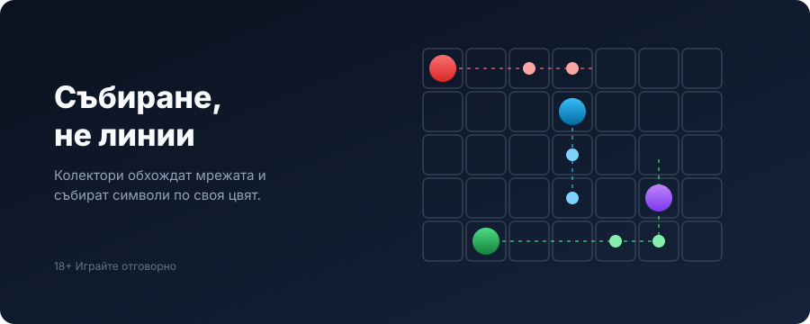

Title tag: ELK Studios: профил на доставчика, механики и топ слотове
Meta description: Кой е ELK Studios (елк студиос): шведското студио зад Pirots и CollectR, механиките X-iter и Betting Strategies, конфигурируемият RTP (защо новите заглавия спират на 94%) и топ слотовете с техните числа.

---

# ELK Studios: профил на доставчика, механики и топ слотове

ELK Studios, или „елк студиос", е шведско студио за слот игри, основано през септември 2013 г. в Стокхолм. То рядко прави класически ротативки с линии и това си личи: повечето му заглавия работят на решетки, събиране на символи и разширяващи се мрежи, а не на познатите пет барабана с фиксирани линии. Ако си играл Pirots, вече познаваш почерка. Тук ще намериш кой е ELK, кои са фирмените му механики и, по-важно за банката ти, каква е реалната RTP политика зад лъскавия дизайн.

## Кои са и на кого принадлежат

ELK Studios е независимо студио, което държи на собствени механики вместо на масово производство. През декември 2021 г. беше придобито от Scientific Games, компания, която по-късно се преименува на Light & Wonder, така че днес ELK е част от по-голяма група, но продължава да излиза под собствено име. Каталогът му е сравнително компактен, над 120 заглавия според различните бройки, което е малко спрямо гигантите в бранша и е съзнателен избор: по-малко игри, но с отличими механики.

В каталога му се повтарят няколко серии, по които лесно ще се ориентираш. Pirots са collection игрите с птици-колектори, Nitropolis и Cygnus са научнофантастичните заглавия с високи тавани и разширяващи се мрежи, Katmandu върви по планинска тема с много начини за печалба, а Wild Toro залага на разхождащи се диви символи. Не е нужно да ги знаеш всичките, но щом разпознаеш серията, вече имаш добра представа каква механика те чака.

Що се отнася до регулация, самото студио посочва лицензи от Британската комисия по хазарта (UKGC) и Малтийския орган по хазарта (MGA, B2B лиценз MGA/B2B/605/2018 от 27 февруари 2019 г.), плюс класове лицензи в Румъния. Това са лицензи на доставчика на софтуер, не на конкретно казино. За българския играч тежи друго: дали казиното, в което играеш игра на ELK, има валиден лиценз от НАП. Как се проверява това обясняваме в [методологията ни](/kak-ocenyavame/), където законността е най-тежкият критерий.

## Фирмените механики, които ще срещаш

Няколко неща се повтарят в игрите на ELK и е добре да ги разпознаваш. CollectR е двигателят за събиране, който дебютира със серията Pirots: цветни герои-колектори се движат по мрежата и обират символи от своя цвят, а един измерител се пълни към надграждания и награди, вместо да има линии. X-iter е системата за купуване на функции, обикновено с около пет нива, при която плащаш предварително, за да влезеш директно в определен режим или бонус, вместо да го чакаш. Betting Strategies са вградени режими за автоматично управление на залога в рамките на авто-игра, с имена като Optimizer, Leveller, Booster и Jumper. Важното за тях е, че менят само размера на залога по зададено правило, а не RTP или очакваната възвръщаемост, тоест не са система за печелене, а за темпо. Върху всичко това често стоят каскади и мрежи, които се разширяват до осем реда по време на функция.

## Какво прави ELK разпознаваем

Почеркът на студиото е дълбочина пред обем: по-малко заглавия, но всяко със своя механика, която трябва да научиш, вместо поредната стандартна ротативка. Игрите са изгладени, мислени първо за телефон, и почти винаги нелинейни, тоест решетки и събиране вместо линии отляво надясно. Това носи и признание: Wild Toro спечели „Игра на годината" на наградите EGR през 2017 г., а Pirots 2 взе същото отличие на CasinoBeats Game Developer Awards през 2024 г.

## Топ слотове и техните числа

Ето няколко от по-известните заглавия с числата, които е добре да знаеш предварително. Числата за волатилност, отбелязани с /10, са по собствената скала на ELK.

*Числата са от страницата на доставчика и международни бази за игри; операторът може да пусне по-ниска RTP версия. Проверявай реалния RTP в инфо-панела на играта.*

Pirots 2 (7 ноември 2023 г.) е collection слот на мрежа 6×6, която се разширява до 8×8, с RTP 94.0% и таван от 10 000 пъти залога. Nitropolis 4 (8 февруари 2023 г.) е на 6 барабана с 4 реда и 4096 начина, разширяващи се до 8 реда, RTP 94.0% и по-висок таван от 50 000 пъти залога. Wild Toro 2 (5 октомври 2021 г.) залага на разхождащи се диви символи и прогресивни множители, RTP 95.0%, волатилност 7/10 и таван 10 000 пъти. Katmandu Gold (1 декември 2020 г.) е от по-старата вълна с по-висок RTP 96.2% (има и версии 96.3% и 96.4% при купуване на бонус), волатилност 7/10 и до 531 441 начина. Cygnus 4 (4 януари 2024 г.) е с RTP 94% и таван 50 000 пъти. Lake's Five (25 март 2018 г.) е по-спокойното заглавие в списъка, RTP 96.3%, волатилност 7/10 и по-нисък таван от 2160 пъти залога.

## RTP политиката, която е добре да знаеш

Ако сложиш числата едно до друго, се вижда тенденция. По-старите заглавия на ELK стигаха до около 96.4% RTP, докато повечето от новите се спират на 94% като най-висока налична версия. Освен това ELK, като почти всички доставчици, пуска игрите в няколко RTP версии, а конкретното казино избира коя да зареди, като за някои регулирани пазари съществуват и доста по-ниски варианти около 87%. Практичният извод е прост: не приемай числото от рекламата или от общ преглед, а провери реалния RTP в инфо-панела на самата игра при твоето казино [VERIFY: коя RTP версия работи при конкретния БГ лицензиран оператор]. Наличността на функции като купуването през X-iter също се различава по пазари [VERIFY: наличност на X-iter купуванията на БГ лицензирания пазар].

## Преди да завъртиш игра на ELK

[Слот игрите](/slot-igri/) на ELK обикновено имат демо режим, в който да усетиш конкретната механика и волатилността, без да залагаш реални пари, а това при студио с толкова разнообразни двигатели си струва повече от обичайното. Ако искаш да сравниш ELK с други студиа, [прегледът ни на доставчиците](/blog/games-providers/) държи един и същ поглед към всяко. Числата по-горе са ориентир, не обещание: високата волатилност значи дълги серии без печалба, а таванът от десетки хиляди пъти залога е рядкост, не очакване. Задай си лимит за загуба и за време преди първото завъртане. 18+ Хазартът може да пристрасти. Играйте отговорно. Ако усетиш, че играта излиза извън контрол, виж [инструментите за отговорна игра](/otgovorna-igra/).

---

**Георги Тодоров**
Публикувано: 17.09.2026 · Последна редакция: 17.09.2026

[About Всички Казина boilerplate]

**Отговорна игра.** 18+ Хазартът може да пристрасти. Играйте отговорно. Ако усетиш, че играта излиза извън контрол или искаш да я ограничиш, виж [инструментите за отговорна игра](/otgovorna-igra/) и възможността за самоизключване чрез националния регистър на уязвимите лица към НАП (подава се писмено само от засегнатото лице). Национална информационна линия за наркотиците, алкохола и хазарта („Солидарност") 0888 99 18 66, делнични дни 10:00–17:00.

**Разкриване на партньорства.** Всички Казина съдържа партньорски (афилиейт) връзки; когато отвориш оферта през такава връзка, това може да финансира сайта, без да променя цената за теб и без да влияе на оценките ни. От 1 август 2026 г. дейността на афилиейт оператори в България се лицензира съгласно Закона за държавния бюджет за 2026 г. (ДВ, бр. 69 от 31.07.2026 г.). Всички Казина е подало заявление за лиценз пред Националната агенция по приходите и очаква издаването му.
