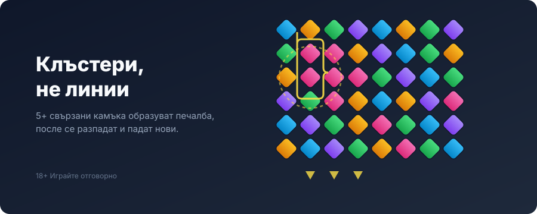
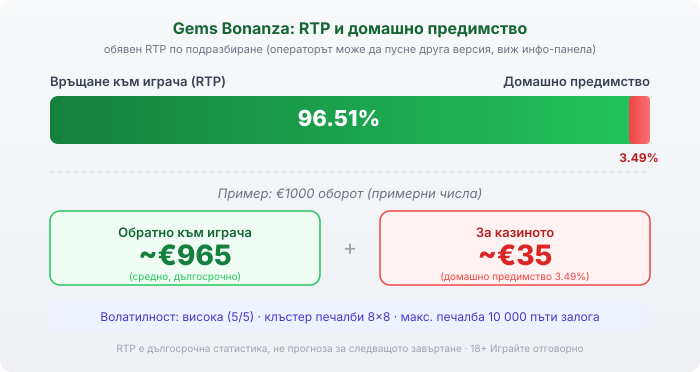

Title tag: Gems Bonanza (Pragmatic): как работи, RTP и Gold Fever
Meta description: Как работи Gems Bonanza (гемс бонанза) на Pragmatic Play: мрежа 8×8 с клъстер печалби, петте Spin Feature модификатора, колекцията Gold Fever, RTP 96.51% и защо високата волатилност значи дълги сухи серии.

---

# Gems Bonanza: как работи, RTP и Gold Fever

Gems Bonanza, или „гемс бонанза" на кирилица, е на Pragmatic Play и излезе през октомври 2020 г. Отдалеч изглежда като поредната шарена игра със скъпоценни камъни, но под пъстрия екран стои конкретна механика, различна от повечето ротативки: тук няма линии. Има мрежа 8×8, върху която камъните се групират, разпадат се и постепенно зареждат една колекция. Числото, което е добре да знаеш още преди първото завъртане, е RTP от 96.51%, а темпераментът зад него е висока волатилност.

## Няма линии, има клъстери

Полето е решетка 8×8, тоест 64 символа падат при всяко завъртане. Печалба се образува, когато поне пет еднакви символа се допират хоризонтално или вертикално, тоест по свързан блок, а не по фиксирана линия отляво надясно. Колкото по-голям е блокът, толкова по-голяма е печалбата. След всяка печалба идва каскадата: печелившите символи изчезват, а на тяхно място падат нови отгоре, което може да навърже нова печалба от същото завъртане. Затова едно завъртане в Gems Bonanza рядко приключва с едно действие, а често се търкаля през няколко разпадания.

## Петте модификатора и как се задействат

Върху някои позиции на мрежата стоят маркери. Когато печеливш блок докосне такъв маркер, той пуска един от петте „Spin Feature" модификатора, всеки от които мени картинката по различен начин. Nuclear (синият) помита символи от мрежата. Wild Gem (розовият) превръща символи в диви. Squares (жълтият) създава мега-символ 2×2. Colossal Symbols (червеният) слага голям мега-символ, който стига от 3×3 до 5×5. Lucky Wilds (зеленият) разпръсква между 5 и 15 случайни диви символа. Тези неща се задействат по време на каскадите и точно те правят резултата на Gems Bonanza по-непредвидим от обикновена клъстер игра.

## Gold Fever: колекцията, която е истинският бонус

Тук няма класически безплатни завъртания със скатер символи, каквито има в много ротативки. Ролята на бонуса я играе Gold Fever. Всеки печеливш символ, който изчезне от мрежата, се брои, а когато в една поредица премахнеш 114 печеливши символа, Gold Fever се отключва. Оттам нататък бонусът има пет прогресивни нива и на всяко от тях всичките пет модификатора са активни едновременно, а множителят на печалбите се качва стъпка по стъпка до 10× на последното ниво. Тоест колекционерската част не е декорация, а механизмът, който отваря най-силната фаза на играта. Има и опция за купуване, при която плащаш 100 пъти залога и Gold Fever се активира на следващото завъртане, но дали изобщо е налична зависи от пазара и оператора, затова провери в самата игра.

## RTP и волатилност

Обявеният RTP на официалната страница е 96.51%, което оставя домашно предимство от 3.49%. При €1000 оборот това значи средно връщане от порядъка на €965 в дългосрочен план и около €35 за казиното. Pragmatic обаче обикновено доставя заглавията си в няколко RTP версии, а операторът избира коя да пусне: покрай стойността около 96.5% в базите се срещат и по-ниски билдове от 95.54% и 94.53%, а част от източниците изписват най-високата версия като 96.55% вместо 96.51%. Разликата е малка, но реалната стойност при теб я проверяваш в инфо-панела на играта в конкретното казино.

*Обявен RTP 96.51% по подразбиране: при €1000 оборот средно ~€965 се връщат на играча, ~€35 остават за казиното (домашно предимство 3.49%). Волатилността е висока (5/5), а максималната печалба е 10 000 пъти залога. Числата за оборота са примерни.*

По-важно от процента е темпераментът. Волатилността е висока, оценена 5/5 по скалата на Pragmatic, тоест игра, в която печалбите идват по-рядко, но на по-едри порции. Според един източник честотата на печалба е около едно на три завъртания, но това число го дава само той, затова го приемай като ориентир, не като гаранция. На практика високата волатилност значи дълги серии без нищо, прекъсвани от отделни по-големи попадения, и банка, която трябва да издържи на сухите периоди. Максималната печалба е 10 000 пъти залога, което е таван, а не очакване. Залогът е между €0.20 и €100 на завъртане.

## Какъв бюджет пасва на висока волатилност

Високата волатилност не е недостатък сама по себе си, но иска друга нагласа за банката. При игра, в която дълги серии не връщат нищо, а печалбата идва на редки по-едри порции, залог, който на нискорискова ротативка би издържал стотици завъртания, тук може да свърши бързо преди изобщо да си стигнал до Gold Fever. Практичният извод е скучен, но верен: при 5/5 волатилност по-малкият залог на завъртане купува повече завъртания със същия бюджет, а купуването на бонуса за 100× залога е точно обратното, наведнъж хвърляш сумата на сто завъртания с надеждата един път да си струва. Никоя от двете посоки не мени домашното предимство от 3.49%, което важи за всяко завъртане еднакво. Затова реши предварително колко си готов да загубиш за вечерта и го третирай като цена на забавлението, а не като залог, който ще се върне.

## С какво Gems Bonanza се различава от Sweet Bonanza

Двете игри често се слагат в един кюп заради „Bonanza" в името и шарените символи, но механиките им са различни. Sweet Bonanza е „pay anywhere" игра, в която символите плащат навсякъде по екрана, стига да са достатъчно на брой, и има отделен рунд с безплатни завъртания и множители-бомби. Gems Bonanza иска свързан блок от поне пет символа, а бонусът ѝ е колекцията Gold Fever, а не scatter завъртания. Ако търсиш точно „безплатни завъртания", тук ще намериш Gold Fever вместо тях.

## Преди да завъртиш

[Слот игрите](/slot-igri/) на Pragmatic обикновено имат демо режим, в който да усетиш темпото и волатилността на Gems Bonanza, без да залагаш реални пари. Ако искаш да видиш как гледаме на отделните студиа, [прегледът ни на доставчиците](/blog/games-providers/) обяснява подхода, а самите ротативки се сравняват най-честно по RTP, затова в [методологията ни](/kak-ocenyavame/) залагаме на реалния процент при конкретното казино, а не на рекламния банер. Задай си лимит за загуба и за време преди първото завъртане, особено при толкова волатилна игра. 18+ Хазартът може да пристрасти. Играйте отговорно. Ако усетиш, че играта излиза извън контрол, виж [инструментите за отговорна игра](/otgovorna-igra/).

---

**Георги Тодоров**
Публикувано: 17.09.2026 · Последна редакция: 17.09.2026

[About Всички Казина boilerplate]

**Отговорна игра.** 18+ Хазартът може да пристрасти. Играйте отговорно. Ако усетиш, че играта излиза извън контрол или искаш да я ограничиш, виж [инструментите за отговорна игра](/otgovorna-igra/) и възможността за самоизключване чрез националния регистър на уязвимите лица към НАП (подава се писмено само от засегнатото лице). Национална информационна линия за наркотиците, алкохола и хазарта („Солидарност") 0888 99 18 66, делнични дни 10:00–17:00.

**Разкриване на партньорства.** Всички Казина съдържа партньорски (афилиейт) връзки; когато отвориш оферта през такава връзка, това може да финансира сайта, без да променя цената за теб и без да влияе на оценките ни. От 1 август 2026 г. дейността на афилиейт оператори в България се лицензира съгласно Закона за държавния бюджет за 2026 г. (ДВ, бр. 69 от 31.07.2026 г.). Всички Казина е подало заявление за лиценз пред Националната агенция по приходите и очаква издаването му.
