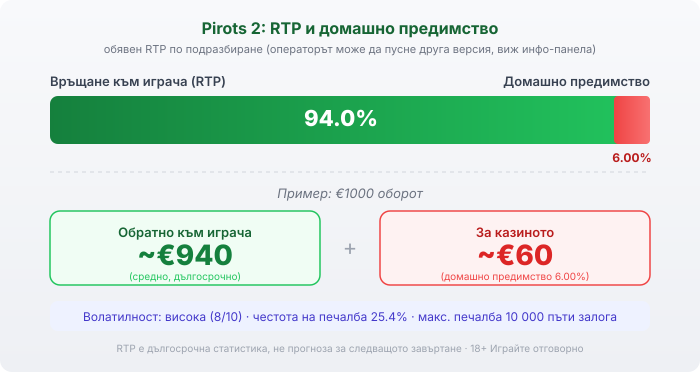

Byline: Георги Тодоров (Editorial) | Market: bg — game explainer, editorial slider (patient teacher), no testing receipts so no Протокол block.

# Pirots 2: как работи, RTP и волатилност

Pirots 2 е дело на ELK Studios, шведско студио, което рядко прави линейни ротативки, и това си личи от първото завъртане. Играта излезе през 2023 г. като продължение на Pirots и смени морската тема с праисторически свят, но същината остана: няма линии, а птици, които се разхождат по мрежата и събират символи. Изглежда игриво, зад анимациите обаче стои конкретна математика с RTP от 94.0%, която е добре да разбереш, преди да заложиш.

## Как е устроена играта

Тук няма нито линии, нито „начини за печалба". Полето е мрежа 6×6 и работи по собствената механика на ELK, наречена CollectR. В началото на всяко завъртане върху мрежата падат кехлибарени символи в четири цвята и четири птици: червена, синя, зелена и лилава. Всяка птица събира кехлибарените символи от своя цвят, които са в съседна на нея клетка. Колкото повече от един цвят събере съответната птица, толкова по-голяма е печалбата. Тоест значение има какво стои до птицата, а не някаква подредба по фиксиран път.

## Събиране и надграждане: истинската механика

Птиците не стоят на едно място. Те се местят по мрежата и обират своя цвят, а когато срещнат функционален символ, го активират. Кехлибарените символи имат седем нива на изплащане и се надграждат със символи-стрелки: сива стрелка вдига нивото на цвета, който съответната птица събира, а многоцветна стрелка вдига нивото на всички кехлибарени символи наведнъж. Върху това стоят и останалите функционални символи. Пуканките запълват празни клетки, за да могат птиците да продължат да се движат. Яйцето излюпва динозавър, който разбутва птиците по нови позиции. Гъбата превръща съседни символи в цвета на колектора. Монетите носят директна печалба до 1000 пъти залога, а wild символът замества кехлибар или подава към максималната печалба. Отделно Red Button пуска метеор, който помита символи и разширява мрежата чак до 8×8. Повечето от тези неща се случват в рамките на едно завъртане и точно затова резултатът на Pirots 2 се трупа на слоеве, а не с една комбинация.

## Бонус играта и купуванията

Три бонус символа отключват бонус игра с пет безплатни падания, а по-едрият вариант е Super Bonus. ELK е сложило и система за купуване, наречена X-iter, с пет режима: „лов на бонус" за 3× залога с по-голям шанс да задействаш бонуса, Popcorn Fiesta за 10×, максимална големина на мрежата за 25×, самата бонус игра за 100× и Super Bonus за 500× залога. Купуването плащаш веднага и на пълна цена. Дали тези опции изобщо са налични зависи от пазара и от конкретния оператор, затова провери в самата игра, преди да разчиташ на тях [VERIFY: наличност на X-iter купуванията на БГ лицензирания пазар].

## RTP и волатилност

Обявеният RTP на Pirots 2 е 94.0%, което оставя домашно предимство от 6.00%. При €1000 оборот това значи средно връщане от порядъка на €940 в дългосрочен план и около €60 за казиното. Числото е по-ниско от обичайните за модерните ротативки около 96%, така че струва си да го знаеш предварително. ELK често доставя заглавията си в няколко RTP версии, а операторът избира коя да пусне, затова реалната стойност при теб проверяваш в инфо-панела на играта в конкретното казино [VERIFY: точна по-ниска RTP версия за Pirots 2 и коя работи при конкретния оператор]. По-важно от самия процент е темпераментът на играта. Волатилността е висока, оценена 8/10 по скалата на ELK, а честотата на печалба е около 25.4%, тоест средно едно на четири завъртания връща нещо. На практика това значи дълги серии без печалба, прекъсвани от отделни по-едри попадения, и банка, която трябва да издържи на сухите периоди. Максималната печалба е 10 000 пъти залога, което е таван, а не очакване.

*Обявен RTP 94.0% по подразбиране: при €1000 оборот средно ~€940 се връщат на играча, ~€60 остават за казиното (домашно предимство 6.00%). Волатилността е висока (8/10), а максималната печалба е 10 000 пъти залога.*

## Какво променя Pirots 2 спрямо обикновена ротативка

Обикновената ротативка приключва завъртането почти веднага: символите падат, плащат по линия или изчезват. При Pirots 2 между падането и резултата има цял слой действия, движение на птиците, надграждане, трансформации и разширяване на мрежата, което прави всяко завъртане по-дълго и по-непредвидимо. Този слой е забавната част и причината играта да изглежда по-жива от класически слот. Той обаче не мени аритметиката: домашното предимство от 6.00% важи за всяко завъртане, независимо колко ефектно изглежда то. И купуванията през X-iter не са изключение. Плащаш за по-бърз достъп до вариацията и до бонуса, не за по-добри шансове, а по-високата цена просто значи по-голяма амплитуда на резултата в двете посоки.

## Преди да завъртиш

[Слот игрите](/slot-igri/) на ELK обикновено имат демо режим, в който да усетиш темпото и волатилността на Pirots 2, без да залагаш реални пари. Ако ELK Studios е ново име за теб, [прегледът ни на доставчиците](/blog/games-providers/) обяснява как гледаме на всяко студио, а ротативките се сравняват най-честно по RTP, затова в [методологията ни](/kak-ocenyavame/) залагаме на реалния процент при конкретното казино, а не на рекламния банер. Задай си лимит за загуба и за време преди първото завъртане, особено при толкова волатилна игра. 18+ Хазартът може да пристрасти. Играйте отговорно. Ако усетиш, че играта излиза извън контрол, виж [инструментите за отговорна игра](/otgovorna-igra/).

---

**Георги Тодоров**
Публикувано: 17.09.2026 · Последна редакция: 17.09.2026

[About Всички Казина boilerplate]

[18+ / RG LINE — footer template]

[AFFILIATE DISCLOSURE — footer template]

CANON ADDITIONS: none (editorial mode).

[VERIFY] flags: (1) точната по-ниска/конфигурируема RTP версия за Pirots 2 и коя работи при конкретния оператор; (2) наличност на X-iter купуванията на БГ лицензирания пазар.
