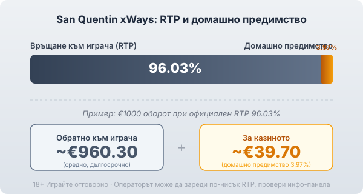
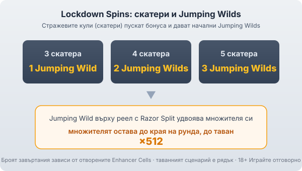

Title tag: San Quentin xWays: RTP 96.03%, xWays и Razor Split
Meta description: San Quentin xWays (сан куентин) от Nolimit City: поле 5×3, 243 начина, RTP 96.03%, екстремна волатилност, таван 150 000×. Как работят Enhancer Cells, xWays и Lockdown Spins.

---

# San Quentin xWays: RTP, xWays/Razor Split и как се играе

San Quentin xWays (сан куентин) е слот на студио Nolimit City от януари 2021 г. с мрачна затворническа тема и репутация на едно от най-волатилните заглавия на пазара. Механиката му не е нито линии, нито проста мрежа, а комбинация от заключени клетки и два начина за размножаване на символите. Затова първо си струва да разглобим частите, преди да гледаме тавана.

## Полето 5×3 и Enhancer Cells

Основата е пет колони и три реда, с 243 начина за печалба отляво надясно. Над и под всяка колона стоят заключени клетки, така наречените Enhancer Cells, оформени като решетки и бодлива тел в тон с темата. В началото са затворени, но се отключват на случаен принцип и разкриват високоплатени символи, wild-ове, Razor Split или xWays. Броят на отворените клетки не е дреболия, защото именно той после определя колко завъртания дава бонусът.

## RTP 96.03% и какво значи при €1000

Официалният RTP по подразбиране е 96.03%, тоест домашно предимство от 3.97%. При €1000 оборот това е средно връщане от порядъка на €960.30 в дългосрочен план и около €39.70 за казиното. Nolimit City пуска играта и в по-ниски конфигурируеми версии, около 94.11% и 90.11%, а някои бази отчитат, че операторите често зареждат именно по-ниската, затова реалният процент се чете от инфо-панела на конкретното казино. Как гледаме на реалния спрямо обявения RTP е описано в [методологията ни](/kak-ocenyavame/).

*Официален RTP 96.03%: при €1000 оборот средно ~€960.30 се връщат на играча, ~€39.70 остават за казиното. Операторът може да зареди по-ниска версия (около 94.11% или 90.11%), затова провери инфо-панела.*

## xWays и Razor Split

Тук се раздуват начините за печалба. Символ xWays, когато се появи, се превръща в две до четири копия на един и същ символ на своя реел, което умножава броя на комбинациите. Razor Split пък разцепва символите на реела си и ги удвоява, а появи ли се и на горната, и на долната клетка на същата колона, удвояването се случва отново. Комбинацията от двете е причината броят на начините да скочи многократно спрямо базовите 243, а самото студио рекламира максимум от порядъка на милиарди начини.

## Lockdown Spins и Jumping Wilds

Безплатните завъртания се казват Lockdown Spins и се пускат от три, четири или пет скатера, изобразени като стражеви кули. Три скатера дават един Jumping Wild, четири дават два, пет дават три. Тук San Quentin не ползва nudge-механиката от други заглавия на Nolimit; вместо това Jumping Wild-овете скачат на нова позиция при всяко завъртане. Броят на самите завъртания не е фиксирано число, а зависи от това колко Enhancer Cells са били отворени при задействането. Важното идва накрая: попадне ли Jumping Wild на реел с Razor Split, множителят му се удвоява и остава до края на рунда, като може да стигне чак до ×512.

*Lockdown Spins: 3/4/5 скатера → 1/2/3 Jumping Wilds. Jumping Wild върху реел с Razor Split удвоява множителя си, който остава до края на рунда, до таван ×512.*

## Волатилност и таван

Nolimit City дава на San Quentin максималната си оценка за волатилност, тоест екстремна. Максималният таван е 150 000× общия залог, сред най-високите в целия жанр на [ротативките](/kazino-igri/rotativki/). Двете вървят ръка за ръка: за да се доближиш до такова число, ти трябва рядко стечение от отключени клетки, xWays, Razor Split и качен множител наведнъж. На практика това значи дълги сухи серии между попаденията. За сравнение, другото заглавие на Nolimit, което разглеждаме, Fire in the Hole xBomb, стига до 60 000× и работи чрез каскади и експлодиращ множител, докато San Quentin залага на разширяване на начините и Jumping Wild-овете.

## Bonus buy

San Quentin предлага и директна покупка на бонуса: 100× залога за три бонус символа, 400× за четири и 2000× за пет. Тази опция обаче зависи изцяло от оператора и пазара и е забранена в редица регулирани юрисдикции, така че в много казина просто няма да я видиш. Покупката не мени математиката в твоя полза; тя само плаща предварително за влизане в рунд, който иначе е рядък.

## Накратко

San Quentin xWays е за играча, който търси дълбока механика и екстремна волатилност, а не спокойно темпо. Enhancer Cells, xWays и Razor Split дават богата игра, а Jumping Wild с ×512 множител е таванният сценарий, който се случва рядко. Числата 150 000× и милиардите начини впечатляват, но именно екстремната волатилност означава дълги периоди без печалба, а домашното предимство от 3.97% тежи върху всеки залог. 18+ Хазартът може да пристрасти. Играйте отговорно. Преди първото завъртане си задай лимит за загуба и за време и провери на инфо-панела кой RTP е зареден, защото по-ниска версия променя сметката не в твоя полза.

---

**Георги Тодоров**
Публикувано: 17.09.2026 · Последна редакция: 17.09.2026

[About Всички Казина boilerplate]

**Отговорна игра.** 18+ Хазартът може да пристрасти. Играйте отговорно. Ако усетиш, че играта излиза извън контрол или искаш да я ограничиш, виж [инструментите за отговорна игра](/otgovorna-igra/) и възможността за самоизключване чрез националния регистър на уязвимите лица към НАП (подава се писмено само от засегнатото лице). Национална информационна линия за наркотиците, алкохола и хазарта („Солидарност") 0888 99 18 66, делнични дни 10:00–17:00.

**Разкриване на партньорства.** Всички Казина съдържа партньорски (афилиейт) връзки; когато отвориш оферта през такава връзка, това може да финансира сайта, без да променя цената за теб и без да влияе на оценките ни. От 1 август 2026 г. дейността на афилиейт оператори в България се лицензира съгласно Закона за държавния бюджет за 2026 г. (ДВ, бр. 69 от 31.07.2026 г.). Всички Казина е подало заявление за лиценз пред Националната агенция по приходите и очаква издаването му.
