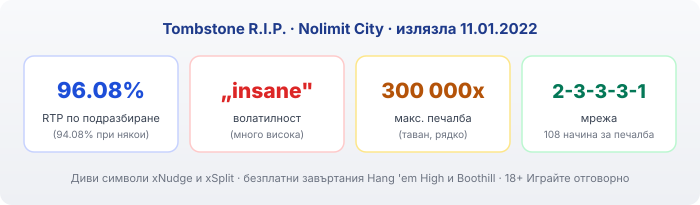
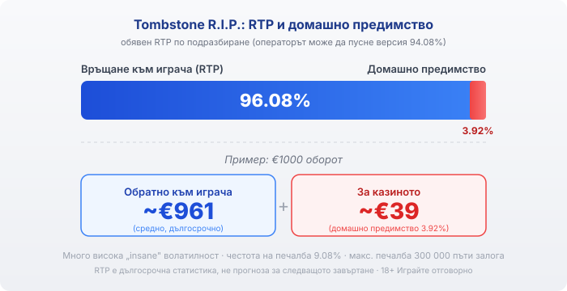

Title tag: Tombstone R.I.P.: RTP, волатилност и как работи
Meta description: Как работи Tombstone R.I.P. на Nolimit City: мрежа 2-3-3-3-1, xNudge и xSplit диви символи, RTP 96.08%, макс. печалба 300 000x и защо „insane" волатилността значи дълги сухи серии.

---

# Tombstone R.I.P.: RTP, волатилност и как работи

Tombstone R.I.P. на Nolimit City излезе на 11.01.2022 г. като пряко продължение на по-ранната Tombstone, със същата уестърн тема и репутация на игра, която не прощава. Ефектите са ефектни, а таванът от 300 000 пъти залога е сред най-високите в онлайн ротативките. Зад това стои конкретна математика с много висока волатилност, която е добре да разбираш, преди да заложиш.

## Как е устроена играта

Tombstone R.I.P. няма стандартен екран 5x3. Мрежата е 2-3-3-3-1: пет барабана с различен брой позиции, което дава 108 начина за печалба в основата на играта. Печалба се образува, когато еднакви символи паднат на съседни барабани отляво надясно, без фиксирани линии. Броят начини не е постоянен: xSplit механиката разделя символи и увеличава позициите, така че 108 е отправната точка, а не таванът. За играч, свикнал с класически линии, това е първото нещо за преосмисляне: тук значение има колко и къде се разширяват барабаните, не подредбата по определена пътека.

## Дивите символи: xNudge и xSplit

Сърцето на играта са два вида диви символи. xNudge wild винаги се избутва нагоре или надолу, докато се покаже целият символ на барабана, и всяка стъпка добавя по +1 към множителя на този див символ. Колкото повече стъпки, толкова по-висок множител се залепя за печалбата. xSplit wild пада на петия барабан, брои се за два символа и разделя символите вляво от себе си, с което вдига броя начини за печалба в същото завъртане. Има и разширен залог, xBet, който вдига залога с 10% и гарантира поне един scatter символ. Плащаш повече за по-чест достъп до бонуса, не за по-добри шансове вътре в него.

## Безплатните завъртания

Три scatter символа пускат Hang 'em High: 8 безплатни завъртания, при които общият множител се натрупва с всеки див символ, паднал по време на рунда. По-горното ниво е Boothill Freespins, 10 завъртания с каубойски символи, които раздават случайни множители от 5x до 999x. Таванът от 300 000 пъти залога се достига в този режим и при подходящо струпване на множители. Това е статистически рядко събитие, не сценарият по подразбиране: повечето бонус рундове приключват доста по-скромно.

## RTP и волатилност

Обявеният RTP по подразбиране е 96.08%, което оставя домашно предимство от 3.92%. При €1000 оборот това значи средно връщане от порядъка на €961 в дългосрочен план и около €39 за казиното. Nolimit City обаче доставя играта и в по-нисък вариант с RTP 94.08%, а операторът избира коя версия да пусне. Коя точно работи при теб проверяваш в инфо-панела на играта в конкретното казино, защото там пише реалната стойност. По-важното число тук е волатилността: Nolimit я определя като „insane", тоест сред най-високите изобщо. Честотата на печалба е 9.08%, тоест средно под всяко десето завъртане връща нещо. На практика това значи дълги серии без печалба, прекъсвани от отделни по-едри попадения, и банка, която трябва да издържи на тези сухи периоди.

*Обявен RTP 96.08% по подразбиране: при €1000 оборот средно ~€961 се връщат на играча, ~€39 остават за казиното (домашно предимство 3.92%). Волатилността е много висока, а максималната печалба е 300 000 пъти залога.*

## Купуването на функцията

Играта позволява да купиш бонус рунда директно: от 70 пъти залога за Hang 'em High до 3000 пъти залога за Boothill Freespins. Плащаш веднага и получаваш достъп до режима, но дългосрочното домашно предимство не се променя от това. Купуваш си по-бърз вход към вариацията, не по-добри шансове. При толкова висока волатилност залог от 3000 пъти за един рунд може да изчезне за секунди, без да върне нищо близко до цената. Дали купуването на функцията изобщо е налично зависи от пазара и от конкретния оператор в България, затова провери в самата игра, преди да разчиташ на него.

## За кой тип играч е

Много високата волатилност не е предимство или недостатък сама по себе си, а въпрос на темперамент и бюджет. Ако очакваш чести малки печалби, които да поддържат баланса, тази игра ще те изнерви: тя е строена около редки едри попадения и дълги паузи между тях. Ако пък играеш с фиксирана сума, която можеш да загубиш изцяло, и точно тръпката на голямата, но малко вероятна печалба ти е интересна, темпото ѝ е логично. Ако не си сигурен кой от двата играча си, много високата волатилност е знак да караш предпазливо и с малки залози.

## Преди да завъртиш

[Слот игрите](/slot-igri/) на Nolimit City обикновено имат демо режим, в който да усетиш темпото и волатилността, без да залагаш реални пари, а ако искаш да сравниш доставчици, [прегледът ни на доставчиците](/blog/games-providers/) стъпва на същата логика. Различните [ротативки](/kazino-igri/rotativki/) се сравняват най-честно по RTP, затова в [методологията ни](/kak-ocenyavame/) гледаме реалния процент на конкретното казино, не рекламния. Задай си лимит за загуба и за време преди първото завъртане, особено при игра с толкова висока волатилност, където банката се топи бързо в сухите серии. 18+ Хазартът може да пристрасти. Играйте отговорно. Ако усетите, че играта излиза извън контрол, вижте [инструментите за отговорна игра](/otgovorna-igra/).

---

**Георги Тодоров**
Публикувано: 17.09.2026 · Последна редакция: 17.09.2026

[About Всички Казина boilerplate]

**Отговорна игра.** 18+ Хазартът може да пристрасти. Играйте отговорно. Ако усетиш, че играта излиза извън контрол или искаш да я ограничиш, виж [инструментите за отговорна игра](/otgovorna-igra/) и възможността за самоизключване чрез националния регистър на уязвимите лица към НАП (подава се писмено само от засегнатото лице). Национална информационна линия за наркотиците, алкохола и хазарта („Солидарност") 0888 99 18 66, делнични дни 10:00–17:00.

**Разкриване на партньорства.** Всички Казина съдържа партньорски (афилиейт) връзки; когато отвориш оферта през такава връзка, това може да финансира сайта, без да променя цената за теб и без да влияе на оценките ни. От 1 август 2026 г. дейността на афилиейт оператори в България се лицензира съгласно Закона за държавния бюджет за 2026 г. (ДВ, бр. 69 от 31.07.2026 г.). Всички Казина е подало заявление за лиценз пред Националната агенция по приходите и очаква издаването му.
