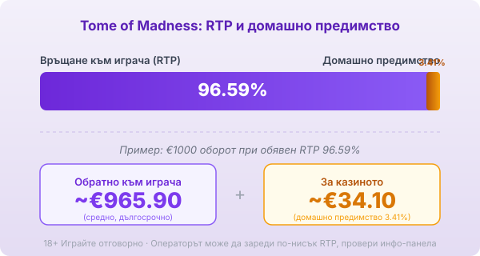
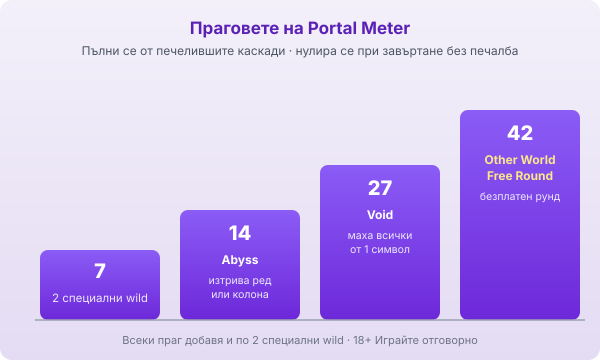

Title tag: Tome of Madness: RTP 96.59%, клъстери и Portal Meter
Meta description: Tome of Madness (том ъв маднес) от Play'n GO: поле 5×5, клъстер печалби, RTP 96.59%. Как Portal Meter трупа портални ефекти до безплатния рунд на 42.

---

# Tome of Madness: RTP, клъстер печалби и как работи Portal Meter

Tome of Madness (том ъв маднес) е слот на Play'n GO от серията за авантюриста Rich Wilde и излиза през юни 2019 г. Пълното му име е „Rich Wilde and the Tome of Madness", а темата е взета от Лъвкрафт: окултен култ, пипала и подземни богове. Това не е класическа ротативка с линии, а поле от клетки, в което еднаквите символи се групират. Цялата игра се върти около един измервател, който се пълни от печелившите каскади.

## Полето 5×5 и клъстерите

Символите падат в мрежа от пет на пет, тоест 25 клетки. Печели се на клъстер: четири или повече еднакви символа, свързани хоризонтално или вертикално, се броят за печалба. След всяка печалба символите от клъстера изчезват, а на тяхно място падат нови отгоре. Каскадите продължават, докато на екрана спре да пада печеливша група.

## RTP 96.59% и какво значи при €1000

Обявеният RTP по подразбиране е 96.59%, тоест домашно предимство от 3.41%. При €1000 оборот това е средно връщане от порядъка на €965.90 в дългосрочен план и около €34.10 за казиното. Play'n GO обаче предлага и по-ниски конфигурируеми версии, 94.52%, 91.59%, 87.52% и 84.50%, които операторът избира, затова реалният процент се чете от инфо-панела на конкретното казино. Разликата между най-високата и най-ниската версия е огромна, а как гледаме на реалния спрямо обявения RTP е описано в [методологията ни](/kak-ocenyavame/).

*Обявен RTP 96.59%: при €1000 оборот средно ~€965.90 се връщат на играча, ~€34.10 остават за казиното. Play'n GO предлага и по-ниски версии (94.52% / 91.59% / 87.52% / 84.50%), затова провери инфо-панела.*

## Каскадите и защо серията е важна

Каскадите не са само визуален ефект. Всеки печеливш символ, който изчезне в рамките на едно завъртане, зарежда измервателя отстрани, наречен Portal Meter. Той се пълни само докато въртенето носи печалби една след друга. Спре ли поредицата, тоест падне ли завъртане без нова печалба, прогресът се нулира и започваш отначало. Оттук идва и разлюляният характер на [ротативката](/kazino-igri/rotativki/): за да стигнеш до силните ефекти, ти трябва дълга серия каскади в едно завъртане.

## Порталните ефекти на 7, 14, 27 и 42

Измервателят има четири прага. На 7 събрани символа получаваш два специални wild-а. На 14 идват два wild-а плюс ефектът Abyss, който изтрива цял ред или цяла колона и предизвиква нова каскада. На 27 се добавя ефектът Void, който маха от полето всички копия на един случаен символ. На 42 се задейства Other World Free Round, безплатен рунд, в който порталните ефекти се редуват на случаен принцип. Колкото по-надълбоко стигне пълненето, толкова повече ефекти се трупат.

*Portal Meter се пълни от печелившите каскади и се нулира при завъртане без печалба. Прагове: 7 → 2 wild, 14 → Abyss, 27 → Void, 42 → безплатен рунд.*

## Rich Wilde и Mega Wild

Самият Rich Wilde е дивата карта в основната игра и удвоява всяка печалба, в която участва. В безплатния рунд се появява голяма дива карта, Mega Wild, която расте и се мести с каскадите, подобно на гиганта от друг Play'n GO слот, Reactoonz. Тези диви карти са начинът, по който бонусът може да събере няколко клъстера в едно голямо попадение.

## Волатилност и таван

Публичните бази определят Tome of Madness като слот с висока волатилност, като част от тях му дават максималната оценка. Максималният таван е 2 000× общия залог, което за grid слот с натрупване не е огромно число, но идва трудно и рядко. Нулиращият се измервател е причината: без дълга серия каскади силните ефекти просто не се задействат, а сухите серии между тях са дълги.

## Bonus buy

Tome of Madness няма бутон за директна покупка на бонуса. Play'n GO по принцип не прави feature buy, така че единственият път до Other World рунда минава през пълненето на измервателя в самата игра.

## Накратко

Tome of Madness е за играча, който харесва механиката на натрупване и клъстерните каскади, а не спокойното въртене на линии. Силата ѝ, порталните ефекти и безплатният рунд, е заключена зад дълга серия печеливши каскади, която се нулира лесно, затова волатилността е висока и сухите серии дълги. Таванът от 2 000× не е сред най-високите, а домашното предимство от 3.41% тежи върху всеки залог. 18+ Хазартът може да пристрасти. Играйте отговорно. Преди да седнеш, задай си лимит за загуба и за време и провери на инфо-панела кой RTP е зареден, защото по-ниска версия променя сметката сериозно не в твоя полза.

---

**Георги Тодоров**
Публикувано: 17.09.2026 · Последна редакция: 17.09.2026

[About Всички Казина boilerplate]

**Отговорна игра.** 18+ Хазартът може да пристрасти. Играйте отговорно. Ако усетиш, че играта излиза извън контрол или искаш да я ограничиш, виж [инструментите за отговорна игра](/otgovorna-igra/) и възможността за самоизключване чрез националния регистър на уязвимите лица към НАП (подава се писмено само от засегнатото лице). Национална информационна линия за наркотиците, алкохола и хазарта („Солидарност") 0888 99 18 66, делнични дни 10:00–17:00.

**Разкриване на партньорства.** Всички Казина съдържа партньорски (афилиейт) връзки; когато отвориш оферта през такава връзка, това може да финансира сайта, без да променя цената за теб и без да влияе на оценките ни. От 1 август 2026 г. дейността на афилиейт оператори в България се лицензира съгласно Закона за държавния бюджет за 2026 г. (ДВ, бр. 69 от 31.07.2026 г.). Всички Казина е подало заявление за лиценз пред Националната агенция по приходите и очаква издаването му.
