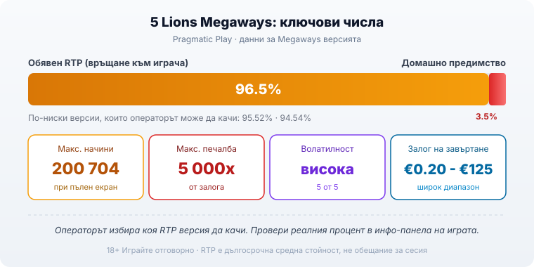
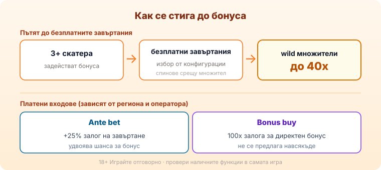

Title tag: 5 Lions Megaways (Pragmatic): RTP, начини и как се играе
Meta description: 5 Lions Megaways на Pragmatic Play: как работи Megaways двигателят с до 200 704 начина, каскадните печалби, RTP 96.5% и защо операторът може да пусне по-нисък.

---

# 5 Lions Megaways (Pragmatic): RTP, начини и как се играе

5 Lions Megaways е версията на азиатската серия на Pragmatic Play, която захвърля фиксираните линии и минава на двигателя Megaways. Ако си виждал името в списъка с ротативки на българско казино и не си сигурен дали е същата игра като 5 Lions отпреди няколко години, краткият отговор е: не е. Тук се играе по различен начин, а разликата започва още от това как изобщо се броят печелившите комбинации.

## Три различни игри с почти еднакво име

Pragmatic Play пусна три заглавия около този мотив и е лесно да ги объркаш, затова специфкациите на едното не важат за другото. Оригиналният 5 Lions е от 2018 г., има 5 барабана на 3 реда и фиксирани 243 начина за печалба. 5 Lions Gold е от 2019 г. и стъпва на същите 5x3 и 243 начина, но добавя джакпот функция и допълнителен бонус за събиране. 5 Lions Megaways е най-новата, от 2021 г., и е единствената от трите, която използва Megaways механиката с променлив брой начини. Когато четеш число за RTP или таван на печалбата, увери се, че е точно за Megaways версията, а не за някоя от другите две.

## Как работи Megaways двигателят

Megaways е механика, лицензирана от Big Time Gaming, при която броят на символите на всеки барабан се променя при всяко завъртане. „Начин" за печалба тук значи поредица от еднакви символи по съседни барабани, започваща от левия, без значение на кой точно ред попада всеки символ. Понеже височината на барабаните се мени, се мени и броят на начините: от няколкостотин при нисък екран до максималните 200 704, когато барабаните се напълнят докрай. При 5 Lions Megaways полето е с 6 барабана с променлива височина, като всеки може да покаже между 2 и 8 символа. Това е причината едно завъртане да ти даде шепа начини, а следващото да отвори десетки хиляди.

## Каскадните печалби

Слотът работи с каскади, които Pragmatic нарича Tumble. Щом се получи печеливша комбинация, участвалите символи изчезват, а на тяхно място падат нови отгоре. Комбинацията се оценява отново, без да плащаш ново завъртане, и това продължава, докато спрат да падат печалби. Една добра каскада в игра с толкова много начини може да навърже няколко удара един след друг от един-единствен залог. Точно тук е и голямата разлика с оригиналния 5 Lions, където няма падащи символи.

## Безплатните завъртания и множителите

Бонусът се задейства, когато на екрана паднат три или повече символа скатер. Оттам избираш между няколко предварително зададени конфигурации: повече завъртания с по-скромен множител или по-малко завъртания със стръмен множител. Печалбите в бонуса се качват от специалните wild символи, които носят множител до 40 пъти. Функцията може да се презадейства, ако паднат нови скатери по време на завъртанията. Няма едно универсално „правилно" разпределение: повече завъртания дават по-плавна игра, а високият множител залага повече на един силен екран.

## RTP и волатилност: дългосрочна сметка, не обещание за сесия

RTP (return to player, връщане към играча) е средният процент от заложените пари, който играта връща в дългосрочен план, изчислен върху милиони завъртания, а не върху твоята вечер. Обявеният RTP на 5 Lions Megaways е 96.5% по данни на Pragmatic Play. Тук идва уловката, която мнозина пропускат: същата игра се доставя и във версии с 95.52% и 94.54%, а операторът избира коя да качи. Затова в [методологията ни](/kak-ocenyavame/) гледаме реалния RTP на конкретното казино, а не рекламния, и ти препоръчваме да отвориш инфо-панела на играта, преди да заложиш. При обявен RTP 96.5% домашното предимство е 3.5% в полза на казиното; при по-ниската версия 94.54% то се качва на 5.46%, което за същия оборот означава осезаемо повече оставена сума. Ако завъртиш €1000 общ оборот, версията с 96.5% връща средно около €965 в дългосрочен план, а тази с 94.54% около €945. Двайсетината евро разлика идват от нищо повече от това коя графика е качил операторът, при абсолютно същата игра на екрана. За една вечер числата няма да излязат толкова гладки в никоя от двете версии, защото това е средна стойност за огромен брой завъртания, но посоката е ясна.

*Ключовите числа за Megaways версията. Операторът може да качи по-ниска RTP версия, затова я проверявай в инфо-панела на конкретното казино.*

Волатилността измерва не колко връща играта, а как: с чести дребни печалби или с редки, но по-едри. 5 Lions Megaways е с висока волатилност (5 от 5). На практика това значи дълги сухи серии, прекъсвани от отделни силни каскади, и баланс, който подскача рязко в двете посоки. Високата волатилност не е нито по-добра, нито по-лоша от ниската, тя просто иска по-голям бюджет и повече търпение, за да преживееш мъртвите периоди.

## Залог, таван и платените функции

Залогът тръгва от €0.20 и стига до €125 на завъртане, така че играта пуска и предпазливи, и агресивни бюджети. Таванът на печалбата е 5 000 пъти залога за цялата игрална сесия на бонуса, което за високоволатилен Megaways е по-скоро скромно в сравнение с заглавия, стигащи десетки хиляди пъти залога. Има и две платени опции. Ante bet качва залога с 25% и удвоява шанса бонусът да се появи. Bonus buy ти дава директно безплатните завъртания срещу 100 пъти залога, но наличието им зависи от региона и от конкретния оператор, а на някои пазари изобщо липсват. Не приемай, че ги има, преди да ги видиш в самата игра. 18+ Хазартът може да пристрасти. Играйте отговорно.

*Как се стига до бонуса и какво струват платените входове. Достъпът до bonus buy и ante bet зависи от региона и оператора.*

## За кого е и как да я подходиш разумно

5 Lions Megaways е за играч, който харесва каскадите и не се плаши от дълги периоди без печалба заради шанса за една дълга верига. Ако търсиш плавна сесия с малък бюджет, високата волатилност бързо ще изяде баланса ти и играта ще ти се стори несправедлива, макар че прави точно това, което пише в спецификацията ѝ. Пробвай я първо в демо режим сред другите [ротативки](/kazino-igri/rotativki/), а ако искаш да сравниш стила на студиото, [прегледът ни на доставчиците](/blog/games-providers/) стъпва на същата логика. Задай си лимит за загуба и за време, преди да отвориш играта, и помни, че при висока волатилност е нормално да минеш дълго на минус, без това да значи, че „голямото" предстои всеки момент. Хазартът не е начин да си върнеш пари или да изкараш доход. Математиката работи за казиното при всяка една от трите версии на RTP, а Megaways двигателят прави само едно нещо със сигурност: разиграва същото домашно предимство по-драматично.

---

**Георги Тодоров**
Публикувано: 18.09.2026 · Последна редакция: 18.09.2026

[About Всички Казина boilerplate]

**Отговорна игра.** 18+ Хазартът може да пристрасти. Играйте отговорно. Ако усетиш, че играта излиза извън контрол или искаш да я ограничиш, виж [инструментите за отговорна игра](/otgovorna-igra/) и възможността за самоизключване чрез националния регистър на уязвимите лица към НАП (подава се писмено само от засегнатото лице). Национална информационна линия за наркотиците, алкохола и хазарта („Солидарност") 0888 99 18 66, делнични дни 10:00–17:00.

**Разкриване на партньорства.** Всички Казина съдържа партньорски (афилиейт) връзки; когато отвориш оферта през такава връзка, това може да финансира сайта, без да променя цената за теб и без да влияе на оценките ни. От 1 август 2026 г. дейността на афилиейт оператори в България се лицензира съгласно Закона за държавния бюджет за 2026 г. (ДВ, бр. 69 от 31.07.2026 г.). Всички Казина е подало заявление за лиценз пред Националната агенция по приходите и очаква издаването му.
