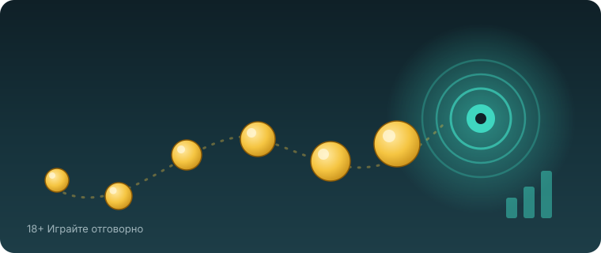

Title tag: Duck Hunters (Nolimit City): RTP, collection и как се играе
Meta description: Duck Hunters на Nolimit City: RTP 96.05%, екстремна волатилност, таван 30 000x, формат 6x5 със scatter pays. Как работят позиционните множители и collection на scatter-ите за безплатните завъртания.

---

# Duck Hunters (Nolimit City): RTP, collection и как се играе

Ако си попадал на „дък хънтърс" в списъка с популярни ротативки и си се чудил защо толкова хора я коментират, отговорът е в механиката, не в темата. Duck Hunters е дело на **Nolimit City**, издадена през февруари 2025 г., и е типичен пример за стила на студиото: сатирична обвивка отгоре, доста агресивна математика отдолу. Ето как всъщност работи, без разкрасяване.

Малко уточнение по източниците, защото името обикаля мрежата с грешна етикетка: играта е на Nolimit City. В каталога на Hacksaw Gaming няма заглавие Duck Hunters, така че ако търсиш „hacksaw duck hunters", всъщност гледаш игра на друго студио.

## Форматът: 6x5 и печалби без линии

Полето е 6 барабана на 5 реда. Тук няма фиксирани линии на печалба. Duck Hunters използва механика scatter pays, при която печелиш, когато 8 или повече еднакви символа паднат някъде по полето, без значение дали са подредени. Този подход отваря повече комбинации от класическите линии, защото символите не трябва да са на определени позиции, а просто да са достатъчно на брой. Всяка печеливша комбинация се маха, а на нейно място падат нови символи. Точно тези каскади са важни, защото задвижват втория и по-интересен двигател на играта.

## Позиционните множители

Сърцето на Duck Hunters са множителите, вързани към конкретни клетки, а не към символи. Всяка позиция на полето започва със стойност x2. Когато на същата клетка се падне печеливш символ при поредна каскада, множителят там се удвоява: от x2 на x4, после x8 и нагоре, теоретично чак до x8 192 на една-единствена позиция. Тоест не гониш просто много символи, а серия от каскади, които се струпват върху едни и същи места по полето.

Това звучи мощно и понякога е, но си струва да се каже честно: такова струпване е рядкост в основната игра. Множителят на дадена клетка расте само докато каскадите продължават, а те свършват бързо, ако новите символи не образуват нова печалба. За да стигне една позиция до горните стойности, трябва да се подредят много последователни попадения точно на нея, което почти не се случва извън бонус режима. Големите числа са възможни, не са всекидневие.

## Collection: как scatter-ите отключват безплатните завъртания

Тук идва частта, която много играчи наричат „collection". Освен обикновените символи, играта има специален scatter символ, и броят му при едно завъртане решава кой бонус режим ще влезе. Не всички безплатни завъртания са еднакви: колкото повече scatter-и събереш, толкова по-щедър режим отваряш.

Схемата е стъпаловидна. Три scatter-а пускат **Duck Hunt Spins**: 7 завъртания с един случаен ъпгрейд. Четири scatter-а водят до **Hawk Eye Spins**: 8 завъртания с два ъпгрейда. Пет scatter-а отключват **Big Game Spins**: 10 завъртания и трите ъпгрейда наведнъж. Разликата между най-слабия и най-силния режим е голяма, защото ъпгрейдите определят колко символи и множители реално ще видиш.

В самите завъртания се включват модификаторите на Nolimit City: xWays и Infectious xWays превръщат клетки в няколко символа, бомбите чистят зони от полето, а символ +1 Shot добавя допълнително завъртане. Позиционните множители остават на място по време на бонуса, което е и причината едрите резултати да идват почти винаги оттам, а не от основната игра.

## RTP и волатилност

Тук са двете числа, които трябва да разбираш, преди да натиснеш спин. RTP е дългосрочен процент на връщане, изчислен върху милиони завъртания; той описва математиката на играта, не какво ще стане в твоята сесия. Обявеният RTP на Duck Hunters е **96.05%** в най-високата конфигурация. Nolimit City предлага и по-ниски версии, около **94.03%** и **92.04%**, а операторът избира коя да зареди. Затова реалният процент на конкретното казино може да е под рекламния и се проверява в инфо-панела на играта. В [методологията ни](/kak-ocenyavame/) гледаме именно тази реална версия, а не най-високата възможна.

Волатилността описва не колко, а как плаща играта: рядко и едро или често и дребно. Duck Hunters е в горния край, самото студио я определя като екстремна. На практика това значи дълги периоди без нищо, накъсани от редки попадения, които може да са големи. Високата волатилност не е по-голям шанс да си на плюс; тя просто разпределя същото домашно предимство на по-резки колебания, които изяждат бюджета по-бързо, ако не внимаваш. При обявен RTP около 96% и €1000 оборот средно се връщат към €960 в дългосрочен план, а към €40 остават за казиното.

*Ключовите числа на Duck Hunters. RTP се доставя в няколко версии (96.05% / 94.03% / 92.04%), затова провери реалната стойност в инфо-панела на конкретното казино.*

## Таванът 30 000x и за кого е играта

Максималната печалба е ограничена до 30 000 пъти залога по данни на Nolimit City. Числото изглежда огромно и точно това е идеята му, но е рекламен таван, не очакван изход. Вероятността да го удариш е около едно на 22 милиона завъртания, тоест за огромното мнозинство играчи той си остава теоретичен. Бонусът също не идва често: средно веднъж на около 200 завъртания. Ако подхождаш към Duck Hunters с представата, че таванът е реалистична цел, играта ще те разочарова бързо.

За кого тогава е тя? За играч, който търси напрежението на екстремната волатилност, разбира, че дългите сухи серии са част от сделката, и залага суми, които може да загуби без да му мигне окото. Ако предпочиташ по-плавен баланс и по-чести дребни печалби, това не е твоята игра, и няма нищо лошо в това. 18+ Хазартът може да пристрасти. Играйте отговорно.

## Демо режим, лимити и реален RTP

Преди да заложиш реални пари, повечето казина предлагат демо режим, в който да видиш как се държат каскадите и колко рядко се редят големите множители. [Ротативките](/slot-igri/) на Nolimit City са известни с това, че изглеждат щедри на теория и стиснати на практика, така че демото е полезен трезвен тест. Ако искаш да сравниш студиото с други, [прегледът ни на доставчиците](/blog/games-providers/) стъпва на същата логика.

Задай си лимит за загуба и за време преди първото завъртане и не го местиш в движение. Провери реалния RTP на конкретното казино в инфо-панела, защото версията с 92.04% и тази с 96.05% са една и съща игра с осезаемо различна математика. Хазартът не е начин да си върнеш пари или да изкараш доход; в дългосрочен план сметката работи за казиното и при екстремно волатилен слот това важи с още по-голяма сила, защото загубите идват на резки серии. Ако усетиш, че играта излиза извън контрол, виж [инструментите за отговорна игра](/otgovorna-igra/).

---

**Георги Тодоров**
Публикувано: 18.09.2026 · Последна редакция: 18.09.2026

[About Всички Казина boilerplate]

**Отговорна игра.** 18+ Хазартът може да пристрасти. Играйте отговорно. Ако усетиш, че играта излиза извън контрол или искаш да я ограничиш, виж [инструментите за отговорна игра](/otgovorna-igra/) и възможността за самоизключване чрез националния регистър на уязвимите лица към НАП (подава се писмено само от засегнатото лице). Национална информационна линия за наркотиците, алкохола и хазарта („Солидарност") 0888 99 18 66, делнични дни 10:00–17:00.

**Разкриване на партньорства.** Всички Казина съдържа партньорски (афилиейт) връзки; когато отвориш оферта през такава връзка, това може да финансира сайта, без да променя цената за теб и без да влияе на оценките ни. От 1 август 2026 г. дейността на афилиейт оператори в България се лицензира съгласно Закона за държавния бюджет за 2026 г. (ДВ, бр. 69 от 31.07.2026 г.). Всички Казина е подало заявление за лиценз пред Националната агенция по приходите и очаква издаването му.
