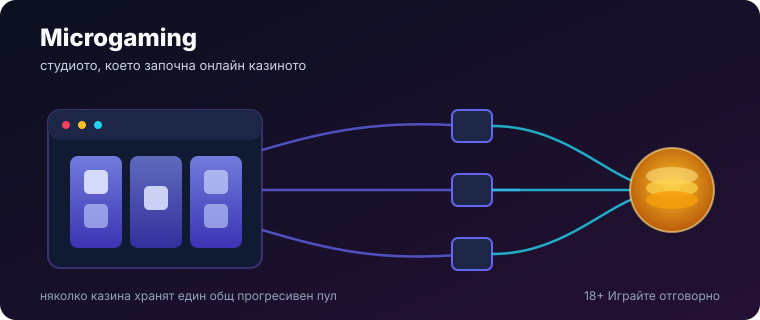
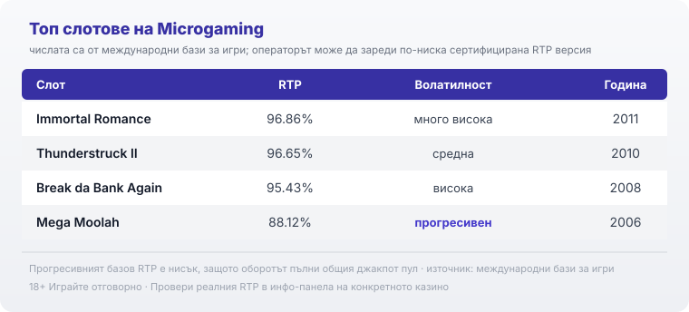

# 04-SEO — 2026-09-18-microgaming (vk-0112)

## SEO audit
- Target query „Microgaming: профил на доставчика, механики и топ слотове" covered in H1 + title + meta + intro.
- Keywords placed naturally: microgaming (H1/title/meta/intro + throughout), майкрогейминг (intro parenthetical + meta), microgaming слотове (covered via „заглавия"/„слот игри" + top-slots section), games global (H2 + meta + closing).
- Entities: остров Ман, 1994, Cash Splash 1998, Mega Moolah, прогресивен джакпот, 243 начина, Quickfire, Games Global, Immortal Romance, Thunderstruck II, Break da Bank Again, RTP версии, B2B/НАП.
- 5 approved internal links (no operator/affiliate — provider hub): /blog/games-providers/, /kak-ocenyavame/, /slot-igri/, /kazino-igri/rotativki/, /otgovorna-igra/.
- Images: hero SVG under H1, top-slots infographic beside its data, both with specific BG ALT + infographic caption.
- No number changed from 03 (diffed: all identical).

**Title tag (57 chars):** Microgaming: профил на доставчика, механики и топ слотове
**Meta description (135 chars):** Кой е Microgaming (майкрогейминг): пионерът зад Mega Moolah, защо слотовете му вече са на Games Global и кои са топ заглавията с числата им.

Internal-link suggestions (all inserted in prose):
[LINK: прегледът ни на доставчиците → /blog/games-providers/]
[LINK: методологията ни → /kak-ocenyavame/]
[LINK: слот игри → /slot-igri/]
[LINK: ротативки → /kazino-igri/rotativki/]
[LINK: инструментите за отговорна игра → /otgovorna-igra/]

---

Title tag: Microgaming: профил на доставчика, механики и топ слотове
Meta description: Кой е Microgaming (майкрогейминг): пионерът зад Mega Moolah, защо слотовете му вече са на Games Global и кои са топ заглавията с числата им.

---

# Microgaming: профил на доставчика, механики и топ слотове

Microgaming (майкрогейминг) е студиото, с което започва онлайн хазартът, и това не е рекламна фраза. През 1994 г. компанията от остров Ман пуска софтуер, който повечето играчи днес приемат за даденост: истинско казино в браузъра, с реални залози. Има обаче обрат, който трябва да се знае още в началото, защото се вижда трудно от името върху играта: от 2022 г. игрите на Microgaming вече се разпространяват от друга компания, Games Global. Тук ще намерите кой стои зад студиото, какво се промени със собствеността, кои са фирмените механики и кои заглавия с числата им си струва да познавате.

## Кой стои зад студиото

Microgaming е частна компания със седалище на остров Ман и е основана през 1994 г. Смята се за създател на първия софтуер за онлайн казино, в година, в която повечето хора още нямаха представа за какво служи интернетът. От тази ранна дата тръгват и нещата, които правят студиото разпознаваемо повече от която и да е отделна тема. През 1998 г. то пуска Cash Splash, приета за първата ротативка със свързан прогресивен джакпот, тоест общ награден фонд, който се пълни от играчи в няколко казина едновременно. Осем години по-късно същата идея се превръща в Mega Moolah и точно тя изкарва името на Microgaming извън бранша.

## 2022: игрите минаха към Games Global

Тук е фактът, който най-често се разказва грешно. През 2022 г. Microgaming продаде дистрибуторския си бизнес, познат като Quickfire, заедно с портфолиото онлайн игри и джакпот мрежата, на новосъздадената Games Global. Сделката беше обявена през ноември 2021 г. и приключи през май 2022 г. Games Global е основана през 2021 г. с частен капитал и оттогава именно тя разработва и разпространява каталога, който преди носеше само етикета Microgaming. Самата Microgaming не изчезна: тя запази платформените си системи и технологията си за спортни залози. За играча това значи, че заглавие, което вижда като „от Microgaming", днес на практика идва през Games Global, а на някои сайтове двете имена още стоят едно до друго. Ако сравнявате доставчици, [прегледът ни на доставчиците](/blog/games-providers/) държи тази разлика ясна, вместо да я замазва.

## Механиките: 243 начина и прогресивната мрежа

Почеркът на студиото стъпва на две основи, а не на дълъг списък с функции. Първата е двигателят „243 начина за печалба": вместо фиксирани линии, всяка комбинация от съседни барабани отляво надясно се брои, което дава по-плътна игра без класическите линии. По този модел вървят две от най-известните заглавия, Immortal Romance и Thunderstruck II, всяко със собствен бонус рунд от безплатни завъртания с натрупващи се множители, Chamber of Spins при едното и Great Hall of Spins при другото. Втората основа е прогресивната джакпот мрежа: няколко казина хранят един общ пул, който расте с всеки залог, докато някъде не падне. Именно тази втора идея, започнала с Cash Splash и узряла в Mega Moolah, е историческият принос на студиото. Механиката на самия прогресив разглеждаме поотделно в текста ни за Mega Moolah, ако искате нивата на джакпота в детайл.

## Прогресивният пул: откъде идват парите

Прогресивният джакпот изглежда като безплатна лотария върху нормалната игра, но не е. RTP (Return to Player, теоретичният процент връщане на дълъг период) на базовата игра при Mega Moolah е 88.12%, което е чувствително под обичайното за ротативки, и това не е случайно: част от всеки залог не се връща в базовата игра, а отива в общия пул. Пълнят джакпота играчите, а не късметът на екрана. Затова и рекордите звучат зашеметяващо: най-голямата печалба, призната от Гинес за рекорди като най-голям джакпот от онлайн ротативка, е на Mega Moolah, спечелена от Jon Heywood на 6 октомври 2015 г., £13,213,838.68, тоест €17,879,645.12. По-късно, през 2019 г., този рекорд беше подобрен от друга игра. Големите числа са реални, но шансът за тях е нищожен и един прогресивен пул не подобрява шансовете ви в конкретната сесия. 18+ Хазартът може да пристрасти. Играйте отговорно.

## Топ слотове и техните числа

Няколко заглавия държат името на студиото живо, а числата им показват къде играе то на скалата.

*Числата са от международни бази за игри; операторът може да зареди по-ниска сертифицирана версия, така че процентът до името е ориентир за заглавието, не гаранция за конкретното казино.*

Immortal Romance (2011) е може би най-разпознаваемото заглавие: пет барабана с 243 начина за печалба, много висока волатилност и RTP 96.86%. Thunderstruck II (2010) е неговият по-спокоен събрат по същия 243-двигател, със средна волатилност и RTP 96.65%. Break da Bank Again (2008) е по-класическа ротативка с висока волатилност и RTP 95.43%. Mega Moolah (2006) стои отделно от останалите: прогресивна игра с четири нива на джакпота и нисък базов RTP от 88.12%, защото оборотът пълни пула. Ако сравните тези проценти, се вижда логиката на цялото портфолио: обикновените заглавия връщат около и над средното, а прогресивът плаща за шанса за милиони с по-ниско базово връщане.

## RTP не е едно число

Почти всяко от тези заглавия съществува в няколко сертифицирани RTP версии, а конкретното казино избира коя да зареди. Затова числото до името на играта е ориентир за самото заглавие, а не гаранция какво връща сайтът, на който играете. Преди да заложите, отворете инфо-панела на играта и вижте коя версия работи там. В [методологията ни](/kak-ocenyavame/) гледаме реалния RTP на конкретното казино, а не рекламния, точно заради тази разлика. Волатилността пък не е „по-добра" или „по-лоша": ниската разтяга сесията с чести дребни връщания, високата пази парите за редки едри попадения, а изборът е въпрос на бюджет и търпение.

## Какво значи това за играча в България

Microgaming, а вече и Games Global, правят игрите, но не приемат залозите ви. Студиото държи доставчически (B2B) лицензи и праща заглавията си за независими тестове, което потвърждава, че генераторът на случайни числа и обявеният RTP отговарят на реалната математика. Тези лицензи обаче са на студиото, не на казиното. За вас като играч в България значение има лицензът на самия оператор пред НАП, защото той регулира къде и при какви условия залагате. Смяната на собствеността от Microgaming към Games Global не мени нищо от това: същата игра, същият тестван генератор, същата математика, различен корпоративен собственик отгоре.

Преди реален залог повечето [слот игри](/slot-igri/) на студиото имат демо режим, в който да усетите темпото и волатилността без пари, а различните [ротативки](/kazino-igri/rotativki/) се съпоставят най-честно по реален RTP, не по рекламния процент до името. Задайте си лимит за загуба и за време преди първото завъртане и ако усетите, че играта излиза извън контрол, вижте [инструментите за отговорна игра](/otgovorna-igra/). Microgaming си остава студиото, което построи този пазар, но за българския играч решаващото е едно: лицензът на казиното пред НАП, не името на доставчика зад играта.

---

**Георги Тодоров**
Публикувано: 18.09.2026 · Последна редакция: 18.09.2026

[About Всички Казина boilerplate]

**Отговорна игра.** 18+ Хазартът може да пристрасти. Играйте отговорно. Ако усетиш, че играта излиза извън контрол или искаш да я ограничиш, виж [инструментите за отговорна игра](/otgovorna-igra/) и възможността за самоизключване чрез националния регистър на уязвимите лица към НАП (подава се писмено само от засегнатото лице). Национална информационна линия за наркотиците, алкохола и хазарта („Солидарност") 0888 99 18 66, делнични дни 10:00–17:00.

**Разкриване на партньорства.** Всички Казина съдържа партньорски (афилиейт) връзки; когато отвориш оферта през такава връзка, това може да финансира сайта, без да променя цената за теб и без да влияе на оценките ни. От 1 август 2026 г. дейността на афилиейт оператори в България се лицензира съгласно Закона за държавния бюджет за 2026 г. (ДВ, бр. 69 от 31.07.2026 г.). Всички Казина е подало заявление за лиценз пред Националната агенция по приходите и очаква издаването му.
