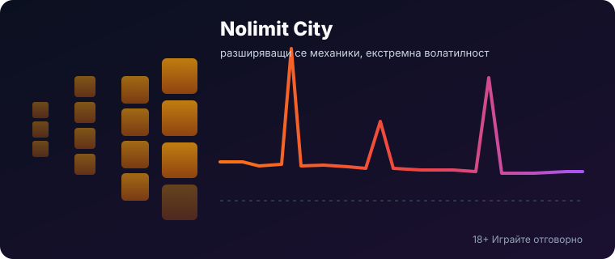
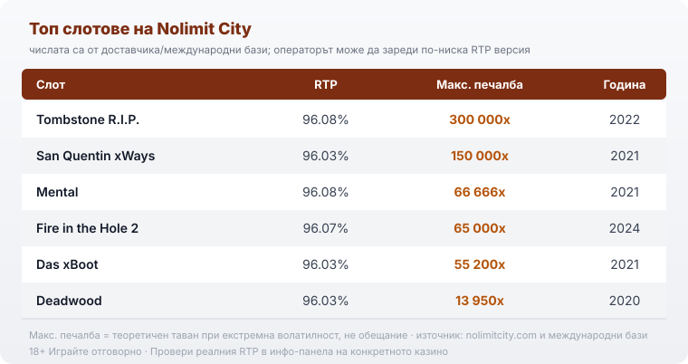

Title tag: Nolimit City: профил на доставчика, механики и топ слотове
Meta description: Кой е Nolimit City, какви са механиките му (xWays, xNudge, xBomb) и кои са топ слотовете. Защо екстремната волатилност е риск и защо RTP идва в няколко версии.

---

# Nolimit City: профил на доставчика, механики и топ слотове

Малко студиа делят играчите на два лагера така рязко, както Nolimit City. Едни се връщат заради дизайна и огромните тавани на печалбите, други странят, защото банката им се изпразва по-често, отколкото при почти всеки друг доставчик. Зад тази репутация стои една конкретна философия: студиото прави слотове с екстремна волатилност и не се извинява за това.

## Кой стои зад студиото

Nolimit City е основано през 2014 г. в Стокхолм от бивши разработчици на NetEnt, тръгнали да правят по-дръзки заглавия от масовия пазар. Компанията днес има екипи и в Малта, и в Индия, а каталогът ѝ надхвърля сто HTML5 слота. През 2022 г. Evolution се съгласи да купи студиото (сделката беше обявена през юни и завършена през август 2022 г.) за сума до 340 милиона евро, с което Nolimit City влезе в същата група като NetEnt, Red Tiger и Big Time Gaming. Придобиването не разми стила. Студиото продължава да излиза под собствено име и да прави точно това, което го направи разпознаваемо. Темите му често са мрачни и провокативни, от затвори и престъпници до военни и минни сюжети, а не поредните плодове и седмици, и именно този тон плюс тежката математика му спечелиха отделна ниша сред играчите.

## Механиките, които носят почерка

Почеркът на Nolimit City е серия функции с представка „x", които се появяват в различни комбинации от игра в игра. xWays превръща един символ в стек от няколко еднакви и така умножава броя на начините за печалба в едно завъртане. xSplit разцепва символите вляво от себе си на две и пак вдига начините. xNudge е див символ, който се избутва нагоре или надолу, докато запълни барабана, и качва множителя си с 1 при всяко избутване. xBomb е див символ, който експлодира, маха съседните символи и добавя +1 към множителя, преди останалите да се срутят надолу. Под средните барабани на част от заглавията стоят Enhancer Cells, заключени клетки, които се отключват при всяко срутване и разкриват допълнителни символи или функции.

Функциите рядко изглеждат залепени отгоре. В San Quentin разширяването на начините през xWays е сърцевината на играта, във Fire in the Hole именно xBomb трупа множителя, а в Tombstone R.I.P. работят xNudge и xSplit. Ако тези три заглавия ти звучат познато, вероятно вече си срещал почерка на студиото, без да си му знаел името.

## Защо всичко опира до волатилността

Волатилността описва как се разпределят печалбите във времето: висока волатилност значи дълги сухи серии, прекъсвани от редки, но потенциално големи попадения. Слотовете на Nolimit City са почти без изключение в горния край на скалата, а част от тях носят етикет „екстремна". Това не е нито предимство, нито недостатък сам по себе си, а въпрос на бюджет и на темперамент. Ако очакваш чести малки връщания, които държат сесията жива, тези игри ще те изтощят. Ако си готов дълго да не печелиш нищо в замяна на малкия шанс за голямо попадение, логиката им пасва на очакванията ти. Практически това значи, че една и съща банка стига за далеч по-малко сесии при екстремна волатилност, отколкото при спокоен слот със същия залог, защото парите излизат на серии, а не равномерно.

Тук идва и обратната страна на прочутите тавани. Максималната печалба, която ще видиш до заглавието, е теоретичен таван, не прогноза за твоята сесия. При Tombstone R.I.P. той е 300 000x залога, но шансът да го докоснеш е нищожен и по-честият изход е обратният: серия завъртания без нищо. RTP (Return to Player, теоретичният процент връщане) е дългосрочна статистика, изчислена върху милиони завъртания, а не обещание за сметката ти тази вечер. 18+ Хазартът може да пристрасти. Играйте отговорно.

## RTP не е едно число

Голяма част от слотовете на Nolimit City излизат в няколко RTP версии и операторът избира коя да пусне. Fire in the Hole 2 е нагледен пример: официалната стойност е 96.07%, но съществуват и билдове с 94.08%, 92.07% и дори 87.05%. Разликата между най-високата и най-ниската версия е близо девет процентни пункта, което на дълъг период е сериозна сума. Едно и също заглавие може да ти връща осезаемо различен процент в две различни казина, затова числото до името на играта е ориентир за самото заглавие, а не гаранция какво върти конкретният сайт.

Практиката е проста: отвори инфо-панела на играта, намери реда за RTP и виж коя версия работи там, преди да заложиш. В [методологията ни](/kak-ocenyavame/) гледаме реалния RTP на конкретното казино, а не рекламния, точно заради тази разлика между версиите.

## Feature buy и къде е ограничен

Nolimit City е сред студиата, които наложиха културата на feature buy, тоест директната покупка на бонус функцията срещу кратно на залога, вместо да я чакаш да падне. Удобството има цена, която мнозина подценяват: плащаш скъпо предварително за вход във функция, която пак може да завърши слабо, а бързият достъп улеснява преследването на загуби. Заради това редица регулирани пазари ограничават или забраняват механиката. Във Великобритания купуването на бонус е забранено за играчи от октомври 2021 г., а самите заглавия остават достъпни в съобразени версии, при които бутонът за покупка е премахнат. Дали ще видиш feature buy зависи изцяло от пазара и от лиценза, под който работи казиното.

## Топ слотове и техните числа

Няколко заглавия направиха студиото разпознаваемо, а числата им показват както размаха, така и разликите между отделните игри. Tombstone R.I.P. (2022) държи един от най-високите тавани в каталога с 300 000x залога при RTP 96.08%. San Quentin xWays (2021) стига до 150 000x при 96.03%. Mental (2021) плаща до 66 666x при 96.08%, Fire in the Hole 2 (2024) до 65 000x при 96.07%, а Das xBoot (2021) до 55 200x при 96.03%. Deadwood (2020) е трезвият контрапункт в списъка: таван от 13 950x при RTP 96.03%, тоест не всяко заглавие на Nolimit City гони шестцифрени множители.

*Числата са от сайта на доставчика и международни бази; операторът може да зареди по-ниска RTP версия, а максималната печалба е теоретичен таван, не обещание.*

## Какво значи това за играча в България

Nolimit City прави игрите, но не приема залозите ти. Студиото държи доставчически (B2B) лицензи и праща заглавията си за тестове в независими лаборатории, което потвърждава, че генераторът на случайни числа и обявеният RTP отговарят на реалната математика. Тези лицензи са на студиото, не на казиното. За теб като играч в България значение има лицензът на самия оператор пред НАП, защото той регулира къде и при какви условия залагаш. Как проверяваме операторите е описано в [нашата методология](/kak-ocenyavame/).

Преди да пуснеш реален залог, повечето [слот игри](/slot-igri/) на студиото имат демо режим, в който да усетиш темпото на волатилността без пари. Ако сравняваш доставчици един до друг, [прегледът ни на доставчиците](/blog/games-providers/) стъпва на същата логика, а различните [ротативки](/kazino-igri/rotativki/) се съпоставят най-честно именно по реален RTP. Задай си лимит за загуба и за време още преди първото завъртане и ако усетиш, че играта излиза извън контрол, виж [инструментите за отговорна игра](/otgovorna-igra/).

Nolimit City не е студио за всеки. Ако търсиш спокойно темпо и чести дребни връщания, ще ти дойде в повече. Но ако разбираш какво купуваш, тоест дълги сухи серии срещу малкия шанс за голямо попадение, и играеш с предварително зададен лимит, това е едно от най-разпознаваемите и технически изпипани студиа на пазара. Само не бъркай високия таван с вероятен изход.

---

**Георги Тодоров**
Публикувано: 18.09.2026 · Последна редакция: 18.09.2026

[About Всички Казина boilerplate]

**Отговорна игра.** 18+ Хазартът може да пристрасти. Играйте отговорно. Ако усетиш, че играта излиза извън контрол или искаш да я ограничиш, виж [инструментите за отговорна игра](/otgovorna-igra/) и възможността за самоизключване чрез националния регистър на уязвимите лица към НАП (подава се писмено само от засегнатото лице). Национална информационна линия за наркотиците, алкохола и хазарта („Солидарност") 0888 99 18 66, делнични дни 10:00–17:00.

**Разкриване на партньорства.** Всички Казина съдържа партньорски (афилиейт) връзки; когато отвориш оферта през такава връзка, това може да финансира сайта, без да променя цената за теб и без да влияе на оценките ни. От 1 август 2026 г. дейността на афилиейт оператори в България се лицензира съгласно Закона за държавния бюджет за 2026 г. (ДВ, бр. 69 от 31.07.2026 г.). Всички Казина е подало заявление за лиценз пред Националната агенция по приходите и очаква издаването му.
