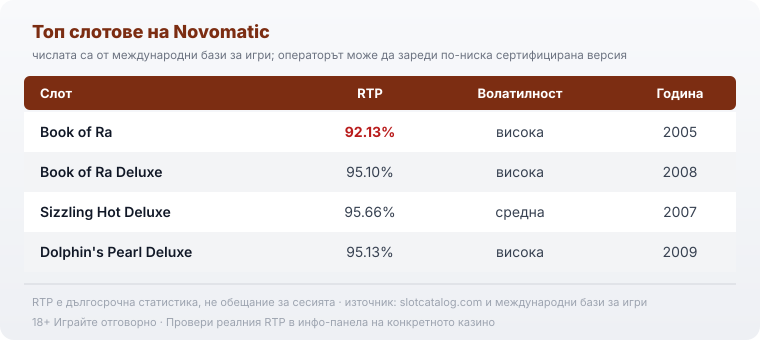

Title tag: Novomatic: профил на доставчика, механики и топ слотове
Meta description: Кой е Novomatic (новоматик): австрийското студио зад Book of Ra и Sizzling Hot, онлайн ръката Greentube, механиките и RTP-то на топ слотовете.

---

# Novomatic: профил на доставчика, механики и топ слотове

Novomatic (новоматик) е австрийска компания, не българска, и това си струва да се каже още в началото, защото плодовите му класики често се бъркат с тези на EGT. Зад „Book of Ra" и „Sizzling Hot" стои един от най-старите производители на гейминг техника в Европа, който първо напълни залите с машини и чак след това излезе онлайн.

## Кой стои зад Novomatic

Компанията е основана през 1980 г. от Johann Graf в градчето Гумполдскирхен в Долна Австрия, където и до днес е седалището на групата. Началото не е онлайн, а съвсем наземно: гейминг машини под марката Admiral, които през следващите десетилетия се разпространяват в около 50 държави и правят Novomatic един от най-големите доставчици на казино техника на континента. Ако сте виждали в зала кабинет с меню от няколко игри на един екран, много вероятно е било от серията Gaminator, запазената марка на наземния бизнес. Тази наземна история обяснява защо и онлайн заглавията изглеждат по-скоро като класически ротативки от казино зала, отколкото като модерните високоволатилни слотове от последните години.

## Greentube: онлайн ръката на Novomatic

Онлайн игрите на Novomatic не излизат директно от австрийската компания, а през нейното дигитално подразделение Greentube. Novomatic придобива мажоритарен дял в базираното във Виена студио през 2010 г. и до следващата година го интегрира напълно като своята дигитална дивизия. Оттам нататък Greentube пренася наземните класики в браузъра и на телефона, така че „Book of Ra" от залата и „Book of Ra" на екрана ви са всъщност едно и също семейство игри, разработвано под един покрив. Greentube държи доставчически лицензи и праща заглавията си за независими тестове.

## Внимание: Novomatic не е Amusnet (EGT)

Точно тук се завърта най-честото объркване. Amusnet, познато на повечето играчи под старото име EGT (Euro Games Technology), е отделна компания, при това българска, със седалище в София и основана през 2002 г.; онлайн подразделението ѝ EGT Interactive се преименува на Amusnet през 2022 г. Двете студиа правят на пръв поглед сходни неща, плодови ротативки със звезди и седмици, джакпот карти и класически барабани, но нямат обща собственост и обща история. Novomatic е австрийска, Amusnet е българска. Ако сравнявате доставчици, [прегледът ни на доставчиците](/blog/games-providers/) държи двете като напълно отделни профили, и така е редно.

## Механиките: книги с разширяващ се символ и прости плодове

Почеркът на Novomatic се крепи на няколко прости идеи, а не на дълъг списък с функции. Най-разпознаваемата е „книгата": в „Book of Ra" и роднините му един символ едновременно е wild и scatter, а три такива стартират безплатни завъртания, в които на случаен принцип се избира един символ и той се разширява върху целия барабан. Именно разширяването, а не отделен бонус купон или множител, е моментът, който носи големите редове. Освен разширяващите се символи, студиото разчита и на още по-стара концепция: простите плодове. „Sizzling Hot" е пет барабана с шепа фиксирани линии, звезда за скатер и класическа гамбъл функция за удвояване, без безплатни завъртания и без бонус рунд. Малко механика, бърз ритъм, познат от залата. Върху тези две основи стъпват серията Gaminator и цялото семейство „Book of", които правят студиото разпознаваемо от разстояние.

## Топ слотове и техните числа

Няколко заглавия държат името на Novomatic живо, а числата им показват едно нещо ясно: това са класики отпреди ерата на рекордните тавани.

*Числата са от международни бази за игри; операторът може да зареди по-ниска сертифицирана версия, така че процентът до името е ориентир за заглавието, не гаранция за конкретното казино.*

„Book of Ra" в оригиналната си версия от 2005 г. е и най-суровият пример: RTP от 92.13%, висока волатилност и теоретичен таван до 5 000 пъти залога, което по днешните стандарти е доста под средното връщане. „Book of Ra Deluxe" от 2008 г. вдига процента до 95.10% и добавя по-разгърнат вид, но остава същата книга с разширяващ се символ. „Sizzling Hot Deluxe" (2007) е плодовата линия с RTP 95.66% и по-спокойна, средна волатилност, докато „Dolphin's Pearl Deluxe" (2009) връща 95.13% при висока волатилност. В същия ред стои и „Lucky Lady's Charm Deluxe" с 95.13% и висока волатилност. Ако сравните тези проценти с модерните студиа, които рекламират 96 и нагоре, се вижда защо класиките на Novomatic са по-скоро за играча, който търси познатата зала, а не максималния теоретичен процент. На сайта разглеждаме поотделно и „Book of Ra", и „Book of Ra Deluxe", и „Sizzling Hot", ако искате механиката на всяко заглавие в детайл.

## RTP не е едно число

Почти всяко от тези заглавия съществува в няколко сертифицирани RTP версии, а конкретното казино избира коя да зареди. При книгите на Novomatic разликата може да е чувствителна: същата игра, която в едната база е 95.10%, другаде тръгва от по-нисък процент. Затова числото до името е ориентир за самото заглавие, а не обещание какво връща сайтът пред вас. Преди да заложите, отворете инфо-панела на играта и вижте кой процент работи там. В [методологията ни](/kak-ocenyavame/) гледаме реалния RTP на конкретното казино именно заради тази разлика, а не рекламния, който върви с името на слота.

## Какво значи това за играча в България

Novomatic и Greentube правят игрите, но не приемат залозите ви. Студиото държи доставчически (B2B) лицензи и праща заглавията си за независими проверки, което потвърждава, че генераторът на случайни числа и обявеният RTP отговарят на реалната математика. Тези лицензи обаче са на студиото, не на казиното. За вас като играч в България значение има лицензът на самия оператор пред НАП, защото той регулира къде и при какви условия залагате. Как проверяваме операторите е описано в [нашата методология](/kak-ocenyavame/), а преди реален залог повечето [слот игри](/slot-igri/) на студиото имат демо режим, в който да усетите темпото и волатилността без пари. При игри с по-ниско от средното връщане това е още по-полезно, отколкото обикновено.

За българския играч решаващото остава едно: лицензът на казиното пред НАП, не лицензът на австрийското студио зад играта. Преди да заложите на класика като „Book of Ra", проверете и коя RTP версия е заредена, защото при тези заглавия тя се мени от казино на казино. Задайте си лимит за загуба и за време преди първото завъртане и ако усетите, че играта излиза извън контрол, вижте [инструментите за отговорна игра](/otgovorna-igra/). 18+ Хазартът може да пристрасти. Играйте отговорно.

---

**Георги Тодоров**
Публикувано: 18.09.2026 · Последна редакция: 18.09.2026

[About Всички Казина boilerplate]

**Отговорна игра.** 18+ Хазартът може да пристрасти. Играйте отговорно. Ако усетиш, че играта излиза извън контрол или искаш да я ограничиш, виж [инструментите за отговорна игра](/otgovorna-igra/) и възможността за самоизключване чрез националния регистър на уязвимите лица към НАП (подава се писмено само от засегнатото лице). Национална информационна линия за наркотиците, алкохола и хазарта („Солидарност") 0888 99 18 66, делнични дни 10:00–17:00.

**Разкриване на партньорства.** Всички Казина съдържа партньорски (афилиейт) връзки; когато отвориш оферта през такава връзка, това може да финансира сайта, без да променя цената за теб и без да влияе на оценките ни. От 1 август 2026 г. дейността на афилиейт оператори в България се лицензира съгласно Закона за държавния бюджет за 2026 г. (ДВ, бр. 69 от 31.07.2026 г.). Всички Казина е подало заявление за лиценз пред Националната агенция по приходите и очаква издаването му.
