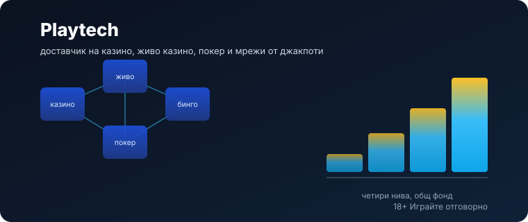
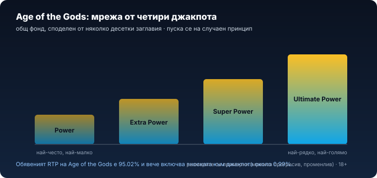
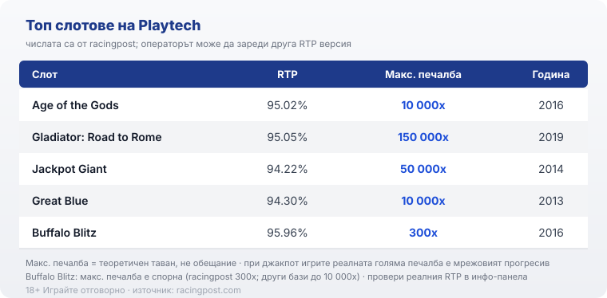

# 03 — Humaniser pass (light)

Verdict: HUMAN-LIKE, light touch. 0 em-dashes; varied paragraph architecture; no banned connectives; no "не A, а B" paragraph-ending antithesis; asymmetric opinionated close. Every number, internal link, RG line, 18+ marker, date, byline and brand mention preserved unchanged from 02-draft.

# Playtech: профил на доставчика, механики и топ слотове

Playtech рядко се набива на очи с името си. Набиват се игрите му: мрежата от джакпоти Age of the Gods, дивите барабани на Buffalo Blitz, римските бонуси на Gladiator. Милиони играчи са завъртали негово заглавие, без изобщо да знаят чие е. Зад доста от лицензираните казина, които подреждат слотове по доставчик, стои една и съща компания, а тя е сред най-старите и най-големите в бранша. Playtech не гони екстремни тавани. Продава инфраструктура.

## Кой стои зад Playtech

Playtech е основана през 1999 г. в Тарту, Естония, от Теди Саги, а днес седалището ѝ е на остров Ман. Компанията излиза на Лондонската фондова борса през 2006 г. и е част от индекса FTSE 250, тоест публично търгувано дружество с хиляди служители и клиенти сред водещите оператори, чиито отчети всеки може да прочете. Саги постепенно намалява дела си и продава последните си акции до 2018 г., така че основателят вече не е сред собствениците. През октомври 2021 г. австралийската Aristocrat договори условия да купи Playtech за около 2,7 милиарда паунда, но сделката не се осъществи и компанията остана самостоятелна. Тази публичност значи за играча повече, отколкото звучи: доставчик, който подава одитирани отчети на регулиран пазар, работи под съвсем различен натиск от анонимно студио без история.

## Не само слотове: целият пакет

Слотовете са само част от бизнеса. Playtech лицензира на операторите цял софтуерен пакет: онлайн казино и ротативки с каталог над 700 заглавия, казино на живо със студиа в няколко държави, сред които Латвия и Филипините, покер мрежа (iPoker), бинго платформа (Virtue Fusion) и спортни залози, а през Snaitech държи голям дял от италианския пазар. Малко доставчици покриват всички тези вертикали наведнъж, и точно тази широчина е продуктът: операторът взима наготово цяло казино, не отделни игри. Компанията не приема твоите залози и не ти изплаща печалби. Тя прави и дава под наем технологията, а казиното, което виждаш отпред, е неин клиент. Затова една и съща игра се появява в десетки различни сайта, всеки със свой лиценз и свои условия, а понякога и с различни настройки на едно и също заглавие.

## Age of the Gods и мрежовите джакпоти

Разпознаваемият почерк на Playtech е Age of the Gods, но това не е една игра, а цяла мрежа. Няколко десетки заглавия споделят общ фонд от четири прогресивни джакпота: Power, Extra Power, Super Power и Ultimate Power, като най-големият расте най-бавно. Самата основна игра Age of the Gods върви на решетка 5x3 с 20 линии и четири бонус режима с безплатни завъртания около Атина, Зевс, Посейдон и Херкулес. Джакпотът обаче се пуска на случаен принцип по време на игра и се решава с отделна мини-игра с избор на монети, независимо от резултата на самото завъртане. Тук е математиката, която банерът пропуска: фондът се пълни от оборота на всички играчи в мрежата, а обявеният RTP на Age of the Gods от 95.02% вече включва вноската към джакпота, около 0.99%. Този процент е отчислен от базовата игра и отива в общия котел. Печели някой в мрежата, рано или късно, но статистически това почти никога не си ти. 18+ Хазартът може да пристрасти. Играйте отговорно.

*Четирите нива споделят общ фонд, който се пълни от оборота на цялата мрежа; вноската към джакпота е част от обявения RTP, а размерът на всяко ниво е променлив, не фиксиран.*

## RTP не е едно число

Голяма част от слотовете на Playtech излизат в няколко сертифицирани RTP версии и операторът избира коя да зареди. Затова две международни бази могат да дадат различен процент за едно и също заглавие: Great Blue например се среща и с 94.30%, и с 96.03% в зависимост от версията и източника. Разликата изглежда дребна, но на дълъг период е реална сума. Числото до името на играта е ориентир за самото заглавие, не гаранция какво върти конкретният сайт. Практиката е проста: отвори инфо-панела на играта, намери реда за RTP и виж коя версия работи там, преди да заложиш. В [методологията ни](/kak-ocenyavame/) гледаме реалния RTP на конкретното казино точно заради тази разлика между версиите.

## Волатилност и таваните

Волатилността описва как се разпределят печалбите във времето: ниска значи чести дребни връщания, висока значи дълги сухи серии с редки по-големи попадения. Повечето заглавия на Playtech стоят в средата на скалата, което ги прави по-предвидими за банката от някои по-нови студиа, но и по-рядко носят шестцифрени множители. На практика това значи, че една и съща банка стига за повече завъртания при умерен слот, отколкото при екстремните заглавия, при които парите излизат на серии. Прогресивните джакпоти са отделен случай: там математиката е нарочно по-стръмна, защото част от оборота отива във фонда, а не обратно в базовата игра. Максималната печалба до заглавието е теоретичен таван, не прогноза за сесията ти, и се отчита различно от различните бази. Buffalo Blitz е нагледен пример: racingpost посочва таван от 300x залога, докато други бази стигат до 10 000x спрямо линийния залог. Когато две сериозни бази се разминават толкова, единственото надеждно число е това от инфо-панела на самата игра.

## Топ слотове и техните числа

Няколко заглавия правят Playtech разпознаваем, а числата им показват по-скоро широчина, отколкото гонитба на тавани. Age of the Gods (2016) е флагманът с RTP 95.02% и таван 10 000x залога, но истинската му притегателна сила е мрежовият джакпот. Gladiator: Road to Rome (2019) е изключението нагоре с деклариран таван 150 000x при RTP 95.05%. Jackpot Giant (2014) е другият прогресив в списъка, с 50 000x и RTP 94.22%, като по-ниският процент е типичен за игрите с прогресивен джакпот, защото част от оборота храни фонда. Great Blue (2013) държи таван 10 000x при 94.30%, а Buffalo Blitz (2016) стои на 95.96% с оспорвания таван от 300x. Не всяко заглавие на Playtech гони голям множител, а джакпот игрите нарочно връщат малко по-малко в базата.

*Числата са от racingpost; операторът може да зареди друга RTP версия, а максималната печалба е теоретичен таван, не обещание, и се отчита различно от различните бази.*

## Какво значи това за играча в България

Playtech прави игрите, но не приема залозите ти. Компанията държи доставчически (B2B) лицензи и праща заглавията си за тестове в независими лаборатории, което потвърждава, че генераторът на случайни числа и обявеният RTP отговарят на реалната математика. Тези лицензи са на доставчика, не на казиното. За теб като играч в България значение има лицензът на самия оператор пред НАП, защото той регулира къде и при какви условия залагаш. Как проверяваме операторите е описано в [нашата методология](/kak-ocenyavame/).

Преди реален залог повечето [слот игри](/slot-igri/) на Playtech имат демо режим, в който да усетиш темпото без пари. Ако сравняваш доставчици един до друг, [прегледът ни на доставчиците](/blog/games-providers/) стъпва на същата логика, а различните [ротативки](/kazino-igri/rotativki/) се съпоставят най-честно именно по реален RTP. Задай си лимит за загуба и за време още преди първото завъртане и ако усетиш, че играта излиза извън контрол, виж [инструментите за отговорна игра](/otgovorna-igra/).

Playtech не е доставчик за лов на екстремни тавани. Силата му е в мащаба, в казиното на живо и в мрежата от джакпоти, а слабостта, ако търсиш адреналин от шестцифрени множители, е точно същата умереност. Ако разбираш, че джакпотът се пълни от оборота на всички и играеш с предварително зададен лимит, това е един от най-надеждните и най-добре тествани доставчици на пазара. Само не бъркай мрежовия джакпот с вероятен изход.

---

**Георги Тодоров**
Публикувано: 18.09.2026 · Последна редакция: 18.09.2026

[About Всички Казина boilerplate]

**Отговорна игра.** 18+ Хазартът може да пристрасти. Играйте отговорно. Ако усетиш, че играта излиза извън контрол или искаш да я ограничиш, виж [инструментите за отговорна игра](/otgovorna-igra/) и възможността за самоизключване чрез националния регистър на уязвимите лица към НАП (подава се писмено само от засегнатото лице). Национална информационна линия за наркотиците, алкохола и хазарта („Солидарност") 0888 99 18 66, делнични дни 10:00–17:00.

**Разкриване на партньорства.** Всички Казина съдържа партньорски (афилиейт) връзки; когато отвориш оферта през такава връзка, това може да финансира сайта, без да променя цената за теб и без да влияе на оценките ни. От 1 август 2026 г. дейността на афилиейт оператори в България се лицензира съгласно Закона за държавния бюджет за 2026 г. (ДВ, бр. 69 от 31.07.2026 г.). Всички Казина е подало заявление за лиценз пред Националната агенция по приходите и очаква издаването му.

