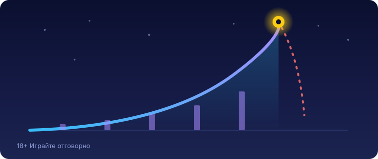

Title tag: Spaceman (Pragmatic): RTP, cash-out и как се играе
Meta description: Spaceman на Pragmatic Play: crash игра с RTP 96.50%, таван 5000x и залог €1-€100. Как работят авто-кешаутът, 50% cash-out и защо реалният RTP варира.

---

# Spaceman (Pragmatic Play): RTP, cash-out механика и как се играе

Spaceman е crash игра на **Pragmatic Play**, пусната през март 2022 г., и печелиш в нея само ако осребриш преди срива. Няма барабани, няма линии за печалба. На екрана се качва множител от 1.00x нагоре заедно с малкия космонавт, а твоята единствена задача е да натиснеш cash-out, преди той да отлети и рундът да приключи. Осребриш ли навреме, множителят в този момент се умножава по залога ти. Закъснееш ли, губиш цялата залог.

Уточнение по името, защото „спейсмен" често се озовава в списъци с ротативки: това не е слот. Механиката е съвсем различна от въртящите се барабани и точно тя обяснява защо играта се коментира толкова.

## Crash игра, а не ротативка

При ротативката резултатът е готов в мига на завъртането: символите падат и ти или печелиш, или не. При crash игра като Spaceman ти сам решаваш кога да излезеш, а множителят расте, докато не се срине в непредвидим момент. Колкото по-дълго чакаш, толкова по-висок е потенциалният множител и толкова по-голям рискът да останеш с празни ръце. Категорията има свой ритъм; ако искаш общата картина, [как работят крас игрите](/blog/krash-igri-aviator/) е добра отправна точка. Spaceman е версията на Pragmatic Play по темата, а най-известният представител на жанра, Aviator, е на друго студио (Spribe) и работи по малко различен начин.

## Как се играе: залог и трите начина за cash-out

Залагаш от €1 до €100 на рунд и през целия рунд имаш един залог в игра. Оттам нататък cash-out става по три начина. Ръчният е най-простият: гледаш множителя и натискаш, когато прецениш. Авто-кешаутът осребрява вместо теб на предварително зададена стойност между 1.01x и 4999.99x, което е удобно, ако не искаш да разчиташ на рефлекси. Третият е сигнатурата на Spaceman, 50% cash-out: осребряваш половината от залога на текущия множител и оставяш другата половина в игра за по-висок. Има и 50% авто-кешаут за същото, само че зададено предварително.

Тук трябва да сме точни, защото играта често се описва погрешно. Spaceman не пуска два независими залога един до друг по начина, по който го прави Aviator. Работиш с един залог и разделяш излизането от него чрез 50% cash-out. Контролът е в кога и на колко части затваряш една позиция, а не в две отделни залагания на един екран.

С примерни числа изглежда така. Залагаш €10 и осребряваш на 2.00x: получаваш €20, тоест €10 чиста печалба. Пуснеш ли вместо това 50% cash-out на 2.00x, прибираш €10 от половината позиция, а другата половина продължава да расте с множителя, докато я затвориш или рундът се срине. Не осребриш ли нищо преди срива, губиш целите €10. Точката на срив е фиксирана в началото на всеки рунд и не зависи от това кога натискаш, така че по-дългото чакане носи по-висок множител срещу по-голям шанс да останеш без нищо.

## RTP и защо на едно казино е по-нисък

RTP е дългосрочният процент на връщане, изчислен върху милиони рундове; той описва математиката на играта, не какво ще се случи в твоята сесия. Обявеният RTP на Spaceman е **96.50%** в основната конфигурация. Pragmatic Play обаче предлага и по-ниски версии, около 95%, а операторът избира коя да зареди. Затова реалният процент на конкретното казино може да е под рекламния и се проверява в инфо-панела на играта. В [методологията ни](/kak-ocenyavame/) гледаме именно тази реална версия, не най-високата възможна. При RTP 96.50% домашното предимство е 3.50%: от €1000 оборот средно се връщат към €965 в дългосрочен план, а към €35 остават за казиното.

*Ключовите числа на Spaceman. RTP се доставя в няколко версии (96.50% или около 95%), затова провери реалната стойност в инфо-панела на конкретното казино.*

## Волатилността, която сам си определяш

Spaceman няма фиксирана волатилност в класическия смисъл. Ти я нагласяш чрез целта на cash-out: ниска цел значи чести, но дребни осребрявания, висока цел значи редки, но по-едри. Само че този контрол е върху разпределението на печалбите, не върху домашното предимство. По-агресивната цел не увеличава шанса ти да си на плюс; тя прави резултатите по-накъсани върху същите 3.50% в полза на казиното.

## Таванът 5000x и за кого е играта

Максималната печалба е ограничена до 5000x залога, тоест €500 000 при максималния залог от €100. Числото изглежда огромно и точно това е идеята му, но е рекламен таван, не очакван изход. Множителите, които доближават горния край, се случват изключително рядко, а колкото по-високо чакаш, толкова по-често рундът се срива преди теб. Ако подхождаш към Spaceman с представата, че таванът е реалистична цел, играта ще те разочарова бързо. За кого тогава е тя? За играч, който харесва напрежението на момента и решението кога да излезе, разбира, че редовно ще осребрява на скромни множители, и залага суми, които може да загуби, без да му мигне окото. 18+ Хазартът може да пристрасти. Играйте отговорно.

## Демо режим, лимити и реален RTP

Преди да заложиш реални пари, повечето казина предлагат демо режим, в който да усетиш темпото и колко бързо се срива множителят, без да рискуваш нищо. Ако искаш да сравниш Pragmatic Play с други студиа за крас и слот игри, [прегледът ни на доставчиците](/blog/games-providers/) стъпва на същата логика. Задай си лимит за загуба и за време преди първия рунд и не го местиш в движение. Провери реалния RTP на конкретното казино в инфо-панела, защото версията с около 95% и тази с 96.50% е една и съща игра с осезаемо различна математика. Spaceman ти дава контрол върху темпото, но не и върху сметката; ако предпочиташ по-плавен баланс, това просто не е твоята игра. Ако усетиш, че играта излиза извън контрол, виж [инструментите за отговорна игра](/otgovorna-igra/).

---

**Георги Тодоров**
Публикувано: 18.09.2026 · Последна редакция: 18.09.2026

[About Всички Казина boilerplate]

**Отговорна игра.** 18+ Хазартът може да пристрасти. Играйте отговорно. Ако усетиш, че играта излиза извън контрол или искаш да я ограничиш, виж [инструментите за отговорна игра](/otgovorna-igra/) и възможността за самоизключване чрез националния регистър на уязвимите лица към НАП (подава се писмено само от засегнатото лице). Национална информационна линия за наркотиците, алкохола и хазарта („Солидарност") 0888 99 18 66, делнични дни 10:00–17:00.

**Разкриване на партньорства.** Всички Казина съдържа партньорски (афилиейт) връзки; когато отвориш оферта през такава връзка, това може да финансира сайта, без да променя цената за теб и без да влияе на оценките ни. От 1 август 2026 г. дейността на афилиейт оператори в България се лицензира съгласно Закона за държавния бюджет за 2026 г. (ДВ, бр. 69 от 31.07.2026 г.). Всички Казина е подало заявление за лиценз пред Националната агенция по приходите и очаква издаването му.
