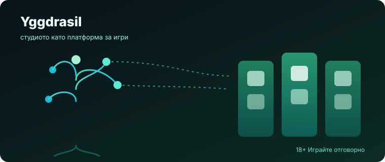
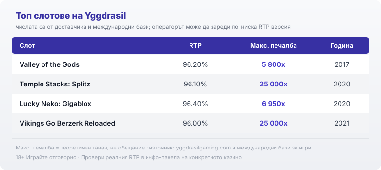

Title tag: Yggdrasil Gaming: профил на доставчика, механики и топ слотове
Meta description: Кой е Yggdrasil (игдрасил): шведско-малтийското студио зад Splitz, GigaBlox и Multiplier Wilds, платформата GATI и числата на топ слотовете.

---

# Yggdrasil Gaming: профил на доставчика, механики и топ слотове

Yggdrasil (игдрасил) се различава от повечето студиа по едно нещо: то е колкото производител на игри, толкова и технологична платформа. Шведско по корени, малтийско по седалище, то стана разпознаваемо не с една запазена тема, а с механики, които после лицензира и на други разработчици.

## Кой стои зад студиото

Yggdrasil е основано през 2013 г. от Fredrik Elmqvist, човек, дошъл от NetEnt, и макар корените да са шведски, седалището на компанията е в Малта, в Сан Джулиан, с развойна база в Краков. Студиото израсна вътре в шведската гейминг група Cherry AB, а през 2019 г. самата Cherry беше изведена от борсата от консорциум начело с частния инвестиционен фонд Bridgepoint, така че днес зад Yggdrasil стои собственост от типа private equity. Основателят предаде поста на изпълнителен директор през 2022 г. след девет години начело, но остана в борда.

## GATI и YGG Masters: студиото като платформа

Онова, което отличава Yggdrasil от съседите му по рафт, е GATI, стандартизиран инструментариум за разработка, който е готов за регулация и позволява едно заглавие да тръгне бързо през много пазари наведнъж. Върху него стъпва програмата YGG Masters, чрез която студиото дава технологията си под лиценз на партньорски разработчици като ReelPlay, Peter & Sons, Bang Bang Games и Hot Rise Games. Игра с логото на Yggdrasil затова невинаги е правена от вътрешния екип на студиото, а понякога от партньор върху неговата платформа.

## Почеркът: Splitz, GigaBlox и Multiplier Wilds

Yggdrasil се разпознава по семейство функции, което студиото нарича GEMs и започна да пуска от 2020 г. Splitz е двигателят, при който символите се разцепват на по-малки и така умножават начините за печалба, докато в Temple Stacks броят им стига до 248 832. GigaBlox работи в обратната посока: пуска огромни символи, до 6 на 6 позиции, които покриват цели участъци от барабаните, и дебютира в Lucky Neko. Multiplier Wilds са лепкавите диви символи, които носят множител и остават на място за няколко завъртания, запазената марка на серията Vikings, където в режим Berzerk множителят стига до 8x. Около тези три идеи се въртят и по-късните MultiMax, GigaRise и DoubleMax.

## Механиките менят формата, не математиката

Splitz с неговите стотици хиляди начини за печалба и GigaBlox с гигантските символи менят формата на играта и тавана на едно попадение, не домашното предимство. Голямото число „248 832 начина" и рекламният таван от десетки хиляди пъти залога са волатилност, не стойност: същите функции, които могат да върнат едро, водят и до дълги сухи серии, докато чакате да се подредят. RTP и предимството на казиното остават заложени в математиката на конкретната версия, независимо колко зрелищна е анимацията отгоре. Множителите и разцепените символи правят пътя по-бурен, но крайната точка си остава там, където я определя математиката. 18+ Хазартът може да пристрасти. Играйте отговорно.

## Топ слотове и техните числа

Няколко заглавия държат името на Yggdrasil живо, а числата им показват къде играе студиото на скалата.

*Числата са от сайта на доставчика и международни бази за игри; операторът може да зареди по-ниска сертифицирана RTP версия, а максималната печалба е теоретичен таван, не обещание.*

Египетското Valley of the Gods (2017) залага на респини и разрастващо се поле при висока волатилност, RTP 96.20% и таван до 5 800x залога. Splitz двигателят получи витрината си в Temple Stacks: Splitz (2020): до 248 832 начина за печалба, RTP 96.10% и таван от 25 000x. GigaBlox дебютира в Lucky Neko: Gigablox (2020), първото заглавие с гигантските символи, RTP 96.40% и таван 6 950x. Модерната глава на серията Vikings, Vikings Go Berzerk Reloaded (2021), качва тавана чак до 25 000x чрез лепкавите множители при RTP 96.00%, докато оригиналният Vikings Go Berzerk от 2016 г. остана по-скромният предшественик със средно-висока волатилност и RTP 96.10%. От другия край на скалата стои Jokerizer, минималистичната ранна класика, чийто режим Jokerizer се играе при RTP до 98%.

## RTP не е едно число

Почти всяко от тези заглавия съществува в няколко сертифицирани RTP версии, а конкретното казино избира коя да зареди. Затова процентът до името на играта е ориентир за самото заглавие, а не гаранция какво връща сайтът, на който играете. Преди да заложите, отворете инфо-панела на играта и вижте коя версия работи там. В [методологията ни](/kak-ocenyavame/) гледаме реалния RTP на конкретното казино, а не рекламния, точно заради тази разлика.

## Какво значи това за играча в България

Yggdrasil прави игрите, но не приема залозите ви. Студиото държи доставчически (B2B) лицензи, сред които от Малта (MGA) и Великобритания (UKGC), плюс Гибралтар, Швеция и още няколко пазара, и праща заглавията си за независими тестове, което потвърждава, че генераторът на случайни числа и обявеният RTP отговарят на реалната математика. Тези лицензи обаче са на студиото, не на казиното. За вас като играч в България значение има лицензът на самия оператор пред НАП, защото той регулира къде и при какви условия залагате. Как проверяваме операторите е описано в [нашата методология](/kak-ocenyavame/), а ако сравнявате доставчици един до друг, [прегледът ни на доставчиците](/blog/games-providers/) държи всяко студио като отделен профил.

Преди реален залог повечето [слот игри](/slot-igri/) на Yggdrasil имат демо режим, в който да усетите темпото и волатилността без пари, а при студио, което залага на функции като Splitz и GigaBlox, това е още по-полезно от обичайното, защото формата на тези игри се усеща едва след няколко завъртания. Задайте си лимит за загуба и за време преди първото завъртане и ако усетите, че играта излиза извън контрол, вижте [инструментите за отговорна игра](/otgovorna-igra/).

За българския играч решаващото остава едно: лицензът на казиното пред НАП, не лицензът на студиото зад играта.

---

**Георги Тодоров**
Публикувано: 18.09.2026 · Последна редакция: 18.09.2026

[About Всички Казина boilerplate]

**Отговорна игра.** 18+ Хазартът може да пристрасти. Играйте отговорно. Ако усетиш, че играта излиза извън контрол или искаш да я ограничиш, виж [инструментите за отговорна игра](/otgovorna-igra/) и възможността за самоизключване чрез националния регистър на уязвимите лица към НАП (подава се писмено само от засегнатото лице). Национална информационна линия за наркотиците, алкохола и хазарта („Солидарност") 0888 99 18 66, делнични дни 10:00-17:00.

**Разкриване на партньорства.** Всички Казина съдържа партньорски (афилиейт) връзки; когато отвориш оферта през такава връзка, това може да финансира сайта, без да променя цената за теб и без да влияе на оценките ни. От 1 август 2026 г. дейността на афилиейт оператори в България се лицензира съгласно Закона за държавния бюджет за 2026 г. (ДВ, бр. 69 от 31.07.2026 г.). Всички Казина е подало заявление за лиценз пред Националната агенция по приходите и очаква издаването му.
