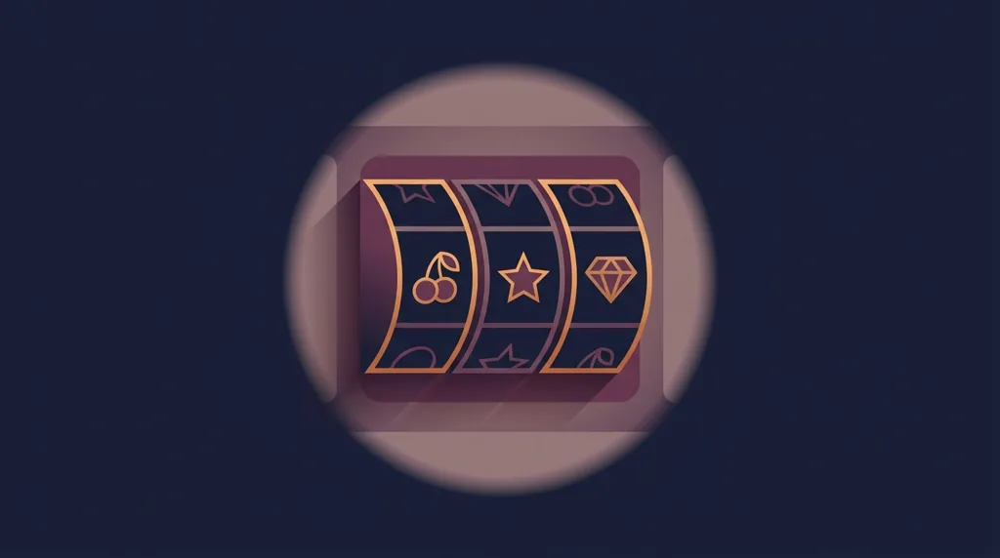
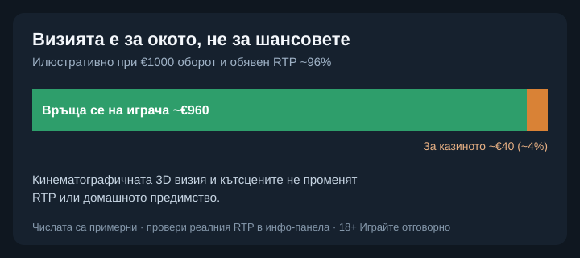

Title tag: Betsoft: профил на доставчика, механики и топ слотове
Meta description: Кой е Betsoft, какво е линията SLOTS3 и кои са топ слотовете му. Защо кинематографичната 3D визия не мени RTP и домашното предимство.

---

# Betsoft: профил на доставчика, механики и топ слотове

Betsoft е сред по-старите имена в бранша, основана през 2006 г., а днес е със седалище в Малта. Почеркът ѝ е лесен за разпознаване: кинематографични 3D слотове с анимирани герои и сюжетни бонус сцени. Каталогът е сравнително компактен, около 200 заглавия.

## SLOTS3 и триизмерната визия

Запазената марка на студиото е линията SLOTS3: слотове с триизмерна графика, кътсцени и сюжет, който тече през бонус рундовете. Изглеждат по-скоро като кратки анимации, отколкото като класическа ротативка. Струва си да се каже веднъж и да важи за целия каталог: колкото и добра да е визията, тя е представяне, а не по-добри шансове. RTP и домашното предимство остават същите, каквито биха били и при семпъл слот със същите правила.

## Какво значат сертификатите

Betsoft работи под регулации на пазари като италианския ADM, а игрите му се тестват от независими лаборатории като GLI и Quinel. Проверката потвърждава, че генераторът на случайни числа е честен и че играта отговаря на обявената си математика. Сертифицирана игра обаче не прави легално казиното, в което се върти: това зависи от [лиценза му от НАП](/zakonno-li-e/), не от доставчика на игрите.

## Механики и формати

Освен обичайните слот механики Betsoft експериментира и с формати извън барабаните. Max Quest е мултиплейър аркаден шутър: вместо да въртиш барабани, купуваш „патрони" и стреляш по мишени за награди, а по-точната игра ти отваря по-голям дял от предварително заложените печалби. Немалко заглавия предлагат и Buy Feature, тоест директно купуване на бонус рунда срещу по-висок залог, за играчите, които не искат да чакат функцията да падне сама.

## Топ слотове на Betsoft

Сред по-известните заглавия са A Night in Paris (обявен RTP около 96.92%, средна волатилност), Take the Bank (около 96.10%) и серията с богове като Take Olympus. В Good Girl Bad Girl избираш „добрия" или „лошия" режим, а самият избор мени RTP и волатилността, в диапазона от около 97.3% до 97.79%. По-високата стойност идва с по-нервна игра, не с по-сигурна печалба.

## Един и същ слот, различен RTP

Дори при заглавие с висок обявен RTP реалната стойност зависи от версията, която казиното е пуснало. Обявен RTP около 96% при €1000 общ оборот означава средно връщане от около €960 в дългосрочен план и около €40 за казиното. Заради това в [методологията ни](/kak-ocenyavame/) гледаме реалния RTP на конкретния оператор, а не рекламния. Активният процент се вижда в инфо-панела на самата игра, преди залога.

*Илюстративен пример при обявен RTP ~96% и €1000 оборот: ~€960 се връщат средно на играча, ~€40 остават за казиното. Реалният RTP се чете в инфо-панела; 3D визията не го променя.*

## Демо режим, лимити и реален RTP

[Слот игрите](/slot-igri/) на Betsoft обикновено имат демо режим, в който да видиш темпото и историята, без да залагаш. Задай си лимит за загуба и за време, преди да отвориш която и да е игра, и провери реалния RTP на конкретното казино. 18+ Хазартът може да пристрасти. Играйте отговорно. Ако усетите, че играта излиза извън контрол, вижте [инструментите за отговорна игра](/otgovorna-igra/).

---

**Георги Тодоров**
Публикувано: 19.09.2026 · Последна редакция: 19.09.2026

[About Всички Казина boilerplate]

**Отговорна игра.** 18+ Хазартът може да пристрасти. Играйте отговорно. Ако усетиш, че играта излиза извън контрол или искаш да я ограничиш, виж [инструментите за отговорна игра](/otgovorna-igra/) и възможността за самоизключване чрез националния регистър на уязвимите лица към НАП (подава се писмено само от засегнатото лице). Национална информационна линия за наркотиците, алкохола и хазарта („Солидарност") 0888 99 18 66, делнични дни 10:00–17:00.

**Разкриване на партньорства.** Всички Казина съдържа партньорски (афилиейт) връзки; когато отвориш оферта през такава връзка, това може да финансира сайта, без да променя цената за теб и без да влияе на оценките ни. От 1 август 2026 г. дейността на афилиейт оператори в България се лицензира съгласно Закона за държавния бюджет за 2026 г. (ДВ, бр. 69 от 31.07.2026 г.). Всички Казина е подало заявление за лиценз пред Националната агенция по приходите и очаква издаването му.
