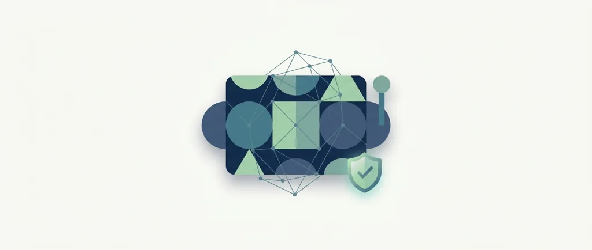
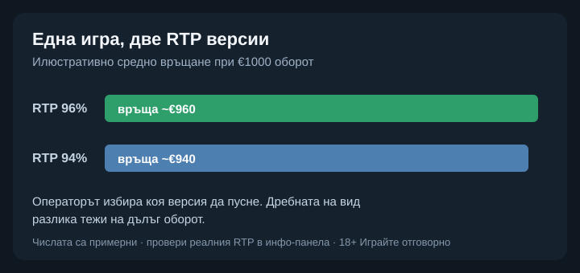

Title tag: BGaming: профил на доставчика, механики и топ слотове
Meta description: Кой е BGaming, какво е „provably fair" и кои са топ слотовете му. Защо доказуемата честност потвърждава завъртането, но не маха домашното предимство.

---

# BGaming: профил на доставчика, механики и топ слотове

BGaming се отделя през 2018 г. от екосистемата на SoftSwiss и оттогава работи като самостоятелно студио под името Stable Games Ltd, регистрирано в Малта. Каталогът е около 250 заглавия, а компанията твърди, че съдържанието ѝ стига до над 3000 платформи по света. Запомня се с две неща: ранното навлизане при крипто казината и т.нар. „provably fair" игри.

## Provably fair: какво значи и какво не

BGaming е сред първите студиа, въвели „доказуемо честни" (provably fair) слотове. Механизмът ти позволява да провериш след завъртане, че резултатът не е бил подменян: играта показва криптографски отпечатък преди завъртането и данните за проверка след него. Полезно е, но е лесно да се надцени. Доказуемата честност потвърждава, че конкретното завъртане е било такова, каквото е обявено. Тя не пипа математиката на играта и не маха домашното предимство. Слотът пак е построен така, че казиното печели в дългосрочен план.

## Какво значат лицензите

Студиото държи B2B лиценз от Malta Gaming Authority, издаден през 2021 г., а игрите му минават през независими лаборатории като iTech Labs и BMM Testlabs; съдържанието е сертифицирано и за пазари като Испания и Румъния. За българския играч оттук следва едно разграничение, което си струва да е ясно: проверено е самото заглавие, но дали казиното е [законно у нас](/zakonno-li-e/) зависи от неговия лиценз от НАП, не от доставчика на игрите.

## Механики и функции

BGaming рекламира няколко собствени механики с търговски имена, но в основата им стоят познати неща: разширяващи се начини за печалба, натрупване и надграждане на символи. Голяма част от заглавията предлагат и Bonus Buy, тоест купуване на бонус рунда срещу по-висок залог. Купуването скъсява чакането до функцията. Шансовете ти не се подобряват, защото плащаш повече за достъп до същата математика.

## Топ слотове на BGaming

Сред разпознаваемите заглавия са Elvis Frog in Vegas (обявен RTP 96%, средно-висока волатилност), Aztec Magic Bonanza (96%, висока волатилност, с максимална печалба до 10 200 пъти залога), Dig Dig Digger (около 95.5%, висока) и Book of Pyramids (около 97.13%, висока). Големият таван на печалбата изглежда примамливо, но е рядко събитие по дизайн: колкото по-висок е максималният множител, толкова по-рядко играта стига до него.

## Един и същ слот, различен RTP

Както при повечето доставчици, част от заглавията на BGaming се доставят в няколко версии с различен RTP, например 96% и 94%, а операторът избира коя да пусне. Обявен RTP 96% при €1000 общ оборот означава средно връщане от около €960 в дългосрочен план и около €40 за казиното, но това важи само ако е пусната именно тази версия. Разликата от два процентни пункта звучи дребна, а на дълъг оборот тежи. Заради това в [методологията ни](/kak-ocenyavame/) гледаме реалния RTP на конкретното казино, а не рекламния.

*Илюстративен пример при €1000 оборот: версия с RTP 96% връща средно ~€960, версия с 94% връща ~€940. Кое число работи, се чете в инфо-панела на конкретното казино.*

## Демо режим, лимити и реален RTP

[Слот игрите](/slot-igri/) на BGaming обикновено имат демо режим, в който да видиш темпото и механиката, без да залагаш. Задай си лимит за загуба и за време, преди да отвориш която и да е игра, и провери реалния RTP на конкретното казино. 18+ Хазартът може да пристрасти. Играйте отговорно. Ако усетите, че играта излиза извън контрол, вижте [инструментите за отговорна игра](/otgovorna-igra/).

---

**Георги Тодоров**
Публикувано: 19.09.2026 · Последна редакция: 19.09.2026

[About Всички Казина boilerplate]

**Отговорна игра.** 18+ Хазартът може да пристрасти. Играйте отговорно. Ако усетиш, че играта излиза извън контрол или искаш да я ограничиш, виж [инструментите за отговорна игра](/otgovorna-igra/) и възможността за самоизключване чрез националния регистър на уязвимите лица към НАП (подава се писмено само от засегнатото лице). Национална информационна линия за наркотиците, алкохола и хазарта („Солидарност") 0888 99 18 66, делнични дни 10:00–17:00.

**Разкриване на партньорства.** Всички Казина съдържа партньорски (афилиейт) връзки; когато отвориш оферта през такава връзка, това може да финансира сайта, без да променя цената за теб и без да влияе на оценките ни. От 1 август 2026 г. дейността на афилиейт оператори в България се лицензира съгласно Закона за държавния бюджет за 2026 г. (ДВ, бр. 69 от 31.07.2026 г.). Всички Казина е подало заявление за лиценз пред Националната агенция по приходите и очаква издаването му.
