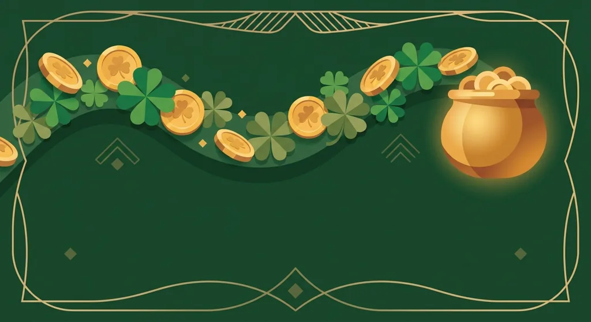
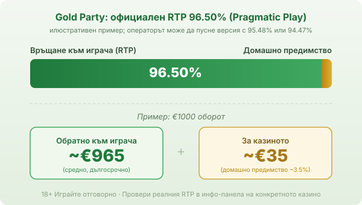

Title tag: Gold Party: RTP, Hold & Spin и как се играе
Meta description: Gold Party на Pragmatic Play: RTP 96.50%, висока волатилност и макс. печалба 5163x. Как работи Hold & Spin бонусът с гърнетата злато и за кого е играта.

---

# Gold Party: RTP, Hold & Spin и как се играе

Gold Party е слот на Pragmatic Play с ирландска тема, който играч в българско казино среща бързо, защото обещава четири джакпота и висока горна печалба. Излязла е през 2022 г. и стъпва на позната схема: обикновени линейни печалби в основната игра плюс отделен бонус, в който гърнета със злато се задържат на екрана и събират суми. По-долу е важното за механиката и за реалния RTP.

## Как изглежда играта

Полето е 5 барабана на 3 реда с 25 фиксирани линии, тоест залагаш на всичките 25 при всяко завъртане. Темата е ирландска, с детелини, подкови и типичните за жанра гърнета злато. В основната игра има и допълнителна механика, наречена Copy Reels: когато цял стек от най-високия символ падне на първия барабан, той може да се копира върху съседни барабани и да умножи печалбата. Дотук играта прилича на десетки други ирландски слотове, но хората я търсят заради бонуса.

## Как работи Money Respin: гърнетата злато и джакпотите

Бонусът на Gold Party е класически Hold & Spin, тук кръстен Money Respin. Hold & Spin означава задържане и завъртане: специалните парични символи (гърнета злато със стойност върху тях) се залепват на местата си, докато свободните позиции продължават да се въртят. Задейства се, когато на екрана паднат поне 6 такива символа наведнъж. Тогава те се фиксират и получаваш 8 повторни завъртания.

За разлика от някои други Hold & Spin слотове, тук нов паричен символ не връща брояча в начало. Допълнителни завъртания идват само от специалния символ за extra spin, а множителите увеличават стойността на вече събраните гърнета. Бонусът тече едновременно на 4 отделни полета 5x3 и накрая всички стойности се сумират.

Четирите джакпота се печелят, като запълниш цяло поле със символи. Mini носи 20x залога, Minor 50x, Major 200x, а Grand цели 5000x. Grand е и причината таванът на играта да стои толкова високо.

## RTP и волатилност

Официалният RTP на Gold Party е 96.50% по данни на Pragmatic Play. RTP (return to player) е дългосрочна статистика върху милиони завъртания, а не обещание за твоята сесия: показва колко от заложеното се връща средно, не какво ще стане за един час игра. При обявен RTP 96.50% и €1000 оборот в дългосрочен план средно се връщат около €965, а към €35 остават за казиното.

Играта се доставя в няколко версии на RTP. Освен основната 96.50%, Pragmatic предлага и по-ниски билдове от 95.48% и 94.47%, а операторът избира коя да пусне. Затова в [методологията ни](/kak-ocenyavame/) гледаме реалния RTP на конкретното казино в инфо-панела на играта, а не рекламната цифра.

Волатилността измерва честотата спрямо размера на печалбите. При Gold Party тя е висока, оценена на 4.5 от 5 по скалата на Pragmatic: печалбите са редки, но потенциално едри, а по-голямата част от парите се концентрират в бонуса. Висока волатилност не значи по-лоша игра. Значи, че балансът се движи на резки скокове и сериите без бонус може да са дълги и сухи.

*Илюстративен пример при обявен RTP 96.50%: €1000 оборот връща средно ~€965, ~€35 остават за казиното. Операторът може да пусне версия с 95.48% или 94.47%, затова RTP се проверява в инфо-панела.*

## Макс. печалба и за кого е играта

Максималната печалба е 5163x залога по данни на Pragmatic Play, а кръгът приключва автоматично, ако бъде достигната. На практика тя идва почти изцяло от бонуса и от Grand джакпота, не от линейните печалби в основата. Такъв таван е висок за слот, но и рядко се стига до него, защото точно това означава висока волатилност.

За кого пасва играта зависи от бюджета и търпението. Ако ти допада идеята за голям еднократен удар и си готов да преживееш дълги серии без печалба, докато чакаш 6-те гърнета за бонуса, Gold Party ти е по мярка. Ако предпочиташ дълга спокойна сесия с малък бюджет и чести дребни печалби, високата волатилност ще ти изяде баланса по-бързо, отколкото ти е приятно. Изборът е въпрос на темперамент и бюджет.

## Демо режим, залог и лимити

Залогът върви от €0.25 до €125 на завъртане, което покрива и малки, и едри бюджети. Преди да заложиш реални пари, [слот игрите](/slot-igri/) на Pragmatic обикновено имат демо режим, в който да усетиш темпото и волатилността на Gold Party без залог. Ако сравняваш заглавия, останалите [казино игри](/kazino-igri/) от същия доставчик стъпват на подобна логика.

Задай си лимит за загуба и за време, преди да отвориш играта, особено при висока волатилност, където балансът пада бързо между бонусите. Хазартът не е начин да си върнеш пари или да изкараш доход; в дългосрочен план математиката работи за казиното и това важи с пълна сила за високоволатилен слот с таван 5163x. 18+ Хазартът може да пристрасти. Играйте отговорно. Ако усетиш, че играта излиза извън контрол, виж [инструментите за отговорна игра](/otgovorna-igra/).

---

**Георги Тодоров**
Публикувано: 19.09.2026 · Последна редакция: 19.09.2026

[About Всички Казина boilerplate]

**Отговорна игра.** 18+ Хазартът може да пристрасти. Играйте отговорно. Ако усетиш, че играта излиза извън контрол или искаш да я ограничиш, виж [инструментите за отговорна игра](/otgovorna-igra/) и възможността за самоизключване чрез националния регистър на уязвимите лица към НАП (подава се писмено само от засегнатото лице). Национална информационна линия за наркотиците, алкохола и хазарта („Солидарност") 0888 99 18 66, делнични дни 10:00–17:00.

**Разкриване на партньорства.** Всички Казина съдържа партньорски (афилиейт) връзки; когато отвориш оферта през такава връзка, това може да финансира сайта, без да променя цената за теб и без да влияе на оценките ни. От 1 август 2026 г. дейността на афилиейт оператори в България се лицензира съгласно Закона за държавния бюджет за 2026 г. (ДВ, бр. 69 от 31.07.2026 г.). Всички Казина е подало заявление за лиценз пред Националната агенция по приходите и очаква издаването му.
