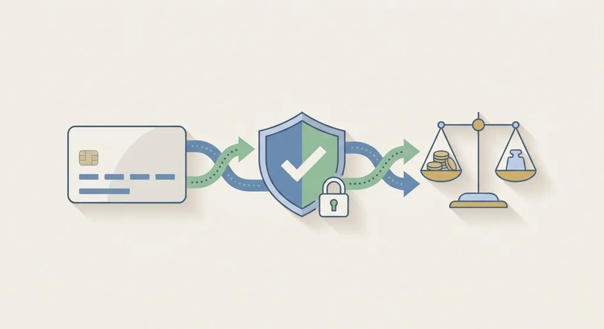

Title tag: Казино плащания: депозити и тегления в БГ казина
Meta description: Как работят депозитите и тегленията в българските онлайн казина: методи, срокове, верификация и какво да провериш преди да избереш начин на плащане.

---

Плащанията в българските онлайн казина минават през шепа познати канала: банкова карта, Revolut, EasyPay или Cashterminal на каса, ePay.bg. Депозитът пада на секундата, независимо кой от тях избереш. Тегленето отнема повече време, и то не заради конкретен оператор: минава през проверка на самоличността, а при първото теглене тя е задължителна навсякъде. При карта или Revolut парите обикновено пътуват по-бързо от каса в брой, но конкретната банка и операторът пак влияят на времето, така че разликата остава по-скоро тенденция, отколкото гарантирано правило.

Минималните и максималните суми се различават според метода и казиното, а някои методи носят собствени такси или прагове, зададени от доставчика на плащането, не от самото казино. Лимитите за теглене пък могат да са дневни, седмични или на транзакция. Преди да депозираш някъде, си струва да провериш секцията за плащания на конкретното казино: прегледай профила на [Betano](/casino/betano/), за да видиш как изглежда на практика.

## Какво да провериш, преди да избереш метод

Първото теглене почти навсякъде изисква верификация: лична карта, а понякога и доказателство за адрес. Минималната сума за депозит и за теглене също варира и си струва да се провери предварително, не след като парите вече са в баланса. Плащанията са в евро, а депозитите в евро имат своя собствена логика със закръгляния и разлики в обменния курс, разгледана в [статията за депозити в евро](/blog/evro-hazart-depoziti/). Надеждността на метода тежи колкото скоростта му: установен канал с малко по-бавно теглене е по-добър избор от непознат метод, който обещава мигновена скорост. Ако плащане закъснее без обяснение, поддръжката на казиното е първото място, откъдето се тръгва - добра практика е предварително да провериш през какъв канал работи тя, чат на живо, имейл или телефон.

## Депозити, тегления и самоконтрол

Изборът между карта, Revolut и каса на практика решава колко бързо и колко удобно движиш парите си. Не решава колко харчиш. Това е отделен въпрос, а отговорът е лимитът на депозита, зададен предварително, преди изобщо да ти потрябва: работи еднакво, без значение през кой метод минават парите ти, и остава на мястото си дори когато смениш метода следващия път. Пълната картина, с всички методи, срокове и особености на тегленето, е в [общия преглед на депозити и тегления](/depoziti-i-teglenia/) на сайта. Методът избираш по удобство.

---

**Георги Тодоров**
Публикувано: 19.09.2026 · Последна редакция: 19.09.2026

[About Всички Казина boilerplate]

**Отговорна игра.** 18+ Хазартът може да пристрасти. Играйте отговорно. Ако усетиш, че играта излиза извън контрол или искаш да я ограничиш, виж [инструментите за отговорна игра](/otgovorna-igra/) и възможността за самоизключване чрез националния регистър на уязвимите лица към НАП (подава се писмено само от засегнатото лице). Национална информационна линия за наркотиците, алкохола и хазарта („Солидарност") 0888 99 18 66, делнични дни 10:00–17:00.

**Разкриване на партньорства.** Всички Казина съдържа партньорски (афилиейт) връзки; когато отвориш оферта през такава връзка, това може да финансира сайта, без да променя цената за теб и без да влияе на оценките ни. От 1 август 2026 г. дейността на афилиейт оператори в България се лицензира съгласно Закона за държавния бюджет за 2026 г. (ДВ, бр. 69 от 31.07.2026 г.). Всички Казина е подало заявление за лиценз пред Националната агенция по приходите и очаква издаването му.
