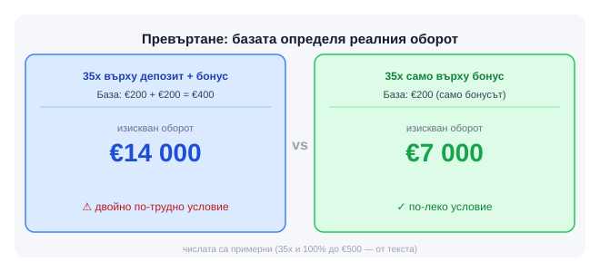

Два бонуса за добре дошли могат да изглеждат еднакви на банер и да са напълно различни в дребния шрифт. 100% до €500 при 35x върху депозит+бонус тежи двойно колкото същия процент при 35x само върху бонуса, а тази разлика рядко стои до самата цифра.

Казино без валиден лиценз от НАП отпада веднага, колкото и добре да изглежда сайтът му. Оттам нататък идват условията, репутацията и това какво се променя на пазара, докато вече играеш.

## Какво всъщност сравняваш

Бонус условията тежат почти колкото лиценза. Превъртането винаги е обвързано с база - депозит+бонус или само бонус, а един и същ множител означава различна реална сума в зависимост от нея. Приносът на отделните игри към самото превъртане варира между казината: ротативките обикновено носят 100%, масите и казино на живо носят по-малко или нищо, а това мени реалния срок, за който можеш да го изпълниш.

*Числата са примерни; 35x и 100% до €500 са от текста.*

Методите на плащане имат местна специфика. EasyPay и Cashterminal остават масов начин за депозит в брой на каса, ePay.bg, картата и Revolut покриват повечето онлайн преводи, а изборът често зависи от това кои от тях приема даден оператор, колко бързо обработва тегления и дали има таван за конкретния метод, който не е посочен на видно място.

Описанието на поддръжката в сайта рядко съвпада с реалния отговор на чата. Проверява се на практика: скорост, работа извън работно време, разбиране на въпрос, зададен на български. Репутацията се гради с години и личи в историята на оператора, рядко в последната рекламна кампания. [Сравни казина](/sravni-kazina/) държи тези детайли едно до друго, а профилът на [Winbet](/casino/winbet/) показва как изглеждат при конкретен оператор.

## Какво следим в новините

За играч с регистрация другаде по-важно е кога съществуващ оператор променя срока за разиграване, вдига минималния депозит за конкретен метод или спира да приема начин на плащане, който ползваш. Такива промени рядко се обявяват на видно място, а нов лицензиран оператор на пазара е само половината новина. [Кое казино да изберете](/blog/koe-kazino-da-izberete/) разглежда точно този избор в детайли, от лиценз до условия.

Задай си лимит на депозита, преди да сравняваш условия, не след това. 18+ Хазартът може да пристрасти. Играйте отговорно.
