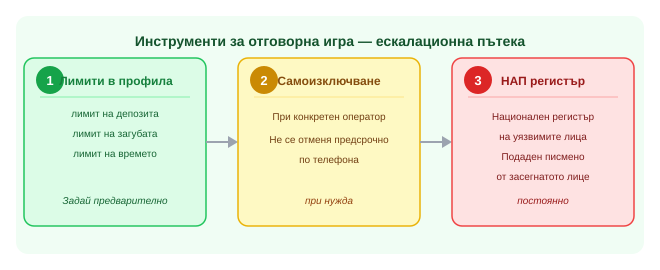

Title tag: Отговорна игра: лимити, самоизключване, помощ
Meta description: Какво включва отговорната игра: лимити на депозит/загуба/време, самоизключване, признаци на проблем и какво да провериш преди да заложиш.

---

Всеки лицензиран оператор е длъжен да предлага в профила на играча лимит на депозита, лимит на загубата и лимит на времето пред екрана, зададени преди първия залог. Отговорната игра означава точно тези инструменти, плюс честна преценка на собственото поведение, докато играеш, и бюджет, който третираш като разход за развлечение, не като инвестиция. 18+ Хазартът може да пристрасти. Играйте отговорно.

## Какво включва отговорната игра

Лимитите работят само ако са зададени предварително, не при първия сигнал за проблем. Когато не стигат, следващата стъпка е самоизключване: временно или постоянно спиране на достъпа, което поддръжката не може да отмени предсрочно по телефона, колкото и убедително да звучи молбата. То може да стане при конкретен оператор или веднъж завинаги през националния регистър на уязвимите лица към НАП, подаден писмено само от засегнатото лице. Признаци, че играта вече е проблем: увеличаване на залога след загуба с цел да се навакса, заемане на пари за игра, укриване пред близки на времето или сумите, поредица от депозити в една вечер след предходна загуба. При тях помага разговор със специалист по зависимости или национална линия за помощ при хазартна зависимост, а не поредният опит да се "отиграе" загубеното. За самите инструменти и как се задават при различните оператори виж [страницата за отговорна игра](/otgovorna-igra/).

*Ескалационна пътека при загуба на контрол над играта.*

## Какво да провериш, преди да заложиш

Проверката преди регистрация е проста: операторът трябва да държи валиден лиценз от НАП, не лиценз от друга юрисдикция, окачен на сайта колкото да изглежда сериозно. Лицензираните в България казина са задължени да предлагат лимити и самоизключване в профила на играча; офшорен сайт без такъв лиценз няма това задължение и обикновено няма към кого да се обърнеш, ако нещо тръгне зле, освен към самия оператор. Изборът на казино с лиценз от НАП, като [Betano](/casino/betano/), тук не е препоръка какво да предпочетеш за игра, а илюстрация на условието по-горе: без лиценз няма гаранция, че лимитите изобщо съществуват извън общите условия, само на хартия. При спор с оператор, забавено теглене, отказано плащане, оспорен бонус, жалбата се подава писмено и [тук е обяснено къде и как](/zhalbi/). Хазартът остава развлечение с предвидима цена само докато лимитите са зададени предварително, а не след първата по-голяма загуба, когато вече е късно да помогнат.
