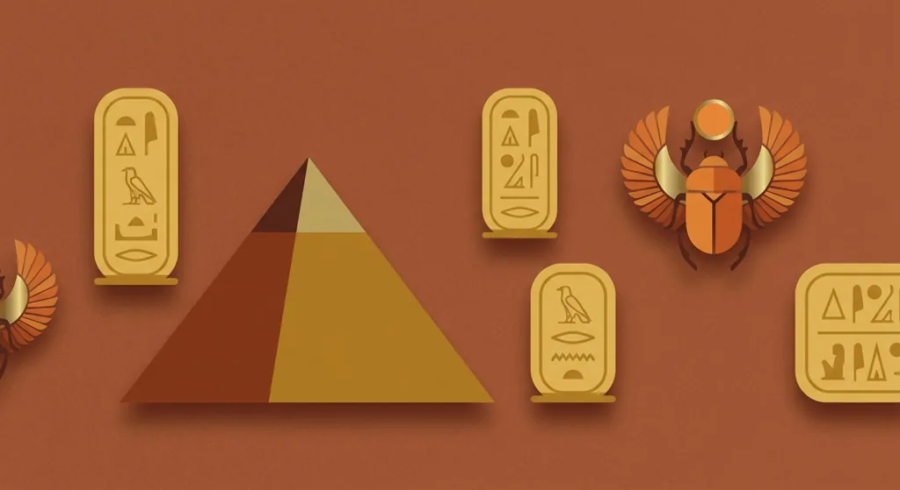
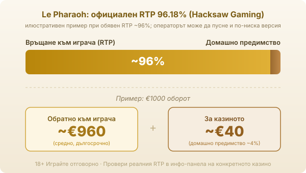

Title tag: Le Pharaoh: RTP 96.18%, механики и как се играе
Meta description: Le Pharaoh на Hacksaw Gaming: RTP 96.18%, таван 15 000x залога, монети и множители, безплатни завъртания и бонус избор. Как работи и за кого е играта.

---

# Le Pharaoh: RTP, механики и как се играе

Le Pharaoh е слот на студиото Hacksaw Gaming, пуснат на 26.09.2024 г. В египетското поле с миеща мечка за водач действието минава през лепкави символи, монети със стойности и няколко бонус игри.

## Как изглежда играта

Полето е 6 барабана на 5 реда с 19 линии, а темата е египетска, с малко хумор около героя. Основната механика се казва Sticky Re-drops: печелившите символи се задържат на място и барабаните се въртят отново, докато падат нови печеливши символи. Всяко такова повторно падане е шанс да се добавят още символи към същата комбинация, без да плащате нов залог за него.

## Как работят монетите и множителите

Най-голямата стойност идва от функцията Golden Riches, която се задейства, когато на екрана попадне символът Rainbow. Той разкрива златните квадрати и обръща скритите в тях монети, а стойностите им са в три нива: бронзовите носят от 0.2x до 4x залога, сребърните от 5x до 20x, а златните от 25x до 500x. Заедно с монетите падат и детелини: зелената умножава съседните монети, а златната умножава всички на екрана, като и двете дават стойност от x2 до x20.

## Безплатните завъртания и бонус изборът

Безплатните завъртания се задействат от scatter символите, а броят на скатерите определя вида на бонуса. При 3 или 4 scatter-а излиза меню за бонус избор между няколко игри. Luck of the Pharaoh дава 10 безплатни завъртания, в които златните квадрати остават активни до края на кръга, докато Lost Treasures е игра от типа hold and win, при която започвате с 3 попълващи се живота и въртите, докато не свършат. Super версиите носят по 12 безплатни завъртания с по-щедри монети. А ако съберете 5 scatter символа, се отключва бонусът Rainbow Over the Pyramids, който гарантира Rainbow символ на всяко от 12-те завъртания. Има и опция Feature Buy, тоест директно купуване на бонуса; струва много пъти залога и не променя дългосрочната математика на играта.

## RTP и волатилност

Обявеният RTP на Le Pharaoh е 96.18% в основната версия по данни на игралните бази. За волатилността базите се разминават: официалният рейтинг е среден, 3 от 5. Но с таван 15 000x и печалби, събрани почти изцяло в бонусите, играта се държи високо-вариативно. На практика това значи дълги сухи серии, прекъсвани от редки едри удари, докато балансът се топи между тях. Много заглавия на Hacksaw се доставят в няколко RTP версии, и Le Pharaoh не е изключение: операторът може да пусне 94.33%, 92.26% или 88.24% вместо пълния процент. Затова в [методологията ни](/kak-ocenyavame/) гледаме реалния RTP на конкретното казино, а не рекламния. При обявен RTP около 96% и €1000 оборот средно се връщат около €960 в дългосрочен план, а към €40 остават за казиното.

*Илюстративен пример при обявен RTP ~96%: €1000 оборот връща средно ~€960, ~€40 остават за казиното. Официалният RTP на Le Pharaoh е 96.18%, но операторът може да пусне и по-ниска версия, затова се проверява в инфо-панела.*

## Максималната печалба и за кого е играта

Таванът на Le Pharaoh е 15 000x залога. Това е потенциалът в идеалния сценарий, когато монети и множители се подредят на върха на бонуса, а не сума, която играта обещава или която повечето сесии ще видят. Залогът тръгва от €0.10 и стига до €100. Какъвто и залог да изберете, ще ви трябва търпение към дълги серии без печалба, заради шанса за рядък едър удар. Подхожда на банкрол, който понася сухите периоди; ако търсите плавен баланс и чести дребни връщания, този слот не е логичният избор.

## Демо режим и лимити

[Слот игрите](/slot-igri/) на Hacksaw обикновено имат демо режим, в който да пробвате Le Pharaoh без залог и да усетите темпото на бонусите, преди да сложите реални пари. Ако искате да сравните студиата, [прегледът ни на доставчиците](/blog/games-providers/) стъпва на същата логика. Задайте си лимит за загуба и за време, преди да отворите играта, и проверете реалния RTP на конкретното казино в инфо-панела. Хазартът не е начин да си върнете пари или да изкарате доход; в дългосрочен план математиката работи за казиното и богатият набор от функции не променя това. 18+ Хазартът може да пристрасти. Играйте отговорно. Ако усетите, че играта излиза извън контрол, вижте [инструментите за отговорна игра](/otgovorna-igra/).

---

**Георги Тодоров**
Публикувано: 19.09.2026 · Последна редакция: 19.09.2026

[About Всички Казина boilerplate]

**Отговорна игра.** 18+ Хазартът може да пристрасти. Играйте отговорно. Ако усетиш, че играта излиза извън контрол или искаш да я ограничиш, виж [инструментите за отговорна игра](/otgovorna-igra/) и възможността за самоизключване чрез националния регистър на уязвимите лица към НАП (подава се писмено само от засегнатото лице). Национална информационна линия за наркотиците, алкохола и хазарта („Солидарност") 0888 99 18 66, делнични дни 10:00–17:00.

**Разкриване на партньорства.** Всички Казина съдържа партньорски (афилиейт) връзки; когато отвориш оферта през такава връзка, това може да финансира сайта, без да променя цената за теб и без да влияе на оценките ни. От 1 август 2026 г. дейността на афилиейт оператори в България се лицензира съгласно Закона за държавния бюджет за 2026 г. (ДВ, бр. 69 от 31.07.2026 г.). Всички Казина е подало заявление за лиценз пред Националната агенция по приходите и очаква издаването му.
