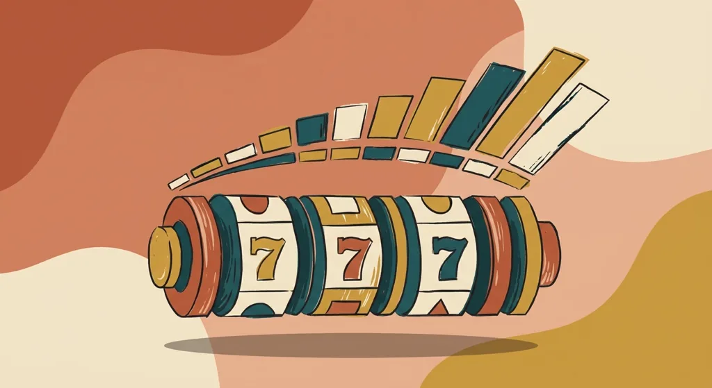

Title tag: Peter & Sons: профил на доставчика, механики и топ слотове
Meta description: Кой е Peter & Sons, младото студио с комикс визия зад Xibalba и Voodoo Hex, как стигат игрите му до играча през Relax и Yggdrasil и защо обявеният RTP зависи от версията, която операторът пуска.

---

# Peter & Sons: профил на доставчика, механики и топ слотове

Peter & Sons е младо студио, основано през 2019 г. в Ереван, Армения, с визия, която трудно се бърка с друга: ръчно рисувана, театрална, близка до графичен роман. Зад заглавия като Xibalba и Voodoo Hex стои екип с художествен произход, който залага на характер и стил, а темпото на нови игри е около едно заглавие месечно.

## Младо студио с почерк на комикс

Отличителното при Peter & Sons е визуалният език: изразителни герои, комикс естетика и собствена технологична рамка за игрите. Това не е студио, което гони обем от еднотипни ротативки; портфолиото му е сравнително компактно, а всяко заглавие има подчертан характер.

## Как стигат игрите до играча

Peter & Sons почти не се среща самостоятелно в лобито на казиното. Студиото е партньор на Relax Gaming по програмата Silver Bullet от 2022 г., а е и в програмата YGS Masters на Yggdrasil, което му дава достъп до чужди механики и по-широка дистрибуция. На практика игрите му достигат до играчите основно през тези агрегатори. Ако едно казино предлага съдържание с етикет „Relax" или „Yggdrasil", е възможно сред него да има и заглавия на Peter & Sons.

## Какво значат лицензите на студиото

Peter & Sons прави игрите, но не ги предлага сам: той е доставчик на софтуер, а самото казино е операторът, който приема залозите и държи парите. Студиото и партньорите му, през които се дистрибутира, държат доставчически (B2B) лицензи за регулирани пазари като Малта и Обединеното кралство. Такъв лиценз означава, че играта е тествана и обявеният RTP отговаря на реалната ѝ математика. Той не гарантира, че конкретно заглавие е достъпно законно в България: това се проверява в публичния регистър на НАП, не по логото на студиото или на агрегатора.

## Подписните механики

В основата на повечето заглавия стоят каскадите: печелившите символи изчезват, отгоре падат нови и една завъртка може да събере няколко последователни печалби. Върху тази верига често работи множител, който в безплатните завъртания само расте и не се нулира до края на рунда, а в част от игрите полето се разраства заедно с каскадите и вдига броя начини за печалба по време на самото завъртане, в някои заглавия от 243 до 7776. Купуването на бонуса също е често срещано, а волатилността по правило е висока до много висока.

## Топ слотове и техните RTP

Най-новата Barbarossa: Dragon Empire (2025) е и най-агресивната: 96.57% обявен RTP срещу таван от 40 000 пъти залога. По-ранните заглавия държат сходни нива на връщане, но с по-предпазливи тавани. Xibalba (2021) стъпва на тема с маите, каскади и разрастващи се барабани при 96.2% и рекламиран таван от 20 000 пъти залога, докато Voodoo Hex (2022) залага на респини с мистериозни стекове при 96.3% и 9400 пъти залога. Dragon Blox GigaBlox (2023) заема механики от Yggdrasil, върти 95.9% и стига до 10 000 пъти залога, а компактната Steamworks (2024) остава по-скромна при 96.17% и таван от 2500 пъти залога. Всички те са високоволатилни игри, при които големите тавани се падат рядко.

*Обявени RTP на пет заглавия на Peter & Sons, между 95.9% и 96.57%. Реалната стойност зависи от заглавието и от версията, която операторът е пуснал.*

## RTP: проверявай версията

Обявеното число е само отправна точка, а реалният процент зависи от версията, която операторът пусне. Част от игрите се доставят в няколко варианта с различен RTP. Voodoo Hex например има освен 96.3% и версии от порядъка на 94%, 90.5% и 86.1%, а Barbarossa се предлага и с около 94% и 91%. При по-ниската версия плащаш осезаемо повече за същата игра. Отвори инфо-панела на играта, намери реда за RTP и виж кое число работи там, преди да заложиш.

## Преди да завъртиш

[Слот игрите](/slot-igri/) на Peter & Sons обикновено имат демо режим, в който да усетиш темпото и волатилността, без да залагаш, а ако искаш да сравниш доставчици един до друг, [прегледът ни на доставчиците](/blog/games-providers/) стъпва на същата логика. Различните [ротативки](/kazino-igri/rotativki/) се сравняват най-честно по RTP, затова в [методологията ни](/kak-ocenyavame/) гледаме реалния процент на конкретното казино вместо рекламния. Задай си лимит за загуба и за време преди първото завъртане, особено при толкова волатилни игри. 18+ Хазартът може да пристрасти. Играйте отговорно. Ако усетите, че играта излиза извън контрол, вижте [инструментите за отговорна игра](/otgovorna-igra/).

---

**Георги Тодоров**
Публикувано: 19.09.2026 · Последна редакция: 19.09.2026

[About Всички Казина boilerplate]

**Отговорна игра.** 18+ Хазартът може да пристрасти. Играйте отговорно. Ако усетиш, че играта излиза извън контрол или искаш да я ограничиш, виж [инструментите за отговорна игра](/otgovorna-igra/) и възможността за самоизключване чрез националния регистър на уязвимите лица към НАП (подава се писмено само от засегнатото лице). Национална информационна линия за наркотиците, алкохола и хазарта („Солидарност") 0888 99 18 66, делнични дни 10:00–17:00.

**Разкриване на партньорства.** Всички Казина съдържа партньорски (афилиейт) връзки; когато отвориш оферта през такава връзка, това може да финансира сайта, без да променя цената за теб и без да влияе на оценките ни. От 1 август 2026 г. дейността на афилиейт оператори в България се лицензира съгласно Закона за държавния бюджет за 2026 г. (ДВ, бр. 69 от 31.07.2026 г.). Всички Казина е подало заявление за лиценз пред Националната агенция по приходите и очаква издаването му.
