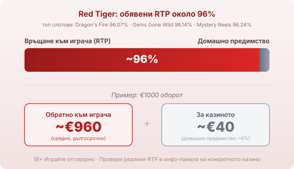

Title tag: Red Tiger: профил на доставчика и топ слотове
Meta description: Кой е Red Tiger, откъде идва и какви механики прави: Daily Drop джакпоти, топ слотове с RTP 96.07-96.24% и защо RTP се проверява в инфо-панела.

---

# Red Tiger: профил на доставчика, механики и топ слотове

Red Tiger, на български изписван и „ред тайгър", е студио, чиито игри се появяват в почти всяко българско онлайн казино, но малцина играчи знаят кой стои зад тях. Основано е през 2014 г. от хора с опит в игралната индустрия, а днес работи под чадъра на Evolution. Разпознаваемо е с две неща: мрежата от джакпоти с краен час и слотовете с чист, лъскав дизайн.

## Кой стои зад Red Tiger

Компанията, чието пълно име е Red Tiger Gaming, стартира през 2014 г. с екип, дошъл от други студиа в бранша, и бързо се утвърди с игрите си на дневни джакпоти. През 2019 г. шведската NetEnt я придоби, а към края на 2020 г. самата NetEnt влезе в групата на Evolution. Така Red Tiger попадна под същия покрив като NetEnt, но продължава да излиза под собствено име. Игрите му се тестват и лицензират от регулатори като Malta Gaming Authority и Британската комисия по хазарта, което значи, че генераторът на случайни числа е проверен и обявеният RTP отговаря на математиката на играта. Лицензът потвърждава, че играта е честна спрямо правилата си, не че правилата са в твоя полза.

## Daily Drop: джакпотите с краен час

Най-разпознаваемата разработка на Red Tiger са мрежовите джакпоти Daily Drop. Идеята е необичайна за индустрията и лесна за играча: всеки джакпот трябва да падне до определен час, независимо кой го спечели. Нивата са няколко, от по-малки пулове, които се раздават често през деня, до по-голям дневен джакпот, който трябва да се изсипе преди крайния си час. Пулът се пълни от малка част от всеки залог в мрежата, точно както при обикновените прогресивни слотове, а самият джакпот се задейства през отделно колело, когато на екрана паднат специалните символи. Механизмът обаче не мени домашното предимство на слота: парите за пула идват от същите залози на играчите и просто се преразпределят на по-малко хора, но по-едро.

## Механики отвъд джакпота

Извън джакпотите Red Tiger залага на няколко повтарящи се хватки. Разширяващи се и залепващи се wild символи, които задействат повторни завъртания. Множители, които растат при поредни печалби. По-новите заглавия ползват и лицензираната Megaways механика, която сменя броя символи на всеки барабан и раздува начините за печалба. Визуалният почерк е постоянен: чисти анимации, ясно поле, без излишен шум по екрана.

## Три слота, които показват почерка

Dragon's Fire е добра отправна точка. Слот с 5 барабана и 40 линии, обявен RTP 96.07% по данни на Red Tiger и висока волатилност. Волатилността описва как се разпределят печалбите: висока значи дълги сухи периоди и редки едри удари, ниска значи чести дребни печалби. Таванът тук стига до 10 366 пъти залога, а множителят на дракона расте при всяка поредна печалба. Игра за търпелив бюджет.

Gems Gone Wild е по-спокойният вариант. Обявеният ѝ RTP е 96.14%, волатилността е по-ниска, а всеки скъпоценен камък може да стане wild и да пусне повторно завъртане. Таванът е скромен, около 1 706 пъти залога, което пасва на дълга сесия с малки колебания.

Mystery Reels връща класическата плодова тема, но с механика на клониращ символ. Обявеният RTP е 96.24%, волатилността е висока, а таванът е 4 991 пъти залога. Бонус колелото се появява рядко, но когато дойде, дърпа сесията нагоре.

## RTP: проверявай числото, не банера

Обявените RTP стойности на слотовете на Red Tiger обикновено се движат около 96%. При €1000 оборот и обявен RTP около 96% средно се връщат около €960 в дългосрочен план, а към €40 остават за казиното. Числото е дългосрочна статистика върху милиони завъртания, не обещание за твоята сесия. Много заглавия се доставят и в няколко версии с различен RTP, а операторът избира коя да пусне. Pirates' Plenty например се среща с различни обявени проценти в различни казина. Затова в [методологията ни](/kak-ocenyavame/) гледаме реалния RTP на конкретното казино, а не рекламния. Отвори инфо-панела на играта и виж кое число работи там, преди да заложиш.

*Илюстративен пример при обявен RTP ~96%: €1000 оборот връща средно ~€960, ~€40 остават за казиното. Обявените RTP се доставят в конфигурируеми версии, затова се проверяват в инфо-панела.*

## Демо режим, лимити и реален RTP

[Слот игрите](/slot-igri/) на Red Tiger обикновено имат демо режим, в който да усетиш темпото и волатилността, без да залагаш, а ако искаш да сравниш студиата, [прегледът ни на доставчиците](/blog/games-providers/) стъпва на същата логика. Задай си лимит за загуба и за време, преди да отвориш която и да е игра, и провери реалния RTP на конкретното казино. Джакпотът с краен час звучи примамливо, но домашното предимство остава на страната на казиното, както при всеки слот. 18+ Хазартът може да пристрасти. Играйте отговорно. Ако усетиш, че играта излиза извън контрол, виж [инструментите за отговорна игра](/otgovorna-igra/).

---

**Георги Тодоров**
Публикувано: 19.09.2026 · Последна редакция: 19.09.2026

[About Всички Казина boilerplate]

**Отговорна игра.** 18+ Хазартът може да пристрасти. Играйте отговорно. Ако усетиш, че играта излиза извън контрол или искаш да я ограничиш, виж [инструментите за отговорна игра](/otgovorna-igra/) и възможността за самоизключване чрез националния регистър на уязвимите лица към НАП (подава се писмено само от засегнатото лице). Национална информационна линия за наркотиците, алкохола и хазарта („Солидарност") 0888 99 18 66, делнични дни 10:00–17:00.

**Разкриване на партньорства.** Всички Казина съдържа партньорски (афилиейт) връзки; когато отвориш оферта през такава връзка, това може да финансира сайта, без да променя цената за теб и без да влияе на оценките ни. От 1 август 2026 г. дейността на афилиейт оператори в България се лицензира съгласно Закона за държавния бюджет за 2026 г. (ДВ, бр. 69 от 31.07.2026 г.). Всички Казина е подало заявление за лиценз пред Националната агенция по приходите и очаква издаването му.
