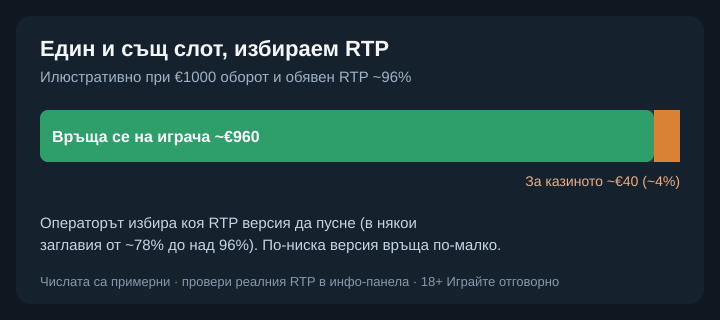

Title tag: Spinomenal: профил на доставчика, механики и топ слотове
Meta description: Кой е Spinomenal, какви игри и механики прави и кои са топ слотовете му. Защо едно и също заглавие може да връща различен RTP в различни казина.

---

# Spinomenal: профил на доставчика, механики и топ слотове

Spinomenal рядко е името, което играчът запомня, но заглавията му се въртят в каталозите на много български онлайн казина. Студиото стартира през 2014 г. с израелски корени, а днес е регистрирано в Малта и работи под лиценз на тамошния регулатор. За десетина години се утвърди като среден по големина, но плодовит доставчик: около 300 собствени заглавия и по няколко нови всеки месец.

## Какво прави Spinomenal

Освен собствените си слотове компанията поддържа и агрегационна платформа, през която едно казино може да пусне игри и на други доставчици, над 2000 заглавия на едно място. За теб това значи, че зад логото „Spinomenal" понякога стои цяла витрина с чужди игри, не само техните. Собственият им каталог е предимно HTML5 слотове, направени да вървят еднакво на телефон и на компютър.

## Какво значат лицензите

Spinomenal държи лицензи от Malta Gaming Authority, британската UK Gambling Commission, румънския ONJN и гръцката хазартна комисия, а игрите му минават през независими лаборатории като BMM Testlabs. Практическото значение е конкретно: тестът потвърждава, че генераторът на случайни числа работи честно и че играта отговаря на обявената си математика. Той не прави играта изгодна за теб. Домашното предимство си остава вградено, а сертификатът само гарантира, че е точно такова, каквото пише в правилата.

## Механики, които ще срещнеш

Голяма част от слотовете стъпват на позната основа: разширяващи се символи в стил „книга", събиране на символи за допълнителна награда (Collect & Win), задържане и повторно завъртане на определени символи (Hold & Hit) и по-едрите Mega символи, които заемат няколко позиции наведнъж. Немалко заглавия предлагат и Bonus Buy, тоест директно купуване на бонус рунда срещу по-висок залог. Това не подобрява шансовете ти. Плащаш повече сега за бърз достъп до функция, чиято математика остава същата.

## Топ слотове на Spinomenal

Сред по-разпознаваемите заглавия са Book of Demi Gods II (обявен RTP около 95.9%, висока волатилност), Egyptian Rebirth II (около 96.3%, средна волатилност) и Majestic King (около 95.16%). Да знаеш, че едно заглавие е популярно, не ти казва нищо за конкретната сесия. Високата волатилност например значи, че печалбите идват по-рядко, но по-едри, не че играта „дава повече".

## Един и същ слот, различен RTP

Ето особеността, която си струва да запомниш при този доставчик. Spinomenal пуска много от заглавията си с няколко избираеми настройки на RTP, в някои случаи от порядъка на 78% до над 96%, а операторът избира коя версия да качи. Затова една и съща игра може да ти връща осезаемо различен процент в две различни казина. При обявен RTP около 96% и €1000 общ оборот средно се връщат около €960 в дългосрочен план, а около €40 остават за казиното, но това важи само ако казиното е пуснало точно тази версия. Заради това в [методологията ни](/kak-ocenyavame/) гледаме реалния RTP на конкретния оператор, а не рекламния.

*Илюстративен пример при €1000 оборот: версия с RTP ~96% връща средно ~€960 (~€40 за казиното). По-ниска избрана версия връща по-малко. Кое число работи, се чете в инфо-панела на конкретното казино.*

## Демо режим, лимити и реален RTP

[Слот игрите](/slot-igri/) на Spinomenal обикновено имат демо режим, в който да видиш темпото и механиката, без да залагаш, а ако сравняваш доставчици, [прегледът ни на доставчиците](/blog/games-providers/) стъпва на същата логика. Задай си лимит за загуба и за време, преди да отвориш която и да е игра, и провери реалния RTP на конкретното казино, особено при заглавие с избираеми версии. 18+ Хазартът може да пристрасти. Играйте отговорно. Ако усетите, че играта излиза извън контрол, вижте [инструментите за отговорна игра](/otgovorna-igra/).

---

**Георги Тодоров**
Публикувано: 19.09.2026 · Последна редакция: 19.09.2026

[About Всички Казина boilerplate]

**Отговорна игра.** 18+ Хазартът може да пристрасти. Играйте отговорно. Ако усетиш, че играта излиза извън контрол или искаш да я ограничиш, виж [инструментите за отговорна игра](/otgovorna-igra/) и възможността за самоизключване чрез националния регистър на уязвимите лица към НАП (подава се писмено само от засегнатото лице). Национална информационна линия за наркотиците, алкохола и хазарта („Солидарност") 0888 99 18 66, делнични дни 10:00–17:00.

**Разкриване на партньорства.** Всички Казина съдържа партньорски (афилиейт) връзки; когато отвориш оферта през такава връзка, това може да финансира сайта, без да променя цената за теб и без да влияе на оценките ни. От 1 август 2026 г. дейността на афилиейт оператори в България се лицензира съгласно Закона за държавния бюджет за 2026 г. (ДВ, бр. 69 от 31.07.2026 г.). Всички Казина е подало заявление за лиценз пред Националната агенция по приходите и очаква издаването му.
