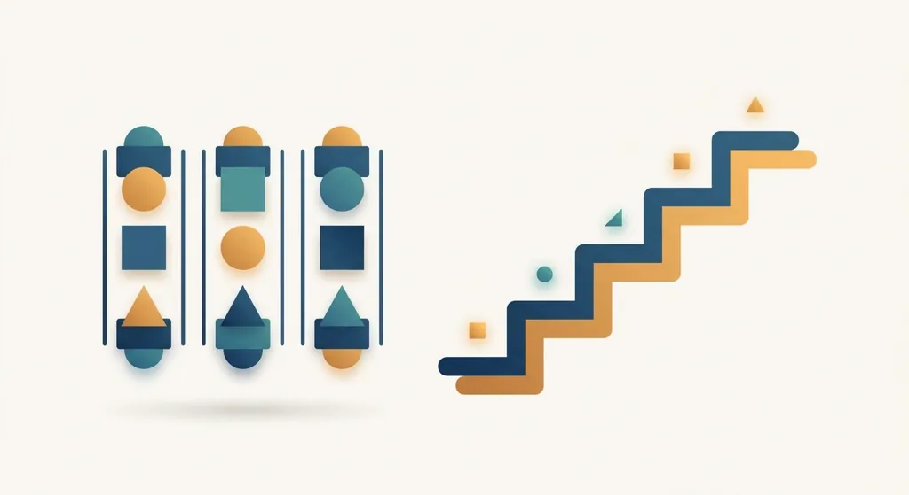
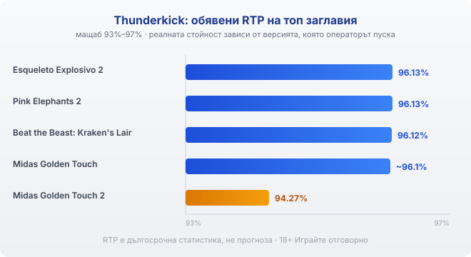

Title tag: Thunderkick: профил на доставчика, механики и топ слотове
Meta description: Кой е Thunderkick, шведското студио зад Esqueleto Explosivo и Pink Elephants, каква е подписната му механика с падащи символи и растящ множител и защо обявеният RTP зависи от версията, която операторът пуска.

---

# Thunderkick: профил на доставчика, механики и топ слотове

Thunderkick е малко шведско студио, основано през 2012 г. в Стокхолм, което рано си спечели име с необичайни теми и механики. Ако си пускал Esqueleto Explosivo с танцуващите скелети или халюциногенните Pink Elephants, вече си виждал почерка му: по-малко заглавия, но всяко с изразен характер вместо конвейерна визия.

## Скандинавско бутиково студио

Компанията се самоопределя като „малко студио, което иска да разбърка нещата", и залага на собствена ръчна изработка на графика и звук, а не на голям обем от еднотипни игри. Екипът работи от Стокхолм, докато лицензирането минава през малтийско дружество на групата.

## Какво значат лицензите на студиото

Thunderkick прави игрите, но не ги предлага сам: той е доставчик на софтуер, а самото казино е операторът, който приема залозите и държи парите. Студиото държи доставчически (B2B) лицензи за регулирани пазари, сред които Малта (MGA) от 2013 г. и Обединеното кралство от 2015 г., а от 2024 г. и Дания. Такъв лиценз означава, че играта е тествана и обявеният RTP отговаря на реалната ѝ математика. Той не е гаранция, че игрите са достъпни или сертифицирани навсякъде: дали конкретно българско казино ги предлага законно, се проверява в публичния регистър на НАП, не по логото на студиото.

## Подписната механика: падащи символи и растящ множител

Най-разпознаваемата идея на Thunderkick са падащите символи с покачващ се множител. В серията Esqueleto Explosivo печелившите символи изчезват, отгоре падат нови, а с всяко поредно падане в рамките на завъртането множителят се удвоява по стълбата. Един кръг може да събере няколко последователни печалби, преди да спре. Механиката е близка до каскадите на други доставчици, но при Thunderkick често е обвързана точно с този растящ множител. Голям резултат идва, когато серията се проточи и множителят се качи високо, а това се случва рядко.

## Формати на печалба

Студиото рядко се държи за класическите линии. Различните му заглавия използват формати с много начини за печалба, от 99 през 243 до 4096, а някои игри тръгват с фиксирани линии в основната игра и минават към формат с повече начини в бонуса. Серията Beat the Beast събира няколко високоволатилни заглавия с митологични чудовища, но всяко от тях има собствен таван на печалбата: това са отделни игри с обща тема, а не свързан общ джакпот.

## Топ слотове и техните RTP

Esqueleto Explosivo 2 (2020) връща обявени 96.13% и стига до 5000 пъти залога, Pink Elephants 2 (2020) също е с 96.13% и по-висок таван от 10 000 пъти залога във формат с 4096 начина, Midas Golden Touch (2019) е с около 96.1%, а Beat the Beast: Kraken's Lair (2018) е с 96.12%. По-новите заглавия показват, че числото не е фиксирано: Midas Golden Touch 2 (2024) излиза с чувствително по-нисък обявен RTP от 94.27% по подразбиране. Повечето от тези игри са с висока волатилност: по-редки, но потенциално по-големи печалби.

*Обявени RTP на няколко заглавия на Thunderkick: класиките седят около 96.1%, докато Midas Golden Touch 2 излиза с 94.27%. Реалната стойност зависи от заглавието и от версията, която операторът е пуснал.*

## RTP: проверявай версията

Една и съща игра може да ти връща различен процент в различни казина, защото част от заглавията се доставят в няколко версии с различен RTP, а операторът избира коя да пусне. Затова числото по-горе е ориентир за самото заглавие. Отвори инфо-панела на играта, намери реда за RTP и виж кое число работи там, преди да заложиш. Ако версията е с чувствително по-нисък процент, плащаш по-скъпо за същата игра и си струва да потърсиш казино с по-добрия вариант.

## Преди да завъртиш

[Слот игрите](/slot-igri/) на Thunderkick обикновено имат демо режим, в който да усетиш темпото и волатилността, без да залагаш, а ако искаш да сравниш доставчици един до друг, [прегледът ни на доставчиците](/blog/games-providers/) стъпва на същата логика. Различните [ротативки](/kazino-igri/rotativki/) се сравняват най-честно по RTP, затова в [методологията ни](/kak-ocenyavame/) гледаме реалния процент на конкретното казино вместо рекламния. Задай си лимит за загуба и за време преди първото завъртане. 18+ Хазартът може да пристрасти. Играйте отговорно. Ако усетите, че играта излиза извън контрол, вижте [инструментите за отговорна игра](/otgovorna-igra/).

---

**Георги Тодоров**
Публикувано: 19.09.2026 · Последна редакция: 19.09.2026

[About Всички Казина boilerplate]

**Отговорна игра.** 18+ Хазартът може да пристрасти. Играйте отговорно. Ако усетиш, че играта излиза извън контрол или искаш да я ограничиш, виж [инструментите за отговорна игра](/otgovorna-igra/) и възможността за самоизключване чрез националния регистър на уязвимите лица към НАП (подава се писмено само от засегнатото лице). Национална информационна линия за наркотиците, алкохола и хазарта („Солидарност") 0888 99 18 66, делнични дни 10:00–17:00.

**Разкриване на партньорства.** Всички Казина съдържа партньорски (афилиейт) връзки; когато отвориш оферта през такава връзка, това може да финансира сайта, без да променя цената за теб и без да влияе на оценките ни. От 1 август 2026 г. дейността на афилиейт оператори в България се лицензира съгласно Закона за държавния бюджет за 2026 г. (ДВ, бр. 69 от 31.07.2026 г.). Всички Казина е подало заявление за лиценз пред Националната агенция по приходите и очаква издаването му.
