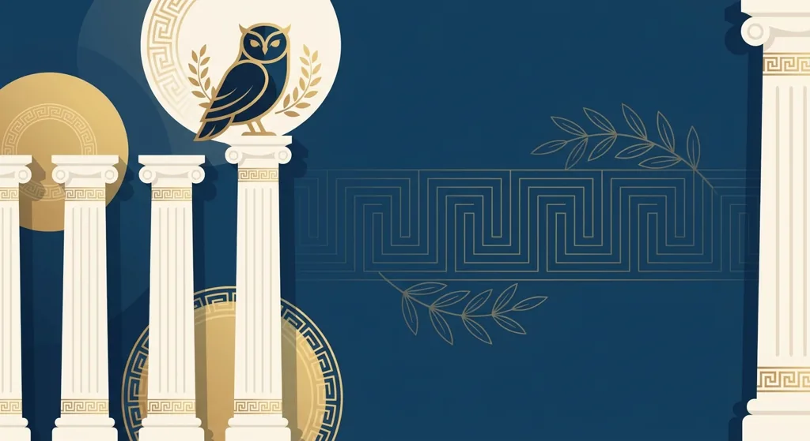
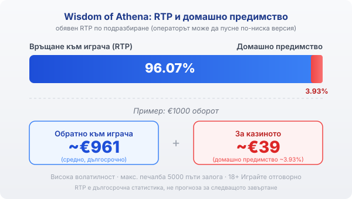

Title tag: Wisdom of Athena (Pragmatic): RTP, множители и как се играе
Meta description: Как работи Wisdom of Athena на Pragmatic Play: печалби от 8 еднакви символа, каскади и множители, които се сумират. Защо обявеният RTP 96.07% оставя 3.93% за казиното и как да проверите версията.

---

# Wisdom of Athena (Pragmatic Play): RTP, множители и как се играе

Wisdom of Athena е слот на Pragmatic Play от 2023 г. с гръцка митологична тема около богинята Атина. Под спокойната визия работи механика, която повечето играчи разпознават от Sweet Bonanza и Gates of Olympus: печалби без линии, падащи символи и множители. Разликата е в детайлите, а те определят как се държи банката ти.

## Как се образува печалба

Мрежата е 6 барабана по 5 позиции. Играта не използва линии, а плаща по брой: печалба се образува, когато на екрана паднат поне 8 еднакви символа, без значение къде стоят. Печелившите символи изчезват, а на тяхно място падат нови отгоре, така че една завъртка може да донесе няколко последователни печалби, докато спре да излиза комбинация. По време на такава серия от падания се отваря допълнителна част от игралното поле, което дава още място за нови съвпадения в рамките на същото завъртане.

## Множителите: сумиране, не wild

Wisdom of Athena няма wild символ, който да замества другите. Стойността идва от отделни символи-множители, които падат със стойност от x2 до x500. В края на всяка серия от падания играта събира всички видими множители и прилага сбора върху печалбата от тази серия. Затова един голям резултат зависи от това колко множителя се струпат заедно, преди каскадата да спре, а това се случва рядко. Механиката награждава търпението към редките моменти, в които няколко високи множителя паднат в един и същ кръг.

## Безплатните завъртания

Четири или повече scatter символа стартират рунд от 10 безплатни завъртания. Тук е и голямата разлика спрямо основната игра: събраният множител се пази през целия рунд и не се нулира между завъртанията, а расте, докато падат нови множители. Ако по време на бонуса паднат три или повече scatter в една серия, получаваш още 5 завъртания. Точно в този режим се случват едрите резултати на играта, защото натрупаният множител може да умножи по-късна печалба. Може и да завърши скромно, ако множителите не дойдат.

## RTP и волатилност

Обявеният по подразбиране RTP на Wisdom of Athena е 96.07%, което оставя домашно предимство от 3.93%. При €1000 оборот това значи средно връщане от порядъка на €961 в дългосрочен план и около €39 за казиното. Pragmatic Play обаче доставя играта и в по-ниски версии, около 95.09% и 94.09%, а операторът избира коя да пусне. Коя точно работи при теб проверяваш в инфо-панела на играта в конкретното казино, защото там пише реалната стойност. Волатилността е висока: печалбите са редки, но потенциално големи, а максималната печалба е 5000 пъти залога, което е таван, а не очакване. На практика това значи дълги серии без резултат, прекъсвани от отделни по-едри попадения.

*Обявен RTP 96.07% по подразбиране: при €1000 оборот средно ~€961 се връщат на играча, ~€39 остават за казиното (домашно предимство ~3.93%). Операторът може да пусне по-ниска версия, затова проверявай инфо-панела.*

## Ante bet и купуване на бонуса

Играта дава два начина да стигнеш по-бързо до безплатните завъртания. Опцията ante bet вдига залога с 25% и повишава честотата на scatter символите. Функцията за купуване на бонуса дава директно рунда срещу цена от 100 пъти залога. И двете плащаш веднага, а нито една не мени дългосрочното домашно предимство: купуваш си по-бърз достъп до вариацията, не по-добри шансове. Залогът е в широк диапазон, от порядъка на €0.20 до €100 на завъртане, така че една и съща сесия изглежда съвсем различно според избраното ниво.

## Внимание с версията 1000

По-късно излезе отделна игра, Wisdom of Athena 1000, която вдига тавана на множителите до x1000 и максималната печалба до 10 000 пъти залога, при малко по-нисък обявен RTP около 96%. По-високият таван не означава по-добри шансове, а по-рядък и по-краен резултат: същата логика, но с още по-дълги сухи периоди. Ако търсиш конкретно базовата игра, провери заглавието в казиното, защото двете вървят една до друга.

## Преди да завъртиш

[Слот игрите](/slot-igri/) на Pragmatic Play обикновено имат демо режим, в който да усетиш темпото и волатилността, без да залагаш, а ако искаш да сравниш доставчици, [прегледът ни на доставчиците](/blog/games-providers/) стъпва на същата логика. Различните [ротативки](/kazino-igri/rotativki/) се сравняват най-честно по RTP, затова в [методологията ни](/kak-ocenyavame/) гледаме реалния процент на конкретното казино вместо рекламния. Задай си лимит за загуба и за време преди първото завъртане, особено при толкова волатилна игра. 18+ Хазартът може да пристрасти. Играйте отговорно. Ако усетите, че играта излиза извън контрол, вижте [инструментите за отговорна игра](/otgovorna-igra/).

---

**Георги Тодоров**
Публикувано: 19.09.2026 · Последна редакция: 19.09.2026

[About Всички Казина boilerplate]

**Отговорна игра.** 18+ Хазартът може да пристрасти. Играйте отговорно. Ако усетиш, че играта излиза извън контрол или искаш да я ограничиш, виж [инструментите за отговорна игра](/otgovorna-igra/) и възможността за самоизключване чрез националния регистър на уязвимите лица към НАП (подава се писмено само от засегнатото лице). Национална информационна линия за наркотиците, алкохола и хазарта („Солидарност") 0888 99 18 66, делнични дни 10:00–17:00.

**Разкриване на партньорства.** Всички Казина съдържа партньорски (афилиейт) връзки; когато отвориш оферта през такава връзка, това може да финансира сайта, без да променя цената за теб и без да влияе на оценките ни. От 1 август 2026 г. дейността на афилиейт оператори в България се лицензира съгласно Закона за държавния бюджет за 2026 г. (ДВ, бр. 69 от 31.07.2026 г.). Всички Казина е подало заявление за лиценз пред Националната агенция по приходите и очаква издаването му.
