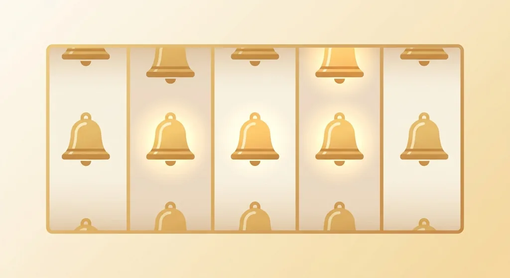
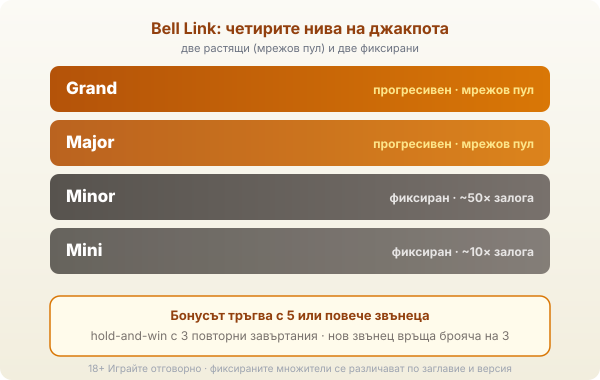

Title tag: Bell Link (EGT Digital): как работи джакпот системата
Meta description: Bell Link на EGT Digital: hold-and-win с 4 нива (Mini, Minor, Major, Grand). Бонусът тръгва с 5+ звънеца; кои нива растат и кои са фиксирани.

---

# Bell Link (EGT Digital): как работи джакпот системата

Bell Link не е отделна игра, а джакпот система, която EGT Digital закача върху цяло семейство свои слотове. Ще я срещнеш като добавка към класики от рода на 40 Super Hot, Flaming Hot и Shining Crown, под името „... Bell Link". Механиката е hold-and-win: събираш символи звънци, те залепват на екрана и в края може да отключат едно от четири нива. EGT Digital е дигиталното подразделение на EGT (Euro Games Technology), а самата Bell Link първо тръгна в наземните зали, преди да мине онлайн.

## Четирите нива: кои растат и кои са фиксирани

Нивата са четири: Mini, Minor, Major и Grand. Горните две, Major и Grand, са прогресивни. Пълнят се от залозите в цялата мрежа от играчи на Bell Link заглавия и затова растат, докато някой не ги удари. Долните две, Minor и Mini, са фиксирани: плащат определен множител на залога, не растяща сума. По игровите бази Minor излиза около 50 пъти залога, а Mini около 10 пъти. [VERIFY: точните множители на фиксираните нива се различават по заглавие и по конфигурация на казиното.] Началните суми на прогресивните нива и процентът на отчисленията към тях не се публикуват официално, затова тук няма да прочетеш измислени числа за тях.

*Четири нива: Mini и Minor са фиксирани, Major и Grand растат от мрежовия пул.*

## Как се пуска бонусът

Bell Link фазата тръгва, когато в едно завъртане паднат 5 или повече звънеца, независимо дали са еднакви или различни. Редовната игра спира и започва hold-and-win: падналите звънци се заключват по местата си, а останалите полета се въртят наново. Стандартно получаваш 3 повторни завъртания. Всеки нов звънец, който залепне, връща брояча обратно на 3, така че поредица от удари удължава фазата. Тя приключва, когато повторните завъртания се изчерпят или целият екран се напълни със звънци.

## Звънците и стойностите им

Всеки звънец носи стойност. Обикновените държат случаен паричен множител, най-често от 1 до 100 пъти залога, а специалните водят към някое от четирите нива на джакпота. При напълнен екран някои заглавия прилагат допълнителен множител върху събраните парични звънци, но той не докосва прогресивните Major и Grand. Смисълът на фазата е да задържиш и събереш възможно най-много звънци, преди повторните завъртания да свършат.

## Кои игри носят Bell Link

Системата се познава по наставката „Bell Link" към името на базова игра. Сред заглавията са 40 Super Hot Bell Link, 40 Burning Hot Bell Link, Flaming Hot Bell Link, 40 Shining Crown Bell Link и Burning Hot Bell Link, тоест същите плодови и класически теми на [EGT](/blog/amusnet-egt-provajdar/), но с добавената джакпот фаза. Базовата игра остава каквато я знаеш; Bell Link е слоят отгоре.

## RTP: зависи от заглавието

Bell Link не носи един-единствен RTP. Всяко заглавие има свой процент, а той често е конфигурируем от казиното. За 40 Super Hot Bell Link игровите бази посочват около 96.5% и средно-висока волатилност, но това число важи за конкретната игра, не за системата като цяло. [VERIFY: RTP е по игрова база и подлежи на операторска версия.] Затова провери процента в инфо-панела на самото заглавие. Джакпотът не сваля домашното предимство в редовната игра; той просто отклонява част от оборота към няколко редки големи изхода.

## Разлика от другите джакпоти на EGT

Системите на EGT лесно се бъркат, защото вървят върху сходни слотове. Bell Link събира звънци в hold-and-win фаза. Jackpot Cards работи иначе: там теглиш карти и събираш три от една боя. Clover Chance пък е мистерия джакпот с детелина, който тръгва на случаен принцип, без символ да го вика. Различни символи, различни бонус фази, а обща е само марката EGT.

## Преди да завъртиш

Bell Link прави класическите EGT слотове по-променливи: базовата игра може дълго да мълчи, докато чакаш петте звънеца за бонуса. Ако темата ти допада, задай си лимит за загуба и за време, преди да седнеш, както при всички [прогресивни джакпоти](/blog/progresivni-dzhakpoti/). В [методологията ни](/kak-ocenyavame/) четем RTP като дългосрочна статистика, не като прогноза за сесията. 18+ Хазартът може да пристрасти. Играйте отговорно. Ако усетиш, че играта излиза извън контрол, виж [инструментите за отговорна игра](/otgovorna-igra/).

---

**Георги Тодоров**
Публикувано: 20.09.2026 · Последна редакция: 20.09.2026

[About Всички Казина boilerplate]

**Отговорна игра.** 18+ Хазартът може да пристрасти. Играйте отговорно. Ако усетиш, че играта излиза извън контрол или искаш да я ограничиш, виж [инструментите за отговорна игра](/otgovorna-igra/) и възможността за самоизключване чрез националния регистър на уязвимите лица към НАП (подава се писмено само от засегнатото лице). Национална информационна линия за наркотиците, алкохола и хазарта („Солидарност") 0888 99 18 66, делнични дни 10:00–17:00.

**Разкриване на партньорства.** Всички Казина съдържа партньорски (афилиейт) връзки; когато отвориш оферта през такава връзка, това може да финансира сайта, без да променя цената за теб и без да влияе на оценките ни. От 1 август 2026 г. дейността на афилиейт оператори в България се лицензира съгласно Закона за държавния бюджет за 2026 г. (ДВ, бр. 69 от 31.07.2026 г.). Всички Казина е подало заявление за лиценз пред Националната агенция по приходите и очаква издаването му.
