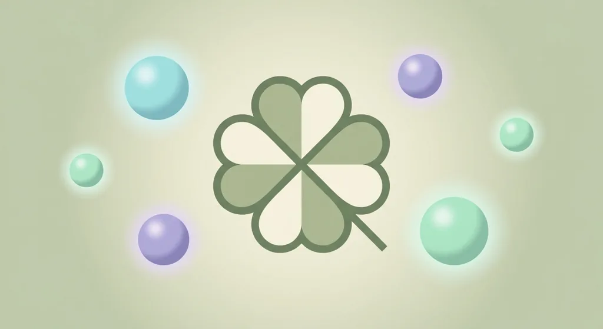
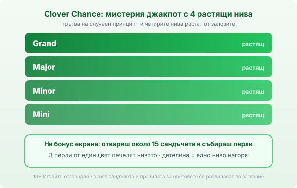

Title tag: Clover Chance (EGT Digital): как работи мистерия джакпотът
Meta description: Clover Chance на EGT Digital: мистерия джакпот с 4 растящи нива, който тръгва на случаен принцип. Събираш перли в сандъчета, детелина качва нивото.

---

# Clover Chance (EGT Digital): как работи мистерия джакпотът

Clover Chance е мистерия джакпот на EGT Digital, вързан върху цяло семейство слотове с тема четирилистна детелина за късмет. Ще го видиш като добавка към заглавия като 20 Super Hot Clover Chance, 40 Mega Clover и Clover Respin. За разлика от бонус, който гониш с определени символи, този се пуска на случаен принцип: в един момент барабаните спират и бонус екранът се отваря, без да си направил нещо специално.

## Четири нива, всичките растящи

Clover Chance има четири нива: Mini, Minor, Major и Grand. Официално и четирите се водят прогресивни, тоест пълнят се от залозите в мрежата и растат, докато някой не ги вземе. Точно тук е една от разликите с Bell Link, където долните нива са фиксиран множител на залога. При Clover Chance логиката е изцяло на растящ пул. Началните суми и процентите на отчисленията към нивата не се публикуват официално, затова конкретни числа за тях няма да прочетеш тук.

*Мистерия старт на случаен принцип, четири растящи нива и събиране на перли с детелина за качване.*

## Как тръгва бонусът

Джакпотът се активира на случаен принцип, по време на редовната игра или на повторно завъртане, без определена комбинация да го вика. Затова е „мистерия": не можеш да го предизвикаш и не можеш да предвидиш кога ще падне. Тръгне ли, редовната игра отстъпва на отделен бонус екран, където се решава кое ниво ще заключиш.

## Перлите, сандъчетата и детелината

На бонус екрана отваряш поредица сандъчета и събираш цветни перли. Три перли от един цвят печелят съответното ниво на джакпота, а специалните символи детелина работят като качване: местят те едно ниво нагоре, към по-голямата награда. По неофициални описания сандъчетата са около 15, но официалната страница не посочва брой. [VERIFY: точният брой сандъчета и точните правила за цветовете се различават по заглавие.] Логиката е права: колкото по-нагоре стигнеш, толкова по-голямо е нивото, което заключваш.

## Кои игри носят Clover Chance

Системата се разпознава по „Clover Chance" или темата с детелина в името. Сред заглавията са 20 Super Hot Clover Chance, 20 Burning Hot Clover Chance, 40 Super Hot Clover Chance, 40 Mega Clover, Clover Respin и 40 Clover Hit, тоест познати теми на [EGT](/blog/amusnet-egt-provajdar/) с добавения джакпот слой. Базовата игра си остава каквато я знаеш; Clover Chance е бонусът отгоре.

## RTP: по заглавие, не по система

Clover Chance няма собствен единен RTP; всяко заглавие носи своя процент. По игровите бази 20 Burning Hot Clover Chance върви около 95.88%, а Clover Respin около 96.5%. [VERIFY: RTP е по игрова база и обикновено подлежи на операторска версия.] Затова провери числото в инфо-панела на конкретната игра. Мистерия джакпотът не мени домашното предимство в редовната игра; той събира част от оборота към няколко редки, големи изхода.

## Разлика от Jackpot Cards и Bell Link

Трите системи на EGT си приличат по това, че седят върху сходни слотове, но бонусите им нямат нищо общо. Clover Chance е мистерия джакпот с перли и детелина, който тръгва сам. Jackpot Cards те кара да теглиш карти и да събираш три от една боя. Bell Link е hold-and-win със звънци, който отключваш с пет или повече символа. Ако темата с детелината ти допада, това е системата с най-малко твое участие: играеш си базовата игра, а джакпотът се пуска, когато реши.

## Преди да завъртиш

Случайният старт значи, че не можеш да „наближиш" джакпота, колкото и да въртиш; всяко завъртане е независимо от предишното. Задай си лимит за загуба и за време, преди да седнеш, както при всички [прогресивни джакпоти](/blog/progresivni-dzhakpoti/). В [методологията ни](/kak-ocenyavame/) четем RTP като дългосрочна статистика, не като обещание за сесията. 18+ Хазартът може да пристрасти. Играйте отговорно. Ако усетиш, че играта излиза извън контрол, виж [инструментите за отговорна игра](/otgovorna-igra/).

---

**Георги Тодоров**
Публикувано: 20.09.2026 · Последна редакция: 20.09.2026

[About Всички Казина boilerplate]

**Отговорна игра.** 18+ Хазартът може да пристрасти. Играйте отговорно. Ако усетиш, че играта излиза извън контрол или искаш да я ограничиш, виж [инструментите за отговорна игра](/otgovorna-igra/) и възможността за самоизключване чрез националния регистър на уязвимите лица към НАП (подава се писмено само от засегнатото лице). Национална информационна линия за наркотиците, алкохола и хазарта („Солидарност") 0888 99 18 66, делнични дни 10:00–17:00.

**Разкриване на партньорства.** Всички Казина съдържа партньорски (афилиейт) връзки; когато отвориш оферта през такава връзка, това може да финансира сайта, без да променя цената за теб и без да влияе на оценките ни. От 1 август 2026 г. дейността на афилиейт оператори в България се лицензира съгласно Закона за държавния бюджет за 2026 г. (ДВ, бр. 69 от 31.07.2026 г.). Всички Казина е подало заявление за лиценз пред Националната агенция по приходите и очаква издаването му.
