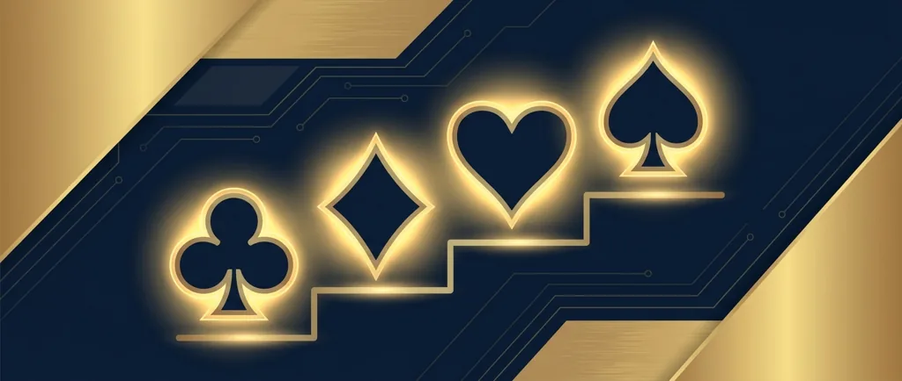
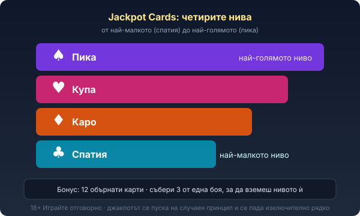

Title tag: Jackpot Cards (Amusnet/EGT): как работи мистерия джакпотът
Meta description: Jackpot Cards на Amusnet (EGT): четири нива по боите карти, случаен старт след завъртане, събери 3 от една боя. Как работи прогресивът и мени ли шансовете ти.

---

# Jackpot Cards: как работи мистерия джакпотът на Amusnet

Jackpot Cards е фирменият прогресивен джакпот на [Amusnet](/blog/amusnet-egt-provajdar/), българския производител, който до 2022 г. се казваше EGT. Лентата му свети над десетки от класическите игри на компанията, а не над една конкретна. Работи като мистерия джакпот: не го отключваш с комбинация, а той сам решава кога да се задейства.

## Четири нива по боите на картите

Jackpot Cards има четири нива и всяко носи името на боя от тесте карти. Спатията е най-малкото, над нея са каро и купа, а пиката е най-голямото. Колкото по-нагоре е нивото, толкова по-голяма е сумата и толкова по-рядко се пада. Тази стълбица е една и съща във всяка игра с Jackpot Cards.

## Кога се пуска бонусът

Мистерия джакпотът се задейства на случаен принцип след завъртане и не зависи от това дали то е спечелило или не. Може да дойде и след голяма печалба, и след напълно празно завъртане. Размерът на залога влияе: по-големите залози повишават шанса джакпотът изобщо да се пусне и да уцелиш по-високо ниво. Точен алгоритъм производителят не публикува, а и моментът така или иначе нито се предвижда, нито се предизвиква.

## Бонусът с обърнатите карти

Пусне ли се Jackpot Cards, екранът се сменя с поле от дванайсет обърнати карти. Обръщаш ги една по една и следиш боите. Щом събереш три карти от една и съща боя, печелиш нивото на тази боя и кръгът приключва веднага.

Три спатии дават най-малкия джакпот, три пики най-големия. Има и разширена версия, Jackpot Cards Plus, която добавя повече карти и колело с бонус функция.

## Откъде идват парите в пула

Пулът на Jackpot Cards се пълни от малка част от всеки залог на всички играчи по мрежата, в която тече джакпотът. Затова сумата расте видимо, когато масата играе, и се нулира до начална стойност веднага щом някой я вземе.

Заради тази мрежова природа джакпотът може да натрупа големи числа, но точно затова се пада изключително рядко: хиляди завъртания захранват един изход. Каква точно част от залога отива в пула Amusnet не обявява публично.

## Мени ли шансовете ти в основната игра

Джакпотът не е безплатен бонус върху играта; той се финансира от същите залози, които правиш. Тази вноска към пула е причината прогресивните игри често да имат малко по-ниска базова възвръщаемост от еквивалент без джакпот. Jackpot Cards не подобрява шансовете ти в редовните завъртания и не сваля домашното предимство. Той просто отделя част от парите на всички и ги събира в един голям, много рядък джакпот. Ако гониш точно този изход, залагаш срещу много дълги шансове. В [методологията ни](/kak-ocenyavame/) третираме джакпота като бонус функция, не като причина да качиш залога.

## В кои игри ще го срещнеш

Jackpot Cards е закачен за голяма част от класическата линия на Amusnet. Ще го намериш в плодовите хитове като [20 Super Hot](/blog/20-super-hot/) и [40 Super Hot](/blog/40-super-hot/), в [Burning Hot](/blog/burning-hot/), както и в игри като Rise of Ra, Extra Stars, Olympus Glory и Versailles Gold. Механиката на джакпота е идентична във всички; сменя се само основната игра под него. Изборът на такъв слот опира до тема и волатилност, не до джакпота.

## Jackpot Cards не е Bell Link или Clover Chance

Amusnet има повече от една джакпот система и лесно се бъркат. Jackpot Cards с четирите бои е класическият EGT джакпот. Bell Link и Clover Chance са отделни системи от линията EGT Digital, с друга визия и друг начин на събиране, обикновено върху по-нови заглавия. По-новата добавка Cash Bomb пък не заменя Jackpot Cards, а се качва върху него. Ако на екрана изскочат четирите карти по боите и полето с обръщане, играеш именно него.

*Четирите нива и правилото на бонуса: събери 3 карти от една боя, за да вземеш нейното ниво.*

## Преди да преследваш джакпота

Мистерия джакпотът изглежда като лесна причина да качиш залога, но по-големият залог само вдига цената на сесията, без да прави рядкото събитие вероятно. [Ротативките](/kazino-igri/rotativki/) с прогресив обикновено имат демо режим, в който да видиш как работи полето с картите без пари. Задай си лимит за загуба и за време преди първото завъртане и играй заради самата игра, не заради джакпота. 18+ Хазартът може да пристрасти. Играйте отговорно. Ако усетиш, че гониш загуба или джакпот, виж [инструментите за отговорна игра](/otgovorna-igra/).

---

**Георги Тодоров**
Публикувано: 20.09.2026 · Последна редакция: 20.09.2026

[About Всички Казина boilerplate]

**Отговорна игра.** 18+ Хазартът може да пристрасти. Играйте отговорно. Ако усетиш, че играта излиза извън контрол или искаш да я ограничиш, виж [инструментите за отговорна игра](/otgovorna-igra/) и възможността за самоизключване чрез националния регистър на уязвимите лица към НАП (подава се писмено само от засегнатото лице). Национална информационна линия за наркотиците, алкохола и хазарта („Солидарност") 0888 99 18 66, делнични дни 10:00–17:00.

**Разкриване на партньорства.** Всички Казина съдържа партньорски (афилиейт) връзки; когато отвориш оферта през такава връзка, това може да финансира сайта, без да променя цената за теб и без да влияе на оценките ни. От 1 август 2026 г. дейността на афилиейт оператори в България се лицензира съгласно Закона за държавния бюджет за 2026 г. (ДВ, бр. 69 от 31.07.2026 г.). Всички Казина е подало заявление за лиценз пред Националната агенция по приходите и очаква издаването му.
